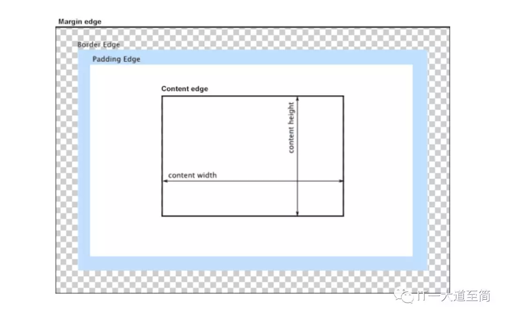

<details>
<summary>参考 - 2020年02月08日</summary>

- [前端布局基础概述](https://mp.weixin.qq.com/s/-LcNZWFFty2lWuND6uuNNA)
- [CSS 中重要的 BFC](https://segmentfault.com/a/1190000013023485)
- [CSS margin 合并问题](https://segmentfault.com/a/1190000013735912)

</details>

前端布局方案主要有三种：

- 传统布局方案（借助浮动、定位等手段）
- flex 布局方案
- grid 布局方案

## CSS 标准盒模型(或 W3C 盒模型)

一个 web 页面是由众多 html 元素拼凑而成的，而每一个 html 元素，都被解析为一个矩形盒，而 CSS 盒模型就是这种矩形盒的解构模型。CSS 盒模型，它由内到外、被四条边界 Content edge、Padding edge、Border edge 和 Margin edge 划分为四个区域：Content area、Padding area、Border area 和 Margin area，在形状上，Content area（又称 content-box）是实心矩形，其余是空心环形（空心部分是 Content area），如下图所示：



每个区域的尺寸，又分别由特定的 CSS 属性来控制，如下图所示：


### box-sizing（CSS3 属性）

box-sizing 的作用就是告诉浏览器：CSS 属性 width 和 height 是用于设置哪一种 box 的尺寸，在 W3C 标准中，box-sizing 的值仅有 `content-box` 和 `border-box`（firefox 则额外支持 padding-box）。

- box-sizing: content-box;

```
width = content-width;
height = content-height;
```

- box-sizing: border-box;

```
width = content-width + padding-left + padding-right + border-left-width + border-right-width;
height = content-height + padding-top + padding-bottom + border-top-height + border-bottom-height;
```

关于 box-sizing 的作用，还有另一种表述：告诉浏览器，是使用 W3C 盒模型(content-box)，还是使用 IE 盒模型(border-box)。

## 文档流

我们常说的文档流其实分为**定位流**、**浮动流**、**普通流**三种。而普通流其实就是指 BFC 中的 FC。FC(Formatting Context)，直译过来是格式化上下文，它是页面中的一块渲染区域，有一套渲染规则，决定了其子元素如何布局，以及和其他元素之间的关系和作用。常见的 FC 有 BFC、IFC，还有 GFC 和 FFC。

三种文档流的定位方案

### 常规流(Normal flow)

- 在常规流中，盒一个接着一个排列;
- 在块级格式化上下文里面， 它们竖着排列；
- 在行内格式化上下文里面， 它们横着排列;
- 当 position 为 static 或 relative，并且 float 为 none 时会触发常规流；
- 对于静态定位(static positioning)，position: static，盒的位置是常规流布局里的位置；
- 对于相对定位(relative positioning)，position: relative，盒偏移位置由 top、bottom、left、right 属性定义。即使有偏移，仍然保留原有的位置 ，其它常规流不能占用这个位置。

### 浮动(Floats)

- 左浮动元素尽量靠左、靠上，右浮动同理
- 这导致常规流环绕在它的周边，除非设置 clear 属性
- 浮动元素不会影响块级元素的布局
- 但浮动元素会影响行内元素的布局，让其围绕在自己周围，撑大父级元素，从而间接影响块级元素布局
- 最高点不会超过当前行的最高点、它前面的浮动元素的最高点
- 不超过它的包含块，除非元素本身已经比包含块更宽
- 行内元素出现在左浮动元素的右边和右浮动元素的左边，左浮动元素的左边和右浮动元素的右边是不会摆放浮动元素的

### 绝对定位(Absolute positioning)

- 绝对定位方案，盒从常规流中被移除，不影响常规流的布局；
- 它的定位相对于它的包含块，相关 CSS 属性：top、bottom、left、right；
- 如果元素的属性 position 为 absolute 或 fixed，它是绝对定位元素；
- 对于 position: absolute，元素定位将相对于上级元素中最近的一个 relative、fixed、absolute，如果没有则相对于 ICB(初始包含块)，注意不是 body 也不是 html；

## 格式化上下文（Formatting Context）

格式化上下文，它指的是具有某种 CSS 格式化规则（布局规则）的上下文环境，在这个上下文环境内的所有子元素，都将根据其特定的 CSS 格式化规则来进行排列。

我们可以给某个作为容器的元素指定特定的格式化上下文，也就是说我们可以定义一个具有特定布局规则的渲染区域。常见的格式化上下文有 BFC（CSS2.1 规范）、IFC（CSS2.1 规范）、 FFC（CSS3 规范新增）和 GFC（CSS3 规范新增），具体介绍如下：

### BFC

BFC, 全称是 block formatting context，它是一个独立封闭的渲染区域，在这个区域内的所有元素，从区域的顶部起，一个接一个地根据自身的布局特性进行排列：在这个区域内的块级元素 ，按从上到下的顺序显示，相邻的块级元素可以使用 margin 隔离，**但在垂直方向上相邻的块级元素会发生 margin 合并**；在这个区域内的 inline-level 或 inline-level-block 元素，则按从左到右的顺序显示。具有 BFC 格式化环境的元素，我们称之为 BFC 元素，可以说，BFC 定义了 BFC 元素 content 区域的渲染规则。

#### 创建 BFC 元素的方式有如下几种（摘自 MDN BFC）

- 根元素或其它包含它的元素
- 浮动元素 (`float` 不为 none)
- `overflow` 不为 visible 的块元素
- 定位元素 (position 为 `absolute`、`fixed`)
- display: `flow-root`(没有副作用)
- 内联块 (display: inline-block)
- 表格元素 (display: table、table-cell、table-caption)
- 弹性项 (display: flex 、inline-flex )
- 网格项 (display: grid 、 inline-grid )
- contain 为以下值的元素: layout, content, 或 strict
- 多列容器 (元素的 column-count 或 column-width 不为 auto， 包括 column-count: 1 的元素)
- column-span: all 应当总是会创建一个新的格式化上下文，即便具有 column-span: all 的元素并不被包裹在一个多列容器中。

#### BFC 元素具有如下特性：

##### 1、 对应一个独立、封闭的渲染区域，子元素的 CSS 样式不会影响 BFC 元素外部；

普通块级元素

<div style="background: green;">
  <div style="width:400px;background: yellow;margin-top: 100px;">margin-top为100px的子元素</div>
  普通块级元素
</div>

BFC 元素

<div style="background: green;display: flow-root;">
  <div style="width:400px;background: yellow;margin-top: 100px;">margin-top为100px的子元素</div>
  BFC元素(display: flow-root)
</div>

说明：

- 普通块级元素，其子元素的 margin-top，并没有隔开自身与父元素（普通块级元素），但是却作用到父元素外部（将父元素和叔伯元素或祖父元素隔开）
- BFC 元素，作为一个独立、封闭的渲染区域，其子元素的 margin-top，则会隔开自身与父元素（BFC 元素），而不会影响到父元素外部；

##### 2、 浮动子元素参与 BFC 父元素的高度计算，也就是 BFC 元素能够识别浮动元素

普通块级元素

<div style="border:1px solid green;">
  <div style="border:1px solid red; float: left;">浮动子元素</div>
  <div style="border:1px solid red; float: left;">浮动子元素</div>
  <div style="border:1px solid red; float: left;">浮动子元素</div>
</div>
<div style="clear: both;"></div>

BFC 元素

<div style="border:1px solid green; display: flow-root;">
  <div style="border:1px solid red; float: left;">浮动子元素</div>
  <div style="border:1px solid red; float: left;">浮动子元素</div>
  <div style="border:1px solid red; float: left;">浮动子元素</div>
</div>
<div style="clear: both;"></div>

说明：

- BFC 元素，能够识别浮动子元素，浮动子元素参与 BFC 元素的高度计算，不会出现“高度塌陷”问题；
- 普通块级元素，不能够识别浮动子元素，会出现“高度塌陷”问题；

##### 3. 占据文档流的 BFC 元素（可使用 overflow: auto 创建），能够识别浮动的兄弟元素

<div style="border:1px solid red;">
  <div style="float:left;background:green;">浮动的兄弟元素</div>
  <div style="background: yellow;width: 400px;height:50px;">普通的块级元素</div>
</div>

<div style="border:1px solid red;">
  <div style="float:left;background:green;">浮动的兄弟元素</div>
  <div style="background: yellow;width: 400px;height:50px;overflow:auto;">BFC元素(overflow:auto)</div>
</div>
<div style="clear: both;"></div>

说明：

- 普通块级元素，不能够识别浮动的兄弟元素，会被浮动的兄弟元素覆盖部分内容；
- 占据文档流的 BFC 元素（可使用 overflow: auto 创建），能够识别浮动的兄弟元素，不会被浮动的兄弟元素覆盖，与之同行显示；

##### 4. 占据文档流的 BFC 元素（可使用 overflow: auto 创建），width 为 auto 时，会占满当前行的剩余宽度

<div style="border:1px solid red;">
  <div style="float:left;background:green;">浮动的兄弟元素</div>
  <div style="background: yellow;width: auto;height:50px;overflow:auto;">BFC元素(overflow:auto;width: auto;)</div>
</div>
<div style="clear: both;"></div>

简言之：

1. BFC 就像一道屏障，隔离出了 BFC 内部和外部，内部和外部区域的渲染相互之间不影响。BFC 有自己的一套内部子元素渲染的规则，不影响外部渲染，也不受外部渲染影响。
2. BFC 的区域不会和外部浮动盒子的外边距区域发生叠加。也就是说，外部任何浮动元素区域和 BFC 区域是泾渭分明的，不可能重叠。
3. BFC 在计算高度的时候，内部浮动元素的高度也要计算在内。也就是说，即使 BFC 区域内只有一个浮动元素，BFC 的高度也不会发生塌缩，高度是大于等于浮动元素的高度的。
4. HTML 结构中，当构建 BFC 区域的元素紧接着一个浮动盒子时，即，是该浮动盒子的兄弟节点，BFC 区域会首先尝试在浮动盒子的旁边渲染，但若宽度不够，就在浮动元素的下方渲染。

### IFC

IFC, 全称是 inline formatting context，其内部的元素，在水平方向上，一个接一个地显示；在垂直方向上，每个元素可以设置不同的对齐方式；IFC 内部的元素，被一行行的矩形框所包含，这些虚拟的矩形框，我们称为行框（line box）。IFC 的作用区域，可以看成是包含其所有子元素的行框组成的矩形区域。

#### 创建方式

和 BFC 相比，它的创建方式是被动的、隐式的，是由所包含的子元素来创建：只有在一个区域内仅包含可水平排列的元素时才会生成，这些子元素可以是文本、inline-level 元素或 inline-block-level 元素。

#### 特性

1. IFC 内部的元素，按从左到右、从上到下的顺序排布；
2. IFC 内部的每个元素，都可以通过设置 vertical-align 属性，来调整在垂直方向上的对齐；
3. 包含这些内部元素的矩形区域，形成的每一行，被称为 line box（行框，后面会详细介绍）；

### FFC 和 GFC

FFC（flex formatting context）和 GFC（grid formatting context），分别是 flex 布局和 grid 布局的内容

## 包含块（Containing Block）

我们在设置元素尺寸属性（width、height、padding、margin 和 border）的百分比值或偏移属性（top、right、bottom 和 left）的值时，通常会有一个“相对参考系”，这个"相对参考系"一般是包裹着这个元素的块级祖先元素（一般是块级父元素）或离这个元素最近的非 static（relative、absolute 和 fixed）定位的祖先元素。这些具有“相对参考系”作用的祖先元素，其容纳区域（cotent box 或 padding box），其实还有一个专门术语形容之，那就是**包含块**

- ICB（initial containing block, 初始包含块）

  任何一个元素都会有一个包含块作为设置尺寸属性和偏移属性的“相对参考系”，而对于顶层的根元素`<html />`，没有任何元素包裹它，但也具有包含块的，它是一个不可见的矩形框，W3C 组织称之为 ICB（initial containing block, 初始包含块）。

- 不同定位元素分别对应的包含块
  - static 和 relative 定位元素的包含块，为其块级祖先元素（通常是块级父元素）的 content box；
  - absolute 定位元素的包含块，为最近的非静态定位祖先元素的 padding box，查无非静态定位祖先元素，那么它的包含块是 ICB（即根元素<html />的包含块）；
  - fix 定位元素的包含块，为当前 viewport（视窗）；

## 浮动原理

## 定位原理

## 行框

- line-height
- vertical-align

## 层叠原理
