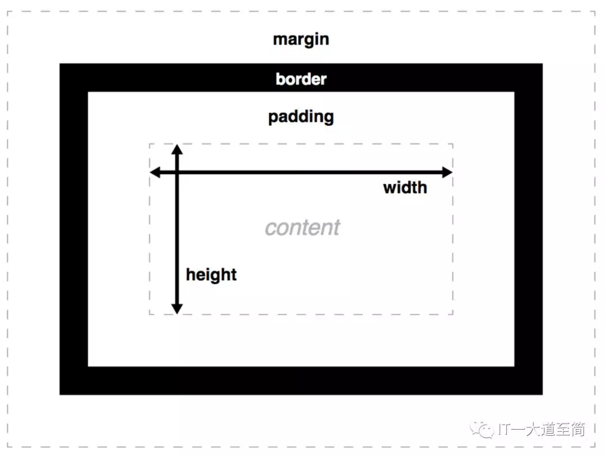

- [前端布局基础概述](https://mp.weixin.qq.com/s/-LcNZWFFty2lWuND6uuNNA)

前端布局方案主要有三种：

- 传统布局方案（借助浮动、定位等手段）
- flex 布局方案
- grid 布局方案

## CSS 标准盒模型(或 W3C 盒模型)

一个 web 页面是由众多 html 元素拼凑而成的，而每一个 html 元素，都被解析为一个矩形盒，而 CSS 盒模型就是这种矩形盒的解构模型。CSS 盒模型，它由内到外、被四条边界 Content edge、Padding edge、Border edge 和 Margin edge 划分为四个区域：Content area、Padding area、Border area 和 Margin area，在形状上，Content area（又称 content-box）是实心矩形，其余是空心环形（空心部分是 Content area），如下图所示：


每个区域的尺寸，又分别由特定的 CSS 属性来控制，如下图所示：



### box-sizing（CSS3 属性）

box-sizing 的作用就是告诉浏览器：CSS 属性 width 和 height 是用于设置哪一种 box 的尺寸，在 W3C 标准中，box-sizing 的值仅有 `content-box` 和 `border-box`（firefox 则额外支持 padding-box）。

- box-sizing: content-box;

```
width = content-width;
height = content-height;
```

- box-sizing: border-box;

```
width = content-width + padding-left + padding-right + border-left-width + border-right-width;
height = content-height + padding-top + padding-bottom + border-top-height + border-bottom-height;
```

关于 box-sizing 的作用，还有另一种表述：告诉浏览器，是使用 W3C 盒模型(content-box)，还是使用 IE 盒模型(border-box)。

## 格式化上下文

格式化上下文，它指的是具有某种 CSS 格式化规则（布局规则）的上下文环境，在这个上下文环境内的所有子元素，都将根据其特定的 CSS 格式化规则来进行排列。

我们可以给某个作为容器的元素指定特定的格式化上下文，也就是说我们可以定义一个具有特定布局规则的渲染区域。常见的格式化上下文有 BFC（CSS2.1 规范）、IFC（CSS2.1 规范）、 FFC（CSS3 规范新增）和 GFC（CSS3 规范新增），具体介绍如下：

### BFC

BFC, 全称是 block formatting context，它是一个独立封闭的渲染区域，在这个区域内的所有元素，从区域的顶部起，一个接一个地根据自身的布局特性进行排列：在这个区域内的块级元素 ，按从上到下的顺序显示，相邻的块级元素可以使用 margin 隔离，**但在垂直方向上相邻的块级元素会发生 margin 合并**；在这个区域内的 inline-level 或 inline-level-block 元素，则按从左到右的顺序显示。具有 BFC 格式化环境的元素，我们称之为 BFC 元素，可以说，BFC 定义了 BFC 元素 content 区域的渲染规则。

#### 创建 BFC 元素的方式有如下几种（摘自 MDN BFC）

- 根元素或其它包含它的元素
- 浮动元素 (元素的 float 不是 none)
- 绝对定位元素 (元素的 position 为 absolute 或 fixed)
- 内联块 (元素具有 display: inline-block)
- 表格单元格 (元素具有 display: table-cell，HTML 表格单元格默认属性)
- 表格标题 (元素具有 display: table-caption, HTML 表格标题默认属性)
- overflow 值不为 visible 的块元素
- display: flow-root
- contain 为以下值的元素: layout, content, 或 strict
- 弹性项 (display: flex 或 inline-flex 元素的子元素)
- 网格项 (display: grid 或 inline-grid 元素的子元素)
- 多列容器 (元素的 column-count 或 column-width 不为 auto， 包括 column-count: 1 的元素)
- column-span: all 应当总是会创建一个新的格式化上下文，即便具有 column-span: all 的元素并不被包裹在一个多列容器中。

#### BFC 元素具有如下特性：

1、 对应一个独立、封闭的渲染区域，子元素的 CSS 样式不会影响 BFC 元素外部；

普通块级元素

<div style="background: green;">
  <div style="width:400px;background: yellow;margin-top: 100px;">margin-top为100px的子元素</div>
  普通块级元素
</div>

BFC 元素

<div style="background: green;display: flow-root;">
  <div style="width:400px;background: yellow;margin-top: 100px;">margin-top为100px的子元素</div>
  BFC元素
</div>

说明：

- 普通块级元素，其子元素的 margin-top，并没有隔开自身与父元素（普通块级元素），但是却作用到父元素外部（将父元素和叔伯元素或祖父元素隔开）
- BFC 元素，作为一个独立、封闭的渲染区域，其子元素的 margin-top，则会隔开自身与父元素（BFC 元素），而不会影响到父元素外部；

2、 浮动子元素参与 BFC 父元素的高度计算，也就是 BFC 元素能够识别浮动元素

普通块级元素

<div style="border:1px solid green;">
  <div style="border:1px solid red; float: left;">浮动子元素</div>
  <div style="border:1px solid red; float: left;">浮动子元素</div>
  <div style="border:1px solid red; float: left;">浮动子元素</div>
</div>
<div style="clear: both;"></div>

BFC 元素

<div style="border:1px solid green; display: flow-root;">
  <div style="border:1px solid red; float: left;">浮动子元素</div>
  <div style="border:1px solid red; float: left;">浮动子元素</div>
  <div style="border:1px solid red; float: left;">浮动子元素</div>
</div>
<div style="clear: both;"></div>
