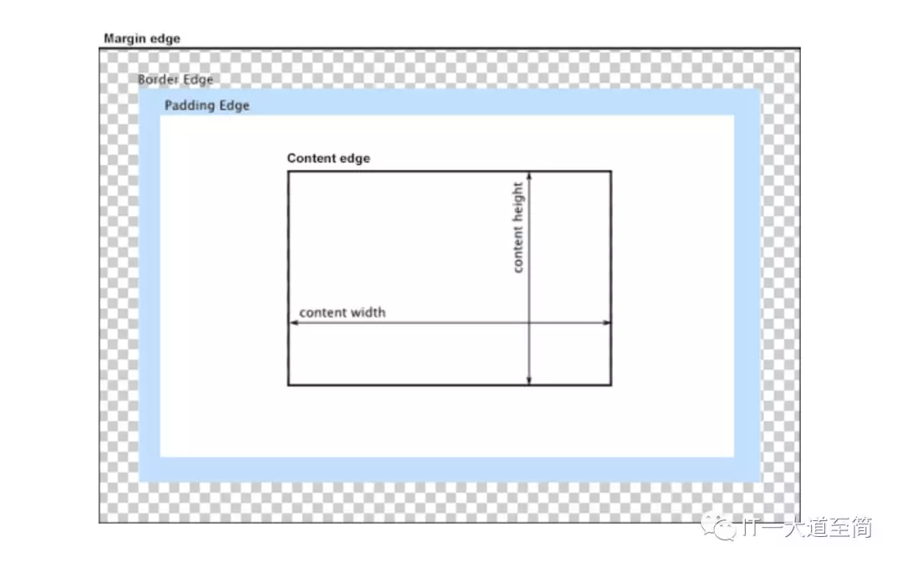
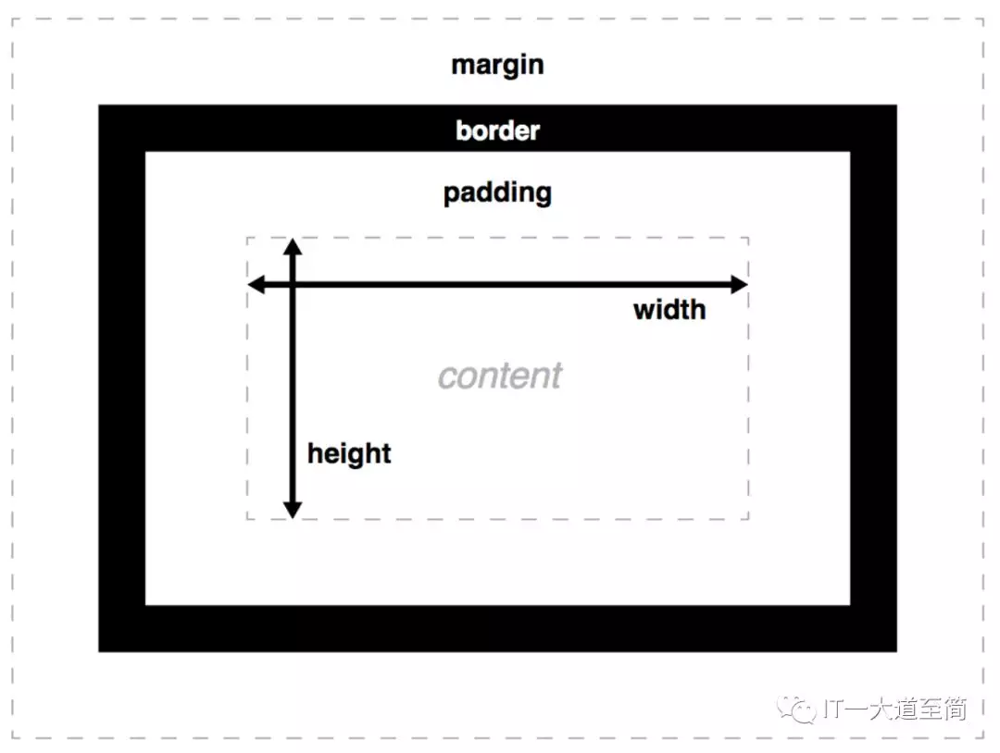

# 盒模型

一个 web 页面是由众多 html 元素拼凑而成的，而每一个 html 元素，都被解析为一个矩形盒，而 CSS 盒模型就是这种矩形盒的解构模型。CSS 盒模型，它由内到外、被四条边界 Content edge、Padding edge、Border edge 和 Margin edge 划分为四个区域：Content area、Padding area、Border area 和 Margin area，在形状上，Content area（又称 content-box）是实心矩形，其余是空心环形（空心部分是 Content area），如下图所示：



每个区域的尺寸，又分别由特定的 CSS 属性来控制，如下图所示：



### box-sizing（CSS3 属性）

box-sizing 的作用就是告诉浏览器：CSS 属性 width 和 height 是用于设置哪一种 box 的尺寸，在 W3C 标准中，box-sizing 的值仅有 `content-box` 和 `border-box`（firefox 则额外支持 padding-box）。

- box-sizing: content-box;

```
width = content-width;
height = content-height;
```

- box-sizing: border-box;

```
width = content-width + padding-left + padding-right + border-left-width + border-right-width;
height = content-height + padding-top + padding-bottom + border-top-height + border-bottom-height;
```

关于 box-sizing 的作用，还有另一种表述：告诉浏览器，是使用 W3C 盒模型(content-box)，还是使用 IE 盒模型(border-box)。
