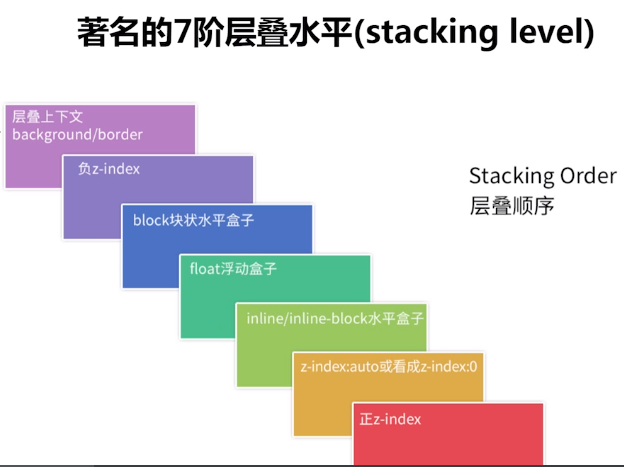
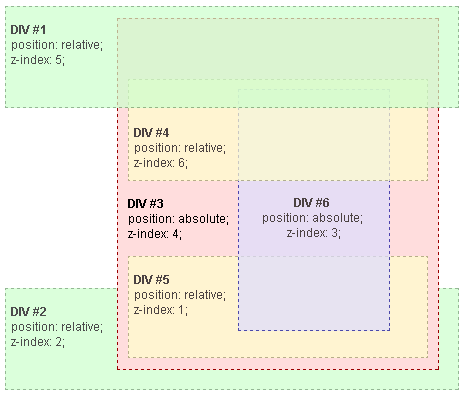

# 层叠原理

参考

- [层叠顺序（stacking level）与堆栈上下文（stacking context）知多少？](https://www.cnblogs.com/coco1s/p/5899089.html)
- [深入理解CSS中的层叠上下文和层叠顺序](https://www.zhangxinxu.com/wordpress/2016/01/understand-css-stacking-context-order-z-index/)
- [层叠上下文](https://developer.mozilla.org/zh-CN/docs/Web/Guide/CSS/Understanding_z_index/The_stacking_context)

## 什么是层叠上下文

层叠上下文，英文称作 ”stacking context”, 是HTML中的一个三维的概念。我们假定用户正面向（浏览器）视窗或网页，而 HTML 元素沿着其相对于用户的一条虚构的 z 轴排开，层叠上下文就是对这些 HTML 元素的一个三维构想。众 HTML 元素基于其元素属性按照优先级顺序占据这个空间。

按照 [W3官方](https://www.w3.org/TR/CSS2/visuren.html#propdef-z-index) 的说法，准确的 7 层为：

1. the background and borders of the element forming the stacking context.
2. the child stacking contexts with negative stack levels (most negative first).
3. the in-flow, non-inline-level, non-positioned descendants.
4. the non-positioned floats.
5. the in-flow, inline-level, non-positioned descendants, including inline tables and inline blocks.
6. the child stacking contexts with stack level 0 and the positioned descendants with stack level 0.
7. the child stacking contexts with positive stack levels (least positive first).

## 层叠上下文创建

创建堆叠上下文的方式 （参考自 [MDN](https://developer.mozilla.org/zh-CN/docs/Web/Guide/CSS/Understanding_z_index/The_stacking_context) ）：

* 文档根元素（`<html>`）；
* position 值为 absolute（绝对定位）或  relative（相对定位）且 z-index 值不为 auto 的元素；
* position 值为 fixed（固定定位）或 sticky（粘滞定位）的元素（沾滞定位适配所有移动设备上的浏览器，但老的桌面浏览器不支持）；
* flex (flexbox) 容器的子元素，且 z-index 值不为 auto；
* grid (grid) 容器的子元素，且 z-index 值不为 auto；
* opacity 属性值小于 1 的元素（参见 the specification for opacity）；
* mix-blend-mode 属性值不为 normal 的元素；
* 以下任意属性值不为 none 的元素：
  * transform
  * filter
  * perspective
  * clip-path
  * mask / mask-image / mask-border
* isolation 属性值为 isolate 的元素；
* -webkit-overflow-scrolling 属性值为 touch 的元素；
* will-change 值设定了任一属性而该属性在 non-initial 值时会创建层叠上下文的元素；
* contain 属性值为 layout、paint 或包含它们其中之一的合成值（比如 contain: strict、contain: content）的元素。

!> 层叠上下文是个独立单位，可以嵌套，z-index大小只在当前上下文有意义，不会跨层级比较

* 层叠上下文可以包含在其他层叠上下文中，并且一起创建一个层叠上下文的层级。
* 每个层叠上下文都完全独立于它的兄弟元素：当处理层叠时只考虑子元素。
* 每个层叠上下文都是自包含的：当一个元素的内容发生层叠后，该元素将被作为整体在父级层叠上下文中按顺序进行层叠。

这里 DIV#3 容器会优先计算出顺序，然后 DIV#3 再以一个整体参与兄弟比较，所以即便 DIV#4 z-index 6 大于 DIV#1 z-index 5，也只能缩在 DIV#3 的包裹之下
