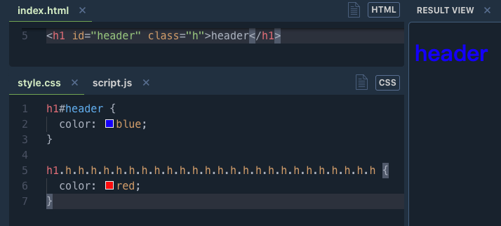

# 选择器优先级及计算

!important > 内联 > id > class、属性、伪类 > tag、伪元素

计算规则是分别统计 (内联, id, class、属性、伪类, tag、伪元素) 出现的次数得到 (a, b, c, d)，然后从左依次向右比较大小，大的胜出，相同继续找下一位比较，都相同，后面的覆盖前面的

通配符 `*` 关系选择器 `+, >, ~, ' '` 对优先级计算没有影响

`!important` 优先级最高，如果都有 `!important` 则还是上面的规则比较

举例

```
ul           (0,0,0,1)
ul.cls       (0,0,1,1)
ul#ide.cls   (0,1,1,1)
```

这里abcd是统计的次数，网上有文章喜欢比作权重，比如 id 相当于 1000，class 10， tag 就是 1，这样出现一次就累加一次比较大小，但是这样会有个问题，如果加满十个会进位吗？



试了下下面 .h class选择器加的再长也不会干掉id选择器
