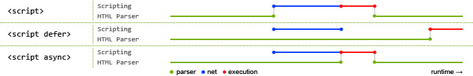

# QA

<details>
<summary>DOCTYPE 的作用</summary>

IE5.5 引入了文档模式的概念，而这个概念是通过使用文档类型(DOCTYPE)切换实现的。

`<!DOCTYPE>`声明位于 HTML 文档中的第一行，处于 `<html>` 标签之前。告知浏览器的解析器用什么文档标准解析这个文档。
DOCTYPE 不存在或格式不正确会导致文档以兼容模式呈现。

在标准模式下，浏览器的解析规则都是按照最新的标准进行解析的。而在兼容模式下，浏览器会以向后兼容的方式来模拟老式浏览器的行为，以保证一些老的网站的正确访问。 在 html5 之后不再需要指定 DTD 文档，因为 html5 以前的 html 文档都是基于 SGML 的，所以需要通过指定 DTD 来定义文档中允许的属性以及一些规则。而 html5 不再基于 SGML 了，所以不再需要使用 DTD。

```html
<!-- html 5 -->
<!DOCTYPE html>

<!-- HTML 4.01 Strict -->
<!DOCTYPE html PUBLIC "-//W3C//DTD HTML 4.01//EN" "http://www.w3.org/TR/html4/strict.dtd">

<!-- HTML 4.01 Transitional -->
<!DOCTYPE html PUBLIC "-//W3C//DTD HTML 4.01 Transitional//EN" "http://www.w3.org/TR/html4/loose.dtd">
```

</details>

<details>
<summary>SGML 、 HTML 、XML 和 XHTML 的区别</summary>

- SGML 是标准通用标记语言，是一种定义电子文档结构和描述其内容的国际标准语言， 是所有电子文档标记语言的起源。
- HTML 是超文本标记语言，主要是用于规定怎么显示网页。
- XML 是可扩展标记语言是未来网页语言的发展方向，XML 和 HTML 的最大区别就在于 XML 的标签是可以自己创建的，数量无限多，而 HTML 的标签都是固定的而且数量有限。
- XHTML 也是现在基本上所有网页都在用的标记语言，他其实和 HTML 没什么本质的区 别，标签都一样，用法也都一样，就是比 HTML 更严格，比如标签必须都用**小写**，标签都必须有**闭合**标签等。

</details>

<details>
<summary>行内元素、块级元素、内联块级元素的区别</summary>

1. 块级元素: display 属性取 block、table、flex、grid 和 list-item 等值的独占一行显示的元素。

   - 每个块级元素独占一行，每个块级元素都会从新的一行开始，从上到下排布
   - 块级元素可以直接控制宽高以及盒子模型的相关 css 属性
   - 在不设置宽度的情况下，块级元素的宽度是他父级元素内容的宽度
   - 在不设置高度的情况下，块级元素的高度是他本身内容的高度

   `<div>` / `<h1>~<h6>` / `<hr>` / `ol ul li` / `dl dt dd` / `<table>` / `<p>` / `<form>`

2. 内联元素: display 属性取 inline 值的可在同一行内排列显示的元素。

   - 内联元素会和其他元素从左到右显示在一行
   - 宽高无效，但`水平方向`可以设置 `padding` 和 `margin`
   - 内联元素的宽高是由内容本身的大小决定的（文字、图片等）
   - 内联元素只能容纳文本或者其他内联元素（不要在内联元素中嵌套块级元素）
     1. 可置换行内元素
        ``、`<object>`、`<video>` 和 `<embed>`，表单类的可替换元素有`<textarea>` 和 `<input>`， 有点特殊，可以设置宽高和 margin 类似 `inline-block` 元素。
     2. 不可置换行内元素
        `<a>` 、`<b>` 、`<strong>` 、`<span>` 、`<label>`、 `<select>` 、`<button>`

3. 内联块级：display 属性取 inline-block、inline-table、inline-flex 和 inline-grid 等值的兼具块级元素和行内级元素布局特性的元素。

   - 和其它 inline 元素同行显示
   - 可以设置宽高/margin/padding（水平和垂直）多个内联块级不会换行

</details>

<details>
<summary>简述一下你对 HTML 语义化的理解</summary>

1. 用正确的标签做正确的事情。
2. html 语义化让页面的内容结构化，结构更清晰，便于浏览器、搜索引擎解析;
3. 即使在没有样式 CSS 情况下也以一种文档格式显示，并且是容易阅读的;
4. 搜索引擎的爬虫也依赖于 HTML 标记来确定上下文和各个关键字的权重，利于 SEO ;
5. 使阅读源代码的人对网站更容易将网站分块，便于阅读维护理解。

</details>

<details>
<summary>defer VS async</summary>

1. `<script src="example.js"></script>`

没有 defer 或 async 属性，浏览器会立即加载并执行相应的脚本。也就是说在渲染 script 标签之后的文档之前，不等待后续加载的文档元素，读到就开始加载和执行，此举会阻塞后续文档的加载；

2. `<script defer src="example.js"></script>`

有了 defer 属性，加载后续文档的过程和 js 脚本的加载(此时仅加载不执行)是并行进行的(异步)，js 脚本的执行需要等到文档所有元素解析完成之后，DOMContentLoaded 事件触发执行之前。另外，defer 脚本是有顺序的

3. `<script async src="example.js"></script>`

有了 async 属性，表示后续文档的加载和渲染与 js 脚本的加载和执行是并行进行的，但一定在 onload 之前，DOMContentLoaded 前后不定，async 脚本之间是没有顺序的



绿色表示文档解析，蓝色表示下载，红色表示脚本执行

也就是说 下载都是并行的，执行都是阻塞的，但是 `defer` 会放在文档解析完之后 DOMContentLoaded 之前执行，`async` 是下好立即执行，所以有可能文档过程中就下好阻塞执行，也可能文档解析结束后才下好执行

</details>

<details>
<summary>preload VS prefetch</summary>

`preload` 是一种声明式的获取（fetch）指令，可以强制浏览器请求资源，提高资源优先级，将加载与执行分离，不阻塞文档解析，同时不阻塞文档 onload 事件。

```html
<!-- 使用 link 标签静态标记需要优先加载的资源，并且是一定会用到的资源 -->
<link rel="preload" as="style" href="/path/to/style.css" />

<!-- 加载好后立即应用样式，模拟异步加载样式-->
<link rel="preload" as="style" href="test.css" onload="this.rel='stylesheet'" />

<!-- 立刻开始下载main.js(不阻塞parser)，并放在内存中，但不会执行其中的JS语句 -->
<link rel="preload" as="script" href="/main.js" />
```

`prefetch` 提示浏览器这个资源将来可能需要，但是把什么时间加载这个资源的决定权交给浏览器，并以较低的优先级获取，然后缓存到 disk 上，当页面上遇到 script 引用了这个资源可以快速的从 disk 缓存中获取。

```html
<!-- 预先加载一个将来可能会用到的资源，但不一定会用到 -->
<link rel="prefetch" as="script" href="next.js" />

<!-- 以较低的优先级加载一个不是那么重要的资源 -->
<link
  rel="prefetch"
  as="script"
  href="https://unpkg.com/prismjs@1.15.0/components/prism-bash.min.js"
  onload="requestAnimationFrame(()=>{
    var script = document.createElement('script'); script.src = this.href; document.body.appendChild(script);
  })"
/>
```

什么时候该用 `preload`？ 什么时候又该用 `prefetch` ?

1. 对于当前页面很有必要的资源使用 preload，对于可能在将来的页面中使用的资源使用 prefetch。
2. preload 可提高资源优先级，prefetch 可以降低资源优先级
3. 用 preload 加载较晚发现的资源，可以较早的加载字体等
4. 如果从一个页面切换到另一个页面，preload 会立即中断，prefetch 不会，可解决跨页打点请求丢失问题
5. 为了提高下一页加载速度而不是当前页的资源使用 prefetch

</details>


<details>
<summary>canvas VS svg</summary>

| Canvas                                                                                                                                                 | SVG                                                                                                                                                                                   |
| ------------------------------------------------------------------------------------------------------------------------------------------------------ | ------------------------------------------------------------------------------------------------------------------------------------------------------------------------------------- |
| 通过 JavaScript 来绘制 2D 图形                                                                                                                         | 是一种使用 XML 描述 2D 图形的语言                                                                                                                                                     |
| 是 HTML5 提供的新元素                                                                                                                                  | 历史久远，并不是 HTML5 转悠的标签                                                                                                                                                     |
| 位图（标量图），放大或改变尺寸会失真；逐像素进行渲染，依赖分辨率                                                                                       | 矢量图，放大或改变尺寸不会失真；不依赖分辨率                                                                                                                                          |
| 弱的文本渲染能力（因为放大会失真）                                                                                                                     | 最适合带有大型渲染区域的应用程序，比如谷歌地图（因为放大不会失真）                                                                                                                    |
| 能够以 .png 或 .jpg 格式保存结果图像；能够引入 .png 或 .jpg 格式的图片                                                                                 | 不能以 .png 或 .jpg 格式保存结果图像；不能引入 .png 或 .jpg 格式的图片                                                                                                                |
| 不支持事件处理器（一旦图形被绘制完成，它就不会继续得到浏览器的关注。如果其位置发生变化，那么整个场景也需要重新绘制，包括任何或许已被图形覆盖的对象。） | 支持事件处理器（SVG DOM 中的每个元素都是可用的。您可以为某个元素附加 JavaScript 事件处理器。每个被绘制的图形均被视为对象。如果 SVG 对象的属性发生变化，那么浏览器能够自动重现图形。） |
| 不能被引擎抓取                                                                                                                                         | 可以被引擎抓取                                                                                                                                                                        |
| ---                                                                                                                                                    | 复杂度高会减慢渲染速度（任何过度使用 DOM 的应用都不快）                                                                                                                               |
| 最适合图像密集型的游戏，其中的许多对象会被频繁重绘                                                                                                     | 不适合游戏应用                                                                                                                                                                        |


</details>


<details>
<summary></summary>


</details>
