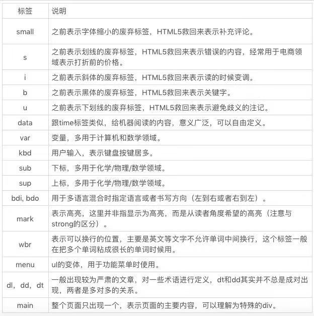

# 语义化

**语义**是我们说话表达的意思，多数的语义实际上都是由文字来承载的。语义类标签则是纯文字的补充，比如标题、自然段、章节、列表，这些内容都是纯文字无法表达的，我们需要依靠语义标签代为表达。

语义化还有啥子用？

1. 语义类标签对开发者更为友好，使用语义类标签增强了可读性，即便是在没有 CSS 的时候，开发者也能够清晰地看出网页的结构，也更便于团队的开发和维护。
2. 语义类标签十分适宜机器阅读。它的文字表现力丰富，更适合搜索引擎检索（SEO），也可以让搜索引擎爬虫更好地获取到更多有效信息，有效提升网页的搜索量，并且语义类标签还可以支持读屏软件，根据文章可以自动生成目录等等。

实际上现代互联网产品中HTML多用于描述“软件界面”而不是“富文本”，UI几乎是没有语义的，而且很多内嵌在App里的H5页面、中后台系统并不是面向搜索引擎的，所以刻意语义化是没有必要的，完全可以直接使用div、span构建整个UI。

语义化场景多用于文章文档报刊的结构描述如下：

```html
<body>
    <header>
      <nav>
        <a href="/html/">HTML</a> | <a href="/css/">CSS</a> | <a href="/js/">JavaScript</a>
      </nav>
    </header>
    <aside>
      <nav></nav>
    </aside>
    <article>
        <header>
          <hgroup>
            <h1>Welcome to my WWF</h1>
            <h2>For a living planet</h2>
          </hgroup>
        </header>
        <section>
          <h1>PRC</h1>
          <p>The People's Republic of China was born in 1949...</p>
        </section>
        <section>……</section>
        <section>……</section>
        <footer>……</footer>
    </article>
    <article>
        ……
    </article>
    <article>
        ……
    </article>
    <footer>
        <address></address>
    </footer>
</body>
```

- `<header>` 标签定义文档或者文档的一部分区域的页眉。`<header>` 元素应该作为介绍内容或者导航链接栏的容器。在一个文档中，您可以定义多个 `<header>` 元素。
- `<footer>` 标签定义文档或者文档的一部分区域的页脚。
- `<aside>` 标签定义 `<article>` 标签外的内容。aside 的内容应该与附近的内容相关。
- `<nav>` 标签定义导航链接的部分。
- `<article>` 标签定义独立的内容。内容本身必须是有意义的且必须是独立于文档的其余部分。如帖子文章评论
- `<hgroup>` 标签被用来对标题元素进行分组。当标题有多个层级（副标题）时，`<hgroup>` 元素被用来对一系列 `<h1> - <h6>` 元素进行分组。
- `<h1> - <h6>` 标签被用来定义 HTML 标题。
- `<section>` 标签定义了文档的某个区域。比如章节、头部、底部或者文档的其他区域。
- `<dl>,<dt>,<dd>` 自定义列表
- `<b>/<strong>` 元素默认均展示为加粗，表示突出强调
- `<em>` 元素默认展示为斜体，重读强调
- `<address>` 元素可以让作者为它最近的 `<article>` 或者 `<body>` 祖先元素提供联系信息。
- `<figure>` 这个元素是用来引入图表、图形、照片等，对应的场景就是像是杂志中的图片一样
- `<figcaption>` 给图表加标题，不能单独出现，配合`<figure>`使用
- `<time>` 可以通过这个标签标记一个具体的时间或日期，应用场景通常就是一篇文章的发表时间
- `<dfn>`	定义一个定义项目。
- `<code>` 定义计算机代码文本。
- `<samp>`定义样本文本。
- `<kbd>`	定义键盘文本。它表示文本是从键盘上键入的。它经常用在与计算机相关的文档或手册中。
- `<var>`	定义变量。您可以将此标签与 `<pre>` 及 `<code>` 标签配合使用。

其他


