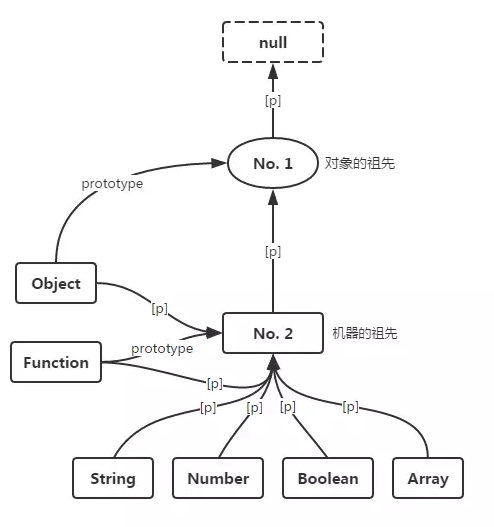

# 进阶

## 作用域、作用域链与提升

- [ES6 变量作用域与提升：变量的生命周期详解](https://zhuanlan.zhihu.com/p/28494566)

### 作用域

**作用域**是一套规则，用于确定在何处以及如何查找变量。JavaScript 中采用了词法作用域规则，即根据写代码时将变量和块写在哪里来决定作用域。


如图引擎在词法分析时根据函数声明`(){...}`就可以区分出三个作用域（气泡），这些逐级嵌套的作用域就形成了 **作用域链**。

① 全局作用域，只有一个标识符：foo。<br>
② foo 所创建的作用域，包含了：a、b、bar。<br>
③ bar 所创建的作用域，只有一个标识符：c。<br>

引擎在查找变量时就会从运行的最内部作用域开始，逐级向上查找，直到遇到第一个匹配的标识符为止，否则抛一个 ReferenceError 异常。

### 提升

无论作用域中的声明出现在什么地方，在代码本身被执行前都会进行预处理。可以将这个过程形象地想象成所有的声明（变量和函数）都会被“移动”到各自作用域的最顶端，这个过程被称为 **提升**。

1. 函数的提升优先级比变量高，会提升到变量之前
2. 函数的提升会将整个函数体一起提升
3. 变量重复声明会被忽略，赋值还留在原处等待运行，函数的重复声明会被覆盖

```js
function foo() {
  bar() // 4 undefined

  var a = 1
  function bar() {
    console.log(3, a)
  }

  var a = 2
  function bar() {
    console.log(4, a)
  }
}
```

等价于

```js
function foo() {
  function bar() {
    console.log(4, a)
  }
  var a

  bar() // 4 undefined

  a = 1
  a = 2
}
```

## 闭包

- [从 JS 垃圾回收机制和词源来透视闭包](https://juejin.im/entry/5aebc7a76fb9a07acc119269)

## 调用栈与执行上下文

- [JavaScript 中的执行上下文和调用栈是什么？](https://zcfy.cc/article/what-is-the-execution-context-amp-stack-in-javascript-by-david-shariff-4007.html)

## 原型链

[[Prototype]]机制就是指对象中的一个内部链接引用另一个对象。如果在第一个对象上没有找到需要的属性或者方法引用，引擎就会继续在[[Prototype]]关联的对象上进行查找。同理，如果在后者中也没有找到需要的引用就会继续查找它的[[Prototype]]，以此类推。这一系列对象的链接被称为 “**原型链**”。



1. 所有对象的原型都指向 Object.prototype
2. 所有构造函数的原型指向 Function.prototype，包括 Object、Function
3. prototype 本质也是对象，其原型都指向 Object.prototype
4. Object.prototype 的原型指向 null

### new 关键字做了啥?

```js
function Foo() {
  this.name = 'name'
}

const a = new Foo()
```

首先每个函数默认都会自带一个名字刚好叫 `prototype` 的属性，且 `prototype` 下具有一个不可枚举的属性 `constructor` 指向关联函数（本例中是 Foo），代码有点类似这样:

```js
Foo.prototype = {
  constructor: Foo,
}
```

当执行 new 调用时:

1. 创建（或者说构造）一个全新的对象。
2. 这个新对象会被执行[[Prototype]]连接到函数的 `prototype` 属性。
3. 这个新对象会绑定到函数调用的 this。
4. 如果函数没有返回其他对象，那么 new 表达式中的函数调用会自动返回这个新对象，否则返回函数返回值。

类似这样：

```js
function myNew(Cons, ...params) {
  const obj = Object.create(Cons.prototype)
  const res = Cons.apply(a, params)
  return typeof res === 'object' ? res : obj
}
```

### instanceof 机制

```js
function Foo() {}
const a = new Foo()
a instanceof Foo // true
```

instanceof 操作符的左操作数是一个普通的对象，右操作数是一个函数。instanceof 回答的问题是：在 a 的整条[[Prototype]]链中是否有指向 Foo.prototype 的对象
