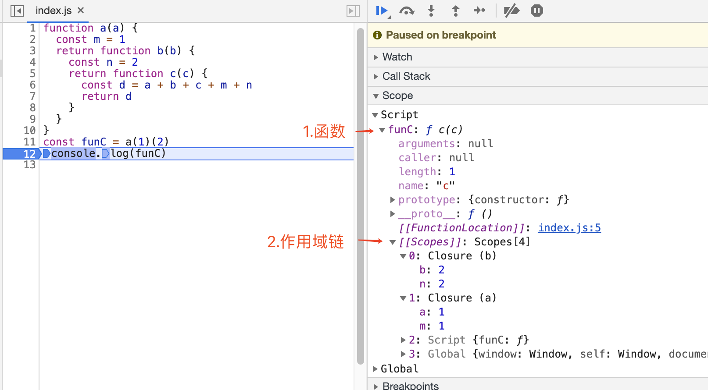

# 闭包

参考

- [从 JS 垃圾回收机制和词源来透视闭包](https://juejin.im/entry/5aebc7a76fb9a07acc119269)

## 什么是闭包

简单说，闭包就是绑定了执行上下文的函数。这个执行上下文就是作用域链所能访问的所有变量、参数、对象、函数。

看下 devtool 更直观的展示

## 闭包特点

1. 状态保持
2. 延后执行

## 应用

1. 柯里化
2. 单例
