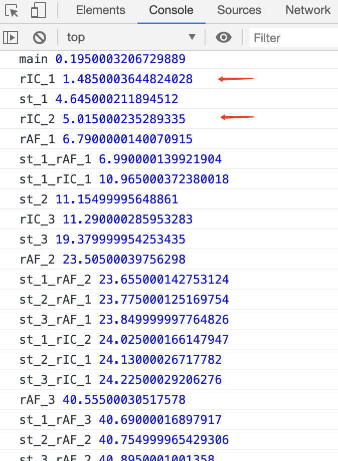

# Event Loop

<details>
<summary>引用参考 - 2020/06/12</summary>

- [从浏览器多进程到 JS 单线程，JS 运行机制最全面的一次梳理](http://www.dailichun.com/2018/01/21/js_singlethread_eventloop.html) - _Lichun Dai 2018-01-21_
- [从 HTML 规范和 W3C 草案来解读 Event Loop、requestAnimationFrame、requestIdleCallback](https://github.com/sl1673495/blogs/issues/47)
- https://html.spec.whatwg.org/#window-event-loop
- [超好用的 API 之 IntersectionObserver](https://juejin.im/post/5d11ced1f265da1b7004b6f7)
- https://developer.mozilla.org/zh-CN/docs/Web/API/Window/requestAnimationFrame
- https://developer.mozilla.org/zh-CN/docs/Web/API/Window/requestIdleCallback

</details>

## 一、事件循环

我们知道 JS 引擎是单线程的，为了非阻塞式的执行多任务，JS 采用了一种任务轮询的方式来实现多任务并行，这种机制被叫做 Eventloop，因为虽然 JS 引擎是单线程的，但是浏览器内核是多线程的，事件线程、定时器线程、网络线程这些是可以与 JS 引擎线程并行的，期间产生的回调就会当做一个 event 加入到任务队列里等待 JS 引擎消费。

JS 中任务类型分为两种：`macrotask` 和 `microtask`，在 ECMAScript 中 macrotask 可称为 task，microtask 称为 jobs

**macrotask(task)**: setImmediate(node\ie\edge) > 鼠标键盘 I/O > MessageChannel、postMessage > setTimeout、setInterval、ajax\
**microtask(jobs)**: process.nextTick(node) > Promise > MutationObserver

JS 引擎一旦空闲，就会从 task 队列里取出一个任务加入执行栈，此间产生的 jobs 也一并执行完，然后再从 task 队列里取出下一个任务进入下一个循环周期，这就是我们常说的**事件循环**


### 案例：Vue.nextTick

源码路径 `src/core/util/next-tick.js`，版本 2.6.11

```js
let timerFunc
// 1、Promise
if (typeof Promise !== 'undefined' && isNative(Promise)) {
  const p = Promise.resolve()
  timerFunc = () => {
    p.then(flushCallbacks)
    if (isIOS) setTimeout(noop)
  }
  isUsingMicroTask = true
  // 2、MutationObserver
} else if (
  !isIE &&
  typeof MutationObserver !== 'undefined' &&
  (isNative(MutationObserver) ||
    // PhantomJS and iOS 7.x
    MutationObserver.toString() === '[object MutationObserverConstructor]')
) {
  let counter = 1
  const observer = new MutationObserver(flushCallbacks)
  const textNode = document.createTextNode(String(counter))
  observer.observe(textNode, {
    characterData: true,
  })
  timerFunc = () => {
    counter = (counter + 1) % 2
    textNode.data = String(counter)
  }
  isUsingMicroTask = true
  // 3、setImmediate
} else if (typeof setImmediate !== 'undefined' && isNative(setImmediate)) {
  timerFunc = () => {
    setImmediate(flushCallbacks)
  }
  // 4、setTimeout
} else {
  // Fallback to setTimeout.
  timerFunc = () => {
    setTimeout(flushCallbacks, 0)
  }
}
```

可以看到 vue 的 nextTick 也正是利用 eventloop 的 microtask 的 Promise 和 MutationObserver，如果不支持再降级为 setImmediate、setTimeout

但是为什么一定要是 nextTick 之后才能拿到 dom 修改呢？我直接`Promise.resolve().then`可不可以呢？通过源码我们发现 vue 为了优化会合并更新，最后也是调用的 nextTick

```js
// 1、src/core/observer/watcher.js
  update () {
    /* istanbul ignore else */
    if (this.lazy) {
      this.dirty = true
    } else if (this.sync) {
      this.run()
    } else {
      queueWatcher(this)
    }
  }

// 2、src/core/observer/scheduler.js
export function queueWatcher (watcher: Watcher) {
  const id = watcher.id
  if (has[id] == null) {
    has[id] = true
    if (!flushing) {
      queue.push(watcher)
    } else {
      // if already flushing, splice the watcher based on its id
      // if already past its id, it will be run next immediately.
      let i = queue.length - 1
      while (i > index && queue[i].id > watcher.id) {
        i--
      }
      queue.splice(i + 1, 0, watcher)
    }
    // queue the flush
    if (!waiting) {
      waiting = true

      if (process.env.NODE_ENV !== 'production' && !config.async) {
        flushSchedulerQueue()
        return
      }
      nextTick(flushSchedulerQueue)
    }
  }
}
// 3、nextTick(flushSchedulerQueue)
export function nextTick (cb?: Function, ctx?: Object) {
  let _resolve
  callbacks.push(() => {
    if (cb) {
      try {
        cb.call(ctx)
      } catch (e) {
        handleError(e, ctx, 'nextTick')
      }
    } else if (_resolve) {
      _resolve(ctx)
    }
  })
  if (!pending) {
    pending = true
    timerFunc()
  }
  // $flow-disable-line
  if (!cb && typeof Promise !== 'undefined') {
    return new Promise(resolve => {
      _resolve = resolve
    })
  }
}

// 4、timerFunc =》flushCallbacks
const callbacks = []
let pending = false

function flushCallbacks () {
  pending = false
  const copies = callbacks.slice(0)
  callbacks.length = 0
  for (let i = 0; i < copies.length; i++) {
    copies[i]()
  }
}

```

所以 watcher 更新和 nextTick 回调都是加入到 nextTick callbacks 中，然后在同一个 microtask 或者 macrotask 中按序遍历执行掉的，所以如果用`Promise.resolve().then`来代替 Vue.nextTick，那么也就是说环境支持 Promise，那么 watcher 最终产生的也是一个 microtask，microtask 队列在一个 macrotask 之后会按序一起执行掉那么理论上也是可以的

## 二、requestAnimationFrame、requestIdleCallback 和 渲染时机

以上感觉还是很清晰的，但是当 eventloop 遇到 requestAnimationFrame、requestIdleCallback、IntersectionObserver、Update rendering 时就感觉一阵模糊了


### 渲染

事件循环是很快的代码的执行都是微秒级别的，而我们的屏幕刷新率一般 60hz，相当于 16.67ms，所以不可能每个事件循环之间都有渲染，渲染是会合并的通常跟屏幕刷新率保持一致，另外如果当前任务并没有产生 reflow\repaint，也没有 requestAnimationFrame 回调，那么也没必要重新渲染，所以传统说法每一次事件循环都夹着渲染是不对的


### requestAnimationFrame

requestAnimationFrame 告诉浏览器——你希望执行一个动画，并且要求浏览器在下次重绘之前调用指定的回调函数更新动画。如果有 rAF 回调就一定会触发渲染，在渲染前会清空 rAF 回调，这期间再次产生的 rAF 都会在下一帧执行，rAF 的执行时机其实主要跟屏幕刷新率有关，比如我自己的一个外接屏幕设置成 50hz，就会基本 20ms 执行一次了


### requestIdleCallback

requestIdleCallback 提供了在空闲时间自动执行队列任务的能力，在一次渲染之后如果没有任何队列任务就进入空闲阶段


因为有个`hasARenderingOpportunity is false` 条件，所以 rIC 的执行时机一般在一次渲染之后下一个任务之前，但也不是绝对的，因为有些 task 并没有触发渲染，renderingOpportunity 还是 false，下一个 task 还没来，就有机会在这个 task 之后插入一个 rIC

```html
<script>
  t0 = performance.now()
  times = 3

  function loopRIC(n) {
    requestIdleCallback(() => {
      console.log('rIC_' + n, performance.now() - t0)
      n < times && loopRIC(n + 1)
    })
  }
  loopRIC(1)

  function loopRAF(n) {
    requestAnimationFrame(() => {
      console.log('rAF_' + n, performance.now() - t0)
      n < times && loopRAF(n + 1)
    })
  }
  loopRAF(1)

  function loopSetTimeout(tn) {
    setTimeout(() => {
      function loopRIC(n) {
        requestIdleCallback(() => {
          console.log('st_' + tn + '_rIC_' + n, performance.now() - t0)
          n < times && loopRIC(n + 1)
        })
      }
      loopRIC(1)

      function loopRAF(n) {
        requestAnimationFrame(() => {
          console.log('st_' + tn + '_rAF_' + n, performance.now() - t0)
          n < times && loopRAF(n + 1)
        })
      }
      loopRAF(1)

      console.log('st_' + tn, performance.now() - t0)
      tn < times && loopSetTimeout(tn + 1)
    }, 2 * tn + 2)
  }
  loopSetTimeout(1)
  console.log('main', performance.now() - t0)
</script>
```



另外 requestIdleCallback 的执行有 50ms 的限制以便于响应更高优先级的任务，但为了不被饿死也提供了 timeout 选项，使得过期的空闲任务会被优先执行

### 案例：React 时间分片
