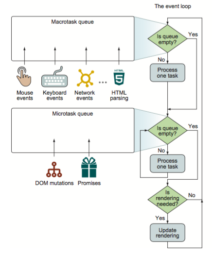
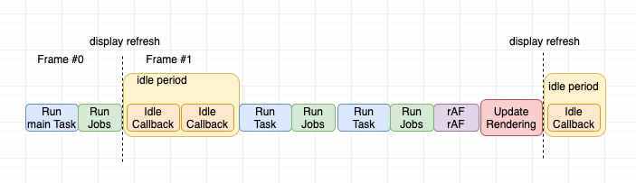
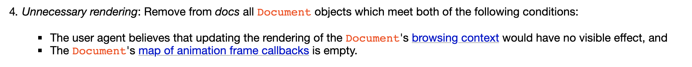
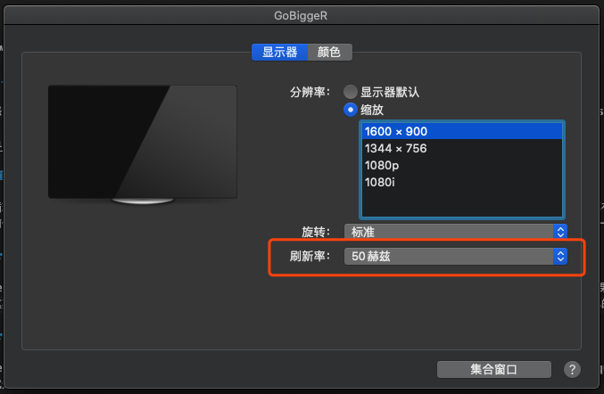
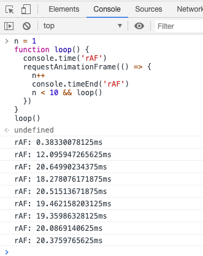
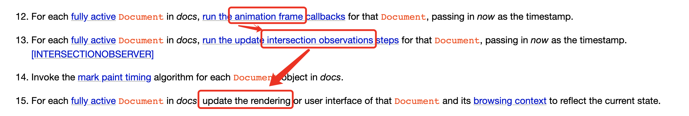
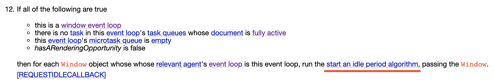

# Event Loop

<details>
<summary>引用参考 - 2020/06/12</summary>

- [从浏览器多进程到 JS 单线程，JS 运行机制最全面的一次梳理](http://www.dailichun.com/2018/01/21/js_singlethread_eventloop.html) - _Lichun Dai 2018-01-21_
- [从 HTML 规范和 W3C 草案来解读 Event Loop、requestAnimationFrame、requestIdleCallback](https://github.com/sl1673495/blogs/issues/47)
- https://html.spec.whatwg.org/#window-event-loop
- [超好用的 API 之 IntersectionObserver](https://juejin.im/post/5d11ced1f265da1b7004b6f7)
- https://developer.mozilla.org/zh-CN/docs/Web/API/Window/requestAnimationFrame
- https://developer.mozilla.org/zh-CN/docs/Web/API/Window/requestIdleCallback
- [Node 定时器详解](http://www.ruanyifeng.com/blog/2018/02/node-event-loop.html)

</details>

## 一、事件循环

我们知道 JS 引擎是单线程的，为了非阻塞式的执行多任务，JS 采用了一种任务轮询的方式来实现多任务并行，这种机制被叫做 Eventloop，因为虽然 JS 引擎是单线程的，但是浏览器内核是多线程的，事件线程、定时器线程、网络线程这些是可以与 JS 引擎线程并行的，期间产生的回调就会当做一个 event 加入到任务队列里等待 JS 引擎消费。

JS 中任务类型分为两种：`macrotask` 和 `microtask`(全小写)，在 ECMAScript 中 macrotask 可称为 task，microtask 称为 job

**macrotask(task)**:

User I/O(鼠标键盘滚轮事件) > MessageChannel、postMessage > setTimeout、setInterval、setImmediate(node\ie\edge)、network I/O、UI rendering(dom 解析)

**microtask(job)**:

process.nextTick(node) > Promise > MutationObserver、Object.observe(已废弃)

JS 引擎一旦空闲，就会从 task 队列里取出一个任务加入执行栈，此间产生的 jobs 也一并执行完，然后再从 task 队列里取出下一个任务进入下一个循环周期，这就是我们常说的**事件循环**



案例：[Vue.nextTick](/frame/vue/nexttick.md)

## 二、requestAnimationFrame、requestIdleCallback 和 渲染时机

以上感觉还是很清晰的，但是当 eventloop 遇到 requestAnimationFrame、requestIdleCallback、IntersectionObserver、Update rendering 时就感觉一阵模糊了



### 渲染

事件循环是很快的代码的执行都是微秒级别的，而我们的屏幕刷新率一般 60hz，相当于 16.67ms，所以不可能每个事件循环之间都有渲染，渲染是会合并的通常跟屏幕刷新率保持一致，另外如果当前任务并没有产生 reflow\repaint，也没有 requestAnimationFrame 回调，那么也没必要重新渲染，所以传统说法每一次事件循环都夹着渲染是不对的



没必要渲染条件：
1. 没有视觉影响
2. 没有请求动画帧回调

### requestAnimationFrame

requestAnimationFrame 告诉浏览器——你希望执行一个动画，并且要求浏览器在下次渲染之前调用指定的回调函数更新动画。如果有 rAF 回调就一定会触发渲染，在渲染前会清空 rAF 回调，这期间再次产生的 rAF 都会在下一帧执行，rAF 的执行时机其实主要跟屏幕刷新率有关，比如我自己的一个外接屏幕设置成 50hz，就会基本 20ms 执行一次了





所以 rAF 一定是在渲染之前执行

### IntersectionObserver

IntersectionObserver 接口提供了一种异步观察目标元素与祖先元素或顶级文档 viewport 的交集中的变化的方法。可以检测某元素是否出现在可视范围内。



根据规范 IntersectionObserver 执行是在 rAF 之后，渲染之前

### requestIdleCallback

requestIdleCallback 提供了在空闲时间自动执行队列任务的能力，在一次渲染之后如果没有任何队列任务就进入空闲阶段



因为有个`hasARenderingOpportunity is false` 条件，所以 rIC 的执行时机一般在**一次渲染之后下一个任务之前**，但也不是绝对的，因为有些 task 并没有触发渲染，renderingOpportunity 还是 false，下一个 task 还没来，就有机会在这个 task 之后插入一个 rIC

```html
<script>
  t0 = performance.now()
  times = 3

  function loopRIC(n) {
    requestIdleCallback(() => {
      console.log('rIC_' + n, performance.now() - t0)
      n < times && loopRIC(n + 1)
    })
  }
  loopRIC(1)

  function loopRAF(n) {
    requestAnimationFrame(() => {
      console.log('rAF_' + n, performance.now() - t0)
      n < times && loopRAF(n + 1)
    })
  }
  loopRAF(1)

  function loopSetTimeout(tn) {
    setTimeout(() => {
      function loopRIC(n) {
        requestIdleCallback(() => {
          console.log('st_' + tn + '_rIC_' + n, performance.now() - t0)
          n < times && loopRIC(n + 1)
        })
      }
      loopRIC(1)

      function loopRAF(n) {
        requestAnimationFrame(() => {
          console.log('st_' + tn + '_rAF_' + n, performance.now() - t0)
          n < times && loopRAF(n + 1)
        })
      }
      loopRAF(1)

      console.log('st_' + tn, performance.now() - t0)
      tn < times && loopSetTimeout(tn + 1)
    }, 2 * tn + 2)
  }
  loopSetTimeout(1)
  console.log('main', performance.now() - t0)
</script>
```


另外 requestIdleCallback 的执行有 50ms 的限制以便于响应更高优先级的任务，但为了不被饿死也提供了 timeout 选项，使得过期的空闲任务会被优先执行

#### 案例：React 时间分片
