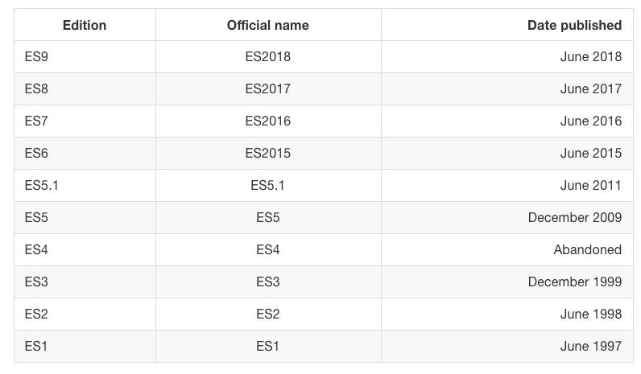

# JavaScript 手册

## 简介

JavaScript 是世界上最流行的编程语言之一，现在也广泛用于除了浏览器之外的其他地方。 比如 Node.js 在过去几年中的崛起，打破了后端开发语言领域 – 这曾经是 Java，Ruby，Python，PHP 和传统的服务器端语言的天下。

JavaScript 手册遵循 2/8 原则：在 20％ 的时间内学习 80％ 的 JavaScript。

本手册旨在让你了解有关 JavaScript 的所有知识！

### JavaScript 的基本定义

JavaScript 是一种编程语言，它是：

- **高级语言**：提供的抽象，允许您忽略运行它的机器的详细信息。它使用垃圾收集器自动管理内存，因此您可以专注于代码，而不是管理内存位置，并且提供了许多结构，允许您处理功能强大的变量和对象。
- **动态语言**：与静态编程语言相反，动态语言在运行时执行许多静态语言在编译时执行的操作。 这有利有弊，它为我们提供了强大的功能，如动态类型，后期绑定，反射，函数式编程，对象运行时更改，闭包等等。
- **动态类型**：变量不强制执行类型。 您可以将任何类型的值重新分配给变量，例如将整数分配给包含字符串的变量。
- **弱类型**：与强类型相反，弱（或松散）类型的语言不强制执行对象的类型。这允许更多的灵活性，但是又将类型安全和类型检查拒之门外。（这也正是 TypeScript 和 Flow 正在改进的地方）
- **解释型**：它通常被称为解释型语言，这意味着它在程序运行之前不需要编译阶段，这和 C ， Java 或 Go 语言不同。实际上，出于性能原因，浏览器在执行之前会编译 JavaScript ，但这对您来说是不可感知的，因为不涉及额外的步骤。
- **多范式**：该语言不强制执行任何特定的编程范例，不像 Java 那样强制使用面向对象编程，或者像 C 那样强制命令式编程。您可以使用面向对象的范例编写 JavaScript ，使用原型和新的（从 ES6 开始）类(classes)语法。您可以使用函数式编程风格编写 JavaScript ，使用其一等函数，甚至以命令式（C-like）编写。

### JavaScript 版本

每当您阅读 JavaScript 相关内容时，您将不可避免地看到以下一些术语：

```
ES3、ES5、ES6、ES7、ES8、
ES2015、ES2016、ES2017、ES2018、
ECMAScript 2015、ECMAScript 2016、ECMAScript 2017、ECMAScript 2018
```

啥意思？其实都指的是 ECMAScript 的标准。JavaScript 是 ECMAScript 标准的一种实现简称 ES 。

除 JavaScript 外，也有其他语言实现了 ECMAScript，包括：

- ActionScript （Flash 脚本语言），自 Flash 宣布将于 2020 年正式停止维护以来，它的人气正在下降。
- JScript（微软脚本语言），因为当时只有 Netscape 支持 JavaScript 并且浏览器大战达到顶峰，微软必须为 Internet Explorer 构建自己的脚本语言。

当然，JavaScript 仍是最流行和广泛使用的 ES 实现。

**为何用一个这么奇怪的名字？**

[Ecma International](/standard-specification/standard-organization/ecma) 是瑞士标准协会，负责制定国际标准。当 JavaScript 被创建时，它由 Netscape 和 Sun Microsystems 呈给 Ecma，Ecma 的标准很多会起个编号，正好编号到 262 号，就把基于 JavaScript 的标准编为 ECMA-262 ，别名 ECMAScript。

**为何版本号有时数字有时年份？**

在 ES2015 之前，ECMAScript 规范通常按其版本号命名。 如 ES5 其实是 2009 年更新发布的 ECMAScript 规范的官方名称。

从 2015 年起，[TC39](/standard-specification/standard-organization/tc39) 决定每年发布一个版本，以年号作为版本号，以避免在版本之间闲置太多，并且反馈循环更快。但社区仍习惯性将 ES2015 称为 ES6，类推 ES2016 为 ES7 等等



ES.Next 始终指向 JavaScript 的下一个版本。

### 最新版本

最新发布版本：[ECMA-262](http://www.ecma-international.org/ecma-262/)，ECMAScript 2018，2018 年 6 月发布。\
最新草稿版本：[tc39 ECMA-262](https://tc39.github.io/ecma262/)

## ES2015

### 简介

> ECMAScript 2015 是 2015 年 6 月被批准的 ECMAScript 标准

ES2015 是该语言的一次重大更新，自 2009 年被标准化的 ES5 以来的一次最主要更新。主要的 JavaScript 引擎也在实现这些特性。

查看[ES2015 标准](http://www.ecma-international.org/ecma-262/6.0/index.html)的所有规格

### ECMAScript 2015 特性

#### Arrows and Lexical This

箭头函数是使用 => 语法的简写函数，支持表达式和带函数体的写法，与普通函数不同的是，箭头函数与上下文共享同一个词法 this, 如果箭头函数在另一个函数里面那么它将共享它父级函数的“arguments”变量

```js
// Expression bodies
var odds = evens.map(v => v + 1)
var nums = evens.map((v, i) => v + i)

// Statement bodies
nums.forEach(v => {
	if (v % 5 === 0) fives.push(v)
})

// Lexical this
var bob = {
	_name: 'Bob',
	_friends: [1],
	printFriends() {
		this._friends.forEach(f =>
			console.log(this._name + ' knows ' + f, this === bob)
		)
	}
}
bob.printFriends() // returns: Bob knows 1 true

// Lexical arguments
function square() {
	let example = () => {
		let numbers = []
		for (let number of arguments) {
			numbers.push(number * number)
		}

		return numbers
	}

	return example()
}
square(2, 4, 7.5, 8, 11.5, 21) // returns: [4, 16, 56.25, 64, 132.25, 441]
```

#### Classes

ES2015 classes 只是一种基于原型的面向对象模式的语法糖，简单方便的声明形式使得类模式更易使用，也增加了互操作性。类支持基于原型的继承、super 调用、实例方法、静态方法和构造函数。

```js
class Person {
	constructor(name) {
		this.name = name
	}
	hello() {
		return 'Hello, I am ' + this.name + '.'
	}
}
class Actor extends Person {
	hello() {
		return super.hello() + ' I am an actor.'
	}
	static birth() {
		return new Person()
	}
	get fullName() {
		return `${this.firstName} ${this.lastName}`
	}
	set age(years) {
		this.theAge = years
	}
}
var tomCruise = new Actor('Tom Cruise')
tomCruise.hello()
```

#### Enhanced Object Literals

增强的对象字面量，支持构造时指定原型`__proto__`, 属性`handle: handle`赋值简写，方法定义及 super 调用，使用计算属性名。这些加起来使得字面量跟类声明更相近，基于对象的设计也从这种便利中获益。

```js
var obj = {
	// 1. Sets the prototype. "__proto__" or '__proto__' would also work.
	__proto__: theProtoObj,
	// Computed property name does not set prototype or trigger early error for
	// duplicate __proto__ properties.
	['__proto__']: somethingElse,
	// 2. Shorthand for ‘handler: handler’
	handler,
	// 3. Methods
	toString() {
		// 4. Super calls
		return 'd ' + super.toString()
	},
	// 5. Computed (dynamic) property names
	['prop_' + (() => 42)()]: 42
}
```

#### Template Strings

模板字符串提供了构建字符串的语法糖。这类似于 Perl、Python 和其他语言中的字符串插值特性。此外，作为可选项，使用标签可以自定义字符串的构建行为，避免注入攻击，或者基于字符串构建高阶的数据结构。

```js
// Basic literal string creation
const basic = `This is a pretty little template string.`

// Multiline strings
const multi = `In ES5 this is
 not legal.`

// Interpolate variable bindings
var name = 'Bob',
	time = 'today'
;`Hello ${name}, how are you ${time}?`

// Unescaped template strings
String.raw`In ES5 "\n" is a line-feed.`

// tag template

// Construct an HTTP request prefix is used to interpret the replacements and construction
tag`Hello ${a + b} world ${a * b}`
// the same as
tag(['Hello ', ' world ', ''], a + b, a * b)

GET`http://foo.org/bar?a=${a}&b=${b}
    Content-Type: application/json
    X-Credentials: ${credentials}
    { "foo": ${foo},
      "bar": ${bar}}`(myOnReadyStateChangeHandler)
```

#### Destructuring

解构允许使用模式匹配赋值，支持数组和对象。解构是会失败弱化的，类似对象查找过程 `foo['bar']`，如果未找到则置为 undefined 也可以指定默认值。

```js
// list matching
var [a, , b] = [1, 2, 3]
a === 1
b === 3

// object matching
var {
	op: a,
	lhs: { op: b },
	rhs: c
} = getASTNode()

// object matching shorthand
// binds `op`, `lhs` and `rhs` in scope
var { op, lhs, rhs } = getASTNode()

// Can be used in parameter position
function g({ name: x }) {
	console.log(x)
}
g({ name: 5 })

// Fail-soft destructuring
var [a] = []
a === undefined

// Fail-soft destructuring with defaults
var [a = 1] = []
a === 1

// Destructuring + defaults arguments
function r({ x, y, w = 10, h = 10 }) {
	return x + y + w + h
}
r({ x: 1, y: 2 }) === 23
```

#### Default + Rest + Spread

被调函数支持设置参数默认值，`...` 运算符可以将数组展开成连续的参数给函数调用，`...` 在定义函数时也可以将剩余的参数收集成一个数组，剩余参数 Rest 代替了`arguments`的使用，更直接的解决常见问题。

```js
// Default
function f(x, y = 12) {
	// y is 12 if not passed (or passed as undefined)
	return x + y
}
f(3) == 15

// Rest
function f(x, ...y) {
	// y is an Array
	return x * y.length
}
f(3, 'hello', true) == 6

// Spread
function f(x, y, z) {
	return x + y + z
}
// Pass each elem of array as argument
f(...[1, 2, 3]) == 6
```

#### Let + Const

let 和 const 都是绑定构造的块级作用域。let 是新的 var。const 是单次赋值的。const 的静态限制禁止变量在赋值前使用。

```js
function f() {
	{
		let x
		{
			// this is ok since it's a block scoped name
			const x = 'sneaky'
			// error, was just defined with `const` above
			x = 'foo'
		}
		// this is ok since it was declared with `let`
		x = 'bar'
		// error, already declared above in this block
		let x = 'inner'
	}
}
```
