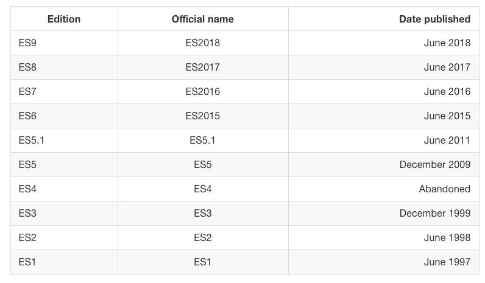

# JavaScript 手册

参考

- [the-complete-javascript-handbook](https://medium.freecodecamp.org/the-complete-javascript-handbook-f26b2c71719c) [[中文 1]](https://www.css88.com/archives/9922) [[中文 2]](https://juejin.im/post/5bff57fee51d45021a167991)
- [Learn ES2015](https://babeljs.io/docs/en/learn) [[中文 1]](https://github.com/fengzilong/es6features-zhCN) [[中文 2]](http://caibaojian.com/es6.html)
- [here-are-examples-of-everything-new-in-ecmascript-2016-2017-and-2018](https://medium.freecodecamp.org/here-are-examples-of-everything-new-in-ecmascript-2016-2017-and-2018-d52fa3b5a70e)

## 简介

JavaScript 是世界上最流行的编程语言之一，现在也广泛用于除了浏览器之外的其他地方。 比如 Node.js 在过去几年中的崛起，打破了后端开发语言领域 – 这曾经是 Java，Ruby，Python，PHP 和传统的服务器端语言的天下。

JavaScript 手册遵循 2/8 原则：在 20％ 的时间内学习 80％ 的 JavaScript。

本手册旨在让你了解有关 JavaScript 的所有知识！

### JavaScript 的基本定义

JavaScript 是一种编程语言，它是：

- **高级语言**：提供的抽象，允许您忽略运行它的机器的详细信息。它使用垃圾收集器自动管理内存，因此您可以专注于代码，而不是管理内存位置，并且提供了许多结构，允许您处理功能强大的变量和对象。
- **动态语言**：与静态编程语言相反，动态语言在运行时执行许多静态语言在编译时执行的操作。 这有利有弊，它为我们提供了强大的功能，如动态类型，后期绑定，反射，函数式编程，对象运行时更改，闭包等等。
- **动态类型**：变量不强制执行类型。 您可以将任何类型的值重新分配给变量，例如将整数分配给包含字符串的变量。
- **弱类型**：与强类型相反，弱（或松散）类型的语言不强制执行对象的类型。这允许更多的灵活性，但是又将类型安全和类型检查拒之门外。（这也正是 TypeScript 和 Flow 正在改进的地方）
- **解释型**：它通常被称为解释型语言，这意味着它在程序运行之前不需要编译阶段，这和 C ， Java 或 Go 语言不同。实际上，出于性能原因，浏览器在执行之前会编译 JavaScript ，但这对您来说是不可感知的，因为不涉及额外的步骤。
- **多范式**：该语言不强制执行任何特定的编程范例，不像 Java 那样强制使用面向对象编程，或者像 C 那样强制命令式编程。您可以使用面向对象的范例编写 JavaScript ，使用原型和新的（从 ES6 开始）类(classes)语法。您可以使用函数式编程风格编写 JavaScript ，使用其一等函数，甚至以命令式（C-like）编写。

### JavaScript 版本

每当您阅读 JavaScript 相关内容时，您将不可避免地看到以下一些术语：

```
ES3、ES5、ES6、ES7、ES8、
ES2015、ES2016、ES2017、ES2018、
ECMAScript 2015、ECMAScript 2016、ECMAScript 2017、ECMAScript 2018
```

啥意思？其实都指的是 ECMAScript 的标准。JavaScript 是 ECMAScript 标准的一种实现简称 ES 。

除 JavaScript 外，也有其他语言实现了 ECMAScript，包括：

- ActionScript （Flash 脚本语言），自 Flash 宣布将于 2020 年正式停止维护以来，它的人气正在下降。
- JScript（微软脚本语言），因为当时只有 Netscape 支持 JavaScript 并且浏览器大战达到顶峰，微软必须为 Internet Explorer 构建自己的脚本语言。

当然，JavaScript 仍是最流行和广泛使用的 ES 实现。

**为何用一个这么奇怪的名字？**

[Ecma International](/standard-specification/standard-organization/ecma) 是瑞士标准协会，负责制定国际标准。当 JavaScript 被创建时，它由 Netscape 和 Sun Microsystems 呈给 Ecma，Ecma 的标准很多会起个编号，正好编号到 262 号，就把基于 JavaScript 的标准编为 ECMA-262 ，别名 ECMAScript。

**为何版本号有时数字有时年份？**

在 ES2015 之前，ECMAScript 规范通常按其版本号命名。 如 ES5 其实是 2009 年更新发布的 ECMAScript 规范的官方名称。

从 2015 年起，[TC39](/standard-specification/standard-organization/tc39) 决定每年发布一个版本，以年号作为版本号，以避免在版本之间闲置太多，并且反馈循环更快。但社区仍习惯性将 ES2015 称为 ES6，类推 ES2016 为 ES7 等等



ES.Next 始终指向 JavaScript 的下一个版本。

### 最新版本

最新发布版本：[ECMA-262](http://www.ecma-international.org/ecma-262/)，ECMAScript 2018，2018 年 6 月发布。\
最新草稿版本：[tc39 ECMA-262](https://tc39.github.io/ecma262/)

## 词法结构

### Unicode

JavaScript 是用 Unicode 编写的。 这意味着您可以用任何语言编写标识符。注意：emoji 不可以。

```js
// How convenient!
var π = Math.PI
var λ = function() {}
var ಠ_ಠ = eval
var lolwat = 'heh'
var foo‌bar = 42
var 〱〱 = 2
〱〱 << 〱〱 // 8
var 哈 = 1
// Fun with Roman numerals
var Ⅳ = 4
var Ⅴ = 5
Ⅳ + Ⅴ // 9
var 😃 = 1 // 会报错 Uncaught SyntaxError: Invalid or unexpected token
```

### 分号

JavaScript 具有非常类似于 C 的语法，但是分号并不是强制的，新设计的语言里可选分号的很多，光是 “可以加分号但是大家都不加” 的语言就有：Go, Scala, Ruby, Python, Swift, Groovy 等等，所以加不加分号纯看个人喜好。

真正会导致上下文解析出问题的 token 有 5 个：括号，方括号，正则开头的斜杠，加号，减号。当以这些开头时需要加分号，而这种情况很少见，即使出现 linter 也会检查出来。还有就是规避 return 换行问题。

所以现在很多开源库代码都不写无意义的分号。

### 空格

JavaScript 不认为空格有意义。多余的空格也会被格式化、压缩工具等剔掉，空格只不过可以保持代码的可读性，比如两个空格缩进。

### 大小写敏感

JavaScript 是大小写敏感的。变量 `name` 和 `Name` 是不一样的。

### 注释

两种注释形式

```js
/* 多行注释 */
// 单行注释
```

### 字面量和标识符

**字面量**：我们将源代码中编写的值称为字面量，例如数字，字符串，布尔或更高级的构造，如 对象字面量 或 数组字面量：

```js
5
'Test'
true
['a', 'b']
{color: 'red', shape: 'Rectangle'}
```

**标识符**：用于标识变量，函数，对象的字符序列，只能包含字母或数字或下划线（“\_”）和美元符号（“\$”），且不能以数字开头。区分大小写。

```js
test
TEST
_test
Test1
$test
```

### 保留字

你不能使用下列标识符，因为他们是语言保留字。

```js
break
do
instanceof
typeof
case
else
new
var
catch
finally
return
void
continue
for
switch
while
debugger
function
this
with
default
if
throw
delete
in
try
class
enum
extends
super
const
export
import
implements
let
private
public
interface
package
protected
static
yield
```

## 变量常量

变量是分配给标识符的一个可变化的量，因此在稍后的程序中可以使用和修改它。JavaScript 中变量不会附加任何类型，可以赋值任何类型值而不会报错，这就是 JavaScript 被称为“弱类型”的原因。

### var

在 ES2015 前`var`是唯一可用于定义变量的构造。

```js
var a = 0
```

如果您忘记添加 `var` ，在现代环境中，启用严格模式后，您将收到错误。 在较旧的环境中（或禁用严格模式），这将简单地初始化变量并将其分配给全局(global)对象，在浏览器中，全局对象是 `window`，在 Node.js 中，全局对象是 `global` 。

```js
// 声明时没有初始化默认值为 undefined
var a //typeof a === 'undefined'

// 可以重复声明覆盖
var a = 1
var a = 2

// 一次声明多个
var a = 1,
  b = 2
```

作用域可控制变量的可见性。ES2015 前只有函数作用域，如果在任何函数外声明的变量将分配给全局对象在全局作用域里可见，如果在函数内声明那么只在函数作用域内可见。即使在函数末尾声明，然后可以在开始引用，因为 JavaScript 在执行代码之前实际上将所有变量都移到了顶层（被称为 hoisting(提升) ）。为避免混淆，请始终在函数开头声明变量。

### let

`let` 是 ES2015 中引入的新功能，它本质上是 `var` 的块作用域版本。 它的作用域仅限于定义它的 block(块)（由一对花括号标识），现代 JavaScript 开发人员可能会选择仅使用 `let` 并完全放弃使用 `var。`

`let` 可以在任何函数之外定义 – 与 `var` 相反 – `let` 不会创建全局变量。

### const

用 `var` 或 `let` 声明的变量可以更改重新分配。 而 const，其值永远不可修改，只在声明时初始化一次，并且必须初始化。

```js
const a = 1;
const b; // Uncaught SyntaxError: Missing initializer in const declaration
```

`const` 不提供不可变性（immutability），只是确保不能更改其本身的引用，其内容如对象数组仍可以修改。

`const` 和 `let` 具有相同的块作用域。
