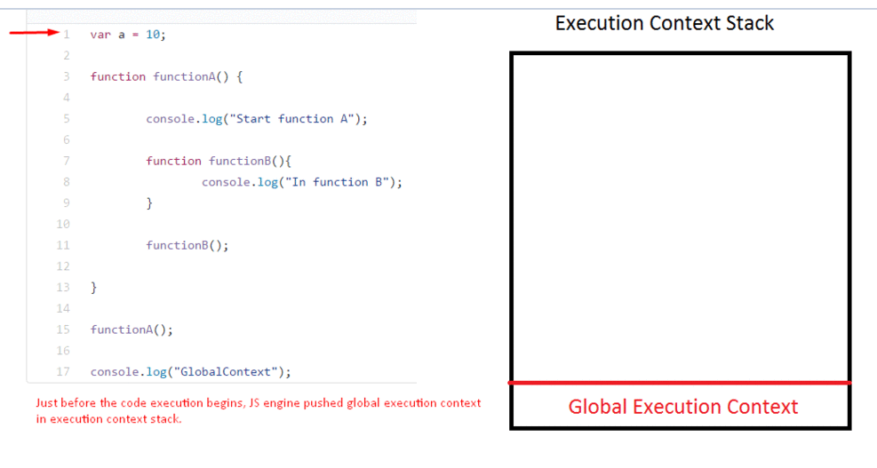

# 执行上下文、作用域链与提升

<details>
<summary>参考</summary>

- [Execution context, Scope chain and JavaScript internals](https://medium.com/@happymishra66/execution-context-in-javascript-319dd72e8e2c)
- [ES6 变量作用域与提升：变量的生命周期详解](https://zhuanlan.zhihu.com/p/28494566)
- [JavaScript 中的执行上下文和调用栈是什么？](https://zcfy.cc/article/what-is-the-execution-context-amp-stack-in-javascript-by-david-shariff-4007.html)

</details>

## 执行上下文 Execution context (EC)

执行上下文就是指js执行环境，圈定了特定时间里可以访问的this、变量、对象、函数。共分三种类型


1. 全局执行上下文 Global execution context (GEC)
2. 函数执行上下文 Functional execution context (FEC)
3. Eval

## 执行栈 Execution context stack (ECS)

执行栈一种栈数据结构，用来存放js执行过程中的执行上下文，首先栈底部是全局执行上下文，当执行全局代码时遇到函数调用，会将函数执行上下文压入栈，执行完函数代码则弹出栈顶，继续执行剩余代码

```js
var a = 10;
function functionA() {
	console.log("Start function A");
	function functionB(){
		console.log("In function B");
	}
	functionB();
}
functionA();
console.log("GlobalContext");
```



## 执行上下文创建过程

分两步骤

1. 创建阶段 Creation phase
2. 执行阶段 Execution phase

### 创建阶段 Creation phase

执行上行文在创建阶段时，js引擎已经调用了函数，但是函数执行并未开始，引擎需要先编译分析代码，主要有两个任务：

1. 创建 Activation object（AO） or the Variable object（VO）

VO 是个特殊的js对象包含了变量、函数参数、内部函数声明信息，没有`__proto__`属性

这里AO是个统一概念，在全局上下文里 AO 就是 Global object 不会像函数里额外创建个VO，在函数上下文里 AO 就是 VO，因为全局上下文不像函数没有arguments

2. 创建 scope chain

一旦 AO 创建完，js引擎就开始初始化 scope chain，scope chain 是个链表指向所有当前函数可访问的AO，也包括当前函数VO

3. 决定this值

创建完 scope chain 之后js引擎开始初始化 this 值

看个例子

```js
function funA (a, b) {
  var c = 3;
  console.log(d) // f d(){...}
  var d = 4
  function d() {
    return a - b;
  }
  console.log(d) // 4
}


funA(1, 2);
```

funA 的执行上下文在创建阶段

```js
executionContextObj = {
  variableObject: {
    argumentObject : {
      0: a,
      1: b,
      length: 2
    },
    d: -> f d(){...} // 函数体存在heap中这里有个引用，并且函数提升优先级更高
    a: 1,
    b: 2,
    c: undefined,
  },
  scopechain: [funA vo -> global vo],
  this
}
```

### 执行阶段 Execution phase

在执行阶段，js引擎会再次扫描代码更新VO，执行代码，如果当前函数上下文找不到的变量，会通过 scope chain 继续向上查找，如果没有找到严格模式下抛出异常`ReferenceError xx is not defined`

funA 执行阶段

```js
executionContextObj = {
  variableObject: {
    argumentObject : {
      0: a,
      1: b,
      length: 2
    },
    d: 4, // 这里函数引用会被赋值覆盖
    a: 1,
    b: 2,
    c: 3,
  },
  scopechain: [funA vo -> global vo],
  this
}
```

## 作用域 Scope

**作用域**即代码执行过程中的变量、函数或者对象的可访问区域，指定了在何处以及如何查找变量的规则。JavaScript 中采用了词法作用域规则，即根据写代码时将变量和块写在哪里来决定作用域。


如图引擎在词法分析时根据函数声明`(){...}`就可以区分出三个作用域（气泡），这些逐级嵌套的作用域就形成了 **作用域链**。

① 全局作用域，只有一个标识符：foo。<br>
② foo 所创建的作用域，包含了：a、b、bar。<br>
③ bar 所创建的作用域，只有一个标识符：c。<br>

引擎在查找变量时就会从运行的最内部作用域开始，逐级向上查找，直到遇到第一个匹配的标识符为止，否则抛一个 ReferenceError 异常。

作用域有三种：

- 全局作用域
- 函数作用域
- 块级作用域

作用域与上下文相比更关注变量的访问。而上下文更关注数据结构的组织以及this的使用。

## 提升 Hoisting

无论作用域中的声明出现在什么地方，在代码本身被执行前都会进行预处理。可以将这个过程形象地想象成所有的声明（变量和函数）都会被“移动”到各自作用域的最顶端，这个过程被称为 **提升**。

1. 函数的提升优先级比变量高，会提升到变量之前
2. 函数的提升会将整个函数体一起提升
3. 变量重复声明会被忽略，赋值还留在原处等待运行，函数的重复声明会被覆盖

```js
function foo() {
  bar() // 4 undefined

  var a = 1
  function bar() {
    console.log(3, a)
  }

  var a = 2
  function bar() {
    console.log(4, a)
  }
}
```

等价于

```js
function foo() {
  function bar() {
    console.log(4, a)
  }
  var a

  bar() // 4 undefined

  a = 1
  a = 2
}
```

ES6 中以 let 与 const 关键字声明的变量同样会在作用域头部被初始化，不过这些变量仅允许在实际声明之后使用。在作用域头部与变量实际声明处之间的区域就称为所谓的暂时死域（Temporal Dead Zone），TDZ 能够避免传统的提升引发的潜在问题。

### 变量生命周期


可以看到

1. var 声明 初始化是一起的，头部访问即已经是初始化过的状态
2. let 先声明，头部访问抛异常，等到了声明语句处才进行初始化
3. function 是声明 初始化 赋值都是一起的，头部可直接调用
