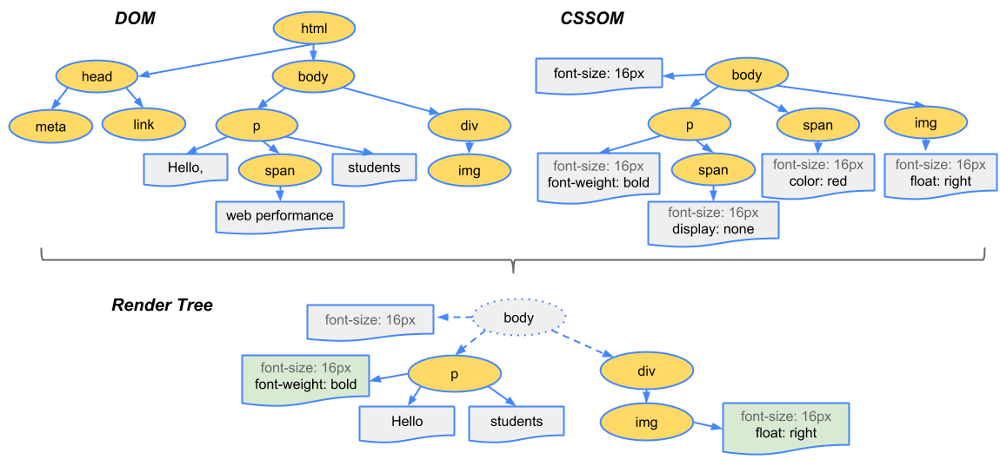

# 浏览器是如何工作的

参考：
- [how browsers work](https://www.html5rocks.com/zh/tutorials/internals/howbrowserswork)
- [认识 V8 引擎](https://zhuanlan.zhihu.com/p/27628685)
- [理解关键渲染路径](https://wufenfen.github.io/2017/03/13/%E3%80%90%E8%AF%91%E3%80%91%E7%90%86%E8%A7%A3%E5%85%B3%E9%94%AE%E6%B8%B2%E6%9F%93%E8%B7%AF%E5%BE%84/)
- [critical-rendering-path](https://developers.google.com/web/fundamentals/performance/critical-rendering-path/)
- [DOM操作成本到底高在哪儿？](https://juejin.im/post/5c1069a16fb9a049e0632fb6)
- [无线性能优化：Composite](http://taobaofed.org/blog/2016/04/25/performance-composite/)
- [详谈层合成（composite）](https://juejin.im/entry/59dc9aedf265da43200232f9)

## 浏览器结构

浏览器主要有下面几个部分：

1. **The user interface（用户界面）**：包括地址栏、前进/后退按钮、书签菜单等。除了浏览器主窗口显示的您请求的页面外，其他显示的各个部分都属于用户界面。
2. **The browser engine（浏览器引擎）**；在用户界面和渲染引擎之间传送指令。
3. **The rendering engine（渲染引擎）**： 负责显示请求的内容。如果请求的内容是 HTML，它就负责解析 HTML 和 CSS 内容，并将解析后的内容显示在屏幕上。
4. **Networking（网络）**：用于网络调用，比如 HTTP 请求。其接口与平台无关，并为所有平台提供底层实现。
5. **UI backend（用户界面后端）**：用于绘制基本的窗口小部件，比如组合框和窗口。其公开了与平台无关的通用接口，而在底层使用操作系统的用户界面方法。
6. **JavaScript interpreter（JavaScript 解释器）**：用于解析和执行 JavaScript 代码。
7. **Data storage（数据存储）**：这是持久层。浏览器需要在硬盘上保存各种数据，例如 Cookie。浏览器也支持存储机制如 localStorage, IndexedDB, WebSQL 和 FileSystem。


Chrome 浏览器的每个标签页都分别对应一个渲染引擎实例。每个标签页都是一个独立的进程。

## 网络

当从用户界面上输入URL之后首先会经过网络层去获取文档内容

要点如下：

- 浏览器根据 DNS 服务器得到域名的 IP 地址；
- 向这个 IP 的机器发送 HTTP 请求；
- 服务器收到、处理并返回 HTTP 请求；
- 浏览器得到返回内容。

## 渲染引擎

渲染引擎的主要作用是将资源文件转化为用户可见的结果，能够将HTML/CSS/JavaScript文本及相应的资源文件转换成图像结果。

下面是WebKit的大致结构：


图中实线框 `WebCore` 是各个浏览器使用的共享部分，包括HTML解析器、CSS解析器、DOM和SVG等。JavaScriptCore是WebKit的默认引擎，在谷歌系列产品中被替换为V8引擎。虚线框是WebKit中的非共享部分,不同的厂商可以自己实现。

渲染引擎拿到网络资源后会经过下列渲染步骤

1. 解析HTML，构建 DOM 树
2. 解析CSS，生成 CSSOM 规则树
3. 过程中会遇到脚本执行而阻塞DOM建立以及修改CSS规则
4. 合并 DOM 树和 CSSOM 规则树，生成render树
5. 布局render树（Layout/reflow），负责各元素尺寸、位置的几何计算，为每个节点分配一个应出现在屏幕上的确切坐标。
6. 绘制render树（paint），由UI backend绘制页面像素信息
7. 浏览器会将各层的信息发送给GPU，GPU会将各层合成（composite），显示在屏幕上


需要着重指出的是，这是一个渐进的过程。为达到更好的用户体验，渲染引擎会力求尽快将内容显示在屏幕上。它不必等到整个 HTML 文档解析完，就会开始构建呈现树和设置布局。在不断接收和处理来自网络的其余内容的同时，渲染引擎会流式的将部分内容解析并显示出来。

### 构建DOM树

HTML 属于非与上下文无关的语法，所以常规解析器都不适用于 HTML。原因在于：

1. 语言的宽容本质。
2. 浏览器历来对一些常见的无效 HTML 用法采取包容态度。
3. 解析过程需要不断地反复。源内容在解析过程中通常不会改变，但是在 HTML 中，脚本标记如果包含 document.write，就会添加额外的标记，这样解析过程实际上就更改了输入内容。

由于不能使用常规的解析技术，浏览器就创建了自定义的解析器来解析 HTML。[HTML5 规范详细地描述了解析算法](http://www.whatwg.org/specs/web-apps/current-work/multipage/parsing.html)，主要分两个阶段组成：标记化和树构建，最终生成DOM树。

DOM（Document Object Model文档对象模型）树是 HTML 文档的对象表示，是由 DOM 元素和属性节点构成的树结构。解析树的根节点是“Document”对象。

无论是DOM还是CSSOM，都是要经过`Bytes → characters → tokens → nodes → object model`这个标记化的词法解析过程。举例：

```html
<!DOCTYPE html>
<html>
  <head>
    <meta name="viewport" content="width=device-width,initial-scale=1">
    <link href="style.css" rel="stylesheet">
    <title>Critical Path</title>
  </head>
  <body>
    <p>Hello <span>web performance</span> students!</p>
    <div></div>
  </body>
</html>
```

词法解析建立DOM树


列举其中的一些重点过程：
1. Conversion转换：浏览器将获得的HTML内容（Bytes）基于他的编码转换为单个字符
2. Tokenizing分词：浏览器按照HTML规范标准将这些字符转换为不同的标记token。每个token都有自己独特的含义以及规则集
3. Lexing词法分析：分词的结果是得到一堆的token，此时把他们转换为对象，这些对象分别定义他们的属性和规则
4. DOM构建：因为HTML标记定义的就是不同标签之间的关系，这个关系就像是一个树形结构一样。

HTML可以部分执行并显示，也就是说，浏览器并不需要等待整个HTML全部解析完毕才开始显示页面。但是，其他的资源有可能阻塞页面的渲染，比如CSS，JavaScript等。

### 构建CSSOM树

CSSOM（CSS对象模型）树是对附在DOM结构上的样式的一种表示方式。它与DOM树的呈现方式相似，只是每个节点都带上样式 ，包括明确定义的和隐式继承的。

在文档的 head 部分遇到了一个 link 标记，该标记引用一个外部 CSS 样式表：style.css，如下

```css
body { font-size: 16px }
p { font-weight: bold }
span { color: red }
p span { display: none }
img { float: right }
```

词法解析


会生成以下的CSSOM树


**CSS是一种渲染阻塞资源(render blocking resource)**，它需要完全被解析完毕之后才能进入生成渲染树的环节。CSS并不像HTML那样能执行部分并显示，因为CSS具有继承属性， 后面定义的样式会覆盖或者修改前面的样式。所以，我们只能等待CSS完全解析之后，才能进入关键渲染路径的下一环节。

因为JavaScript脚本的执行必须等到CSSOM生成之后，所以说CSS也会**阻塞脚本(script blocking)**。

### 执行JavaScript

JavaScript是一种解析**阻塞资源(parser blocking resource)**，它能阻塞HTML页面的解析。

当页面解析到`<script>`标签，不管脚本是內联的还是外联，页面解析都会暂停，转而加载JavaScript文件（外联的话）并且执行JavaScript。

为了避免JavaScript文件下载阻塞页面的解析，我们可以在`<script>`标签上添加async或者defer属性，使得JavaScript文件异步加载。(下载并行，但执行仍会阻塞)

```html
<script async src="script.js"> <!-- 异步下载完立即执行，但下载时间不定所有一定onload之前，不确定DOMContentLoaded前后 -->
<script defer src="script.js"> <!-- 异步下载, DOM、CSSOM构建之后，DOMContentLoaded事件之前，再执行 -->
```

JavaScript引擎的执行过程大致是：

源代码 → 抽象语法树 → 字节码 → JIT → 本地代码(V8引擎没有中间字节码)。一段代码的抽象语法树示例如下

```js
function demo(name) {
    console.log(name);
}
```

```json
{
  "type": "Program",
  "start": 0,
  "end": 46,
  "body": [
    {
      "type": "FunctionDeclaration",
      "start": 0,
      "end": 46,
      "id": { "type": "Identifier", "start": 9, "end": 13, "name": "demo" },
      "expression": false,
      "generator": false,
      "params": [{ "type": "Identifier", "start": 14, "end": 18, "name": "name" }],
      "body": {
        "type": "BlockStatement",
        "start": 20,
        "end": 46,
        "body": [
          {
            "type": "ExpressionStatement",
            "start": 26,
            "end": 44,
            "expression": {
              "type": "CallExpression",
              "start": 26,
              "end": 43,
              "callee": {
                "type": "MemberExpression",
                "start": 26,
                "end": 37,
                "object": { "type": "Identifier", "start": 26, "end": 33, "name": "console" },
                "property": { "type": "Identifier", "start": 34, "end": 37, "name": "log" },
                "computed": false
              },
              "arguments": [{ "type": "Identifier", "start": 38, "end": 42, "name": "name" }]
            }
          }
        ]
      }
    }
  ],
  "sourceType": "module"
}
```


### 生成渲染树

DOM 树与 CSSOM 树合并后形成渲染树，包含网页上所有`可见的` DOM 内容，以及每个节点的所有 CSSOM 样式信息。



- 某些节点不可见（例如 head 部分、 脚本标记等），因为它们不会体现在渲染输出中，所以会被忽略
- 某些节点通过 CSS 隐藏，设置了“display: none”属性，因此在渲染树中也会被忽略

### 布局

布局决定了视口的大小，为CSS样式提供了依据，比如百分比的换算或者视口的总像素值。视口大小是由meta标签的name属性为viewport的内容设置所决定的，如果缺少这个标签，默认的视口大小为980px。

最常见的viewport设置是自适应于设备尺寸，设置如下：

```html
<meta name="viewport" content="width=device-width,initial-scale=1">
```

为弄清每个对象在网页上的确切大小和位置，浏览器从渲染树的根节点开始进行遍历。让我们考虑下面这样一个简单的实例：

```html
<!DOCTYPE html>
<html>
  <head>
    <meta name="viewport" content="width=device-width,initial-scale=1">
    <title>Critial Path: Hello world!</title>
  </head>
  <body>
    <div style="width: 50%">
      <div style="width: 50%">Hello world!</div>
    </div>
  </body>
</html>
```

以上网页的正文包含两个嵌套 div：第一个（父）div 将节点的显示尺寸设置为视口宽度的 50%，第二个嵌套 div 将其宽度设置为其父项的 50%，即视口宽度的 25%。


布局流程的输出是一个**“盒模型”**，它会精确地捕获每个元素在视口内的确切位置和尺寸：所有相对测量值都转换为屏幕上的绝对像素。

### 绘制

至此我们知道了哪些节点可见、它们的计算样式以及几何信息，我们就可以将渲染树中的每个节点通过GPU转换成屏幕上的实际像素，叫做paint绘制。

绘制过程所需要花费的时间取决于DOM的大小以及元素的CSS样式。有些样式比较耗时，比如一个复杂的渐变背景色比起简单的单色背景需要更多的时间来渲染。

### 合成

上述中的渲染中止步于绘制，但实际上绘制这一步也没有这么简单，它可以结合渲染层和合成层的概念来讲。

通俗来说：在 DOM 树中每个节点都会对应一个 LayoutObject，当他们的 LayoutObject 处于相同的坐标空间时，就会形成一个 RenderLayers ，也就是渲染层。
RenderLayers 来保证页面元素以正确的顺序合成，这时候就会出现层合成（composite），从而正确处理透明元素和重叠元素的显示。


- 可以认为默认只有一个渲染图层，所有的DOM节点都是在这个渲染图层下的
- 如果开启了硬件加速功能，可以将某个节点变成合成层
- 合成层之间的绘制互不干扰，由GPU直接控制
- 而普通渲染图层中，就算是absolute等布局，变化时不影响整体的回流，但是由于在同一个图层中，仍然是会影响绘制的，因此做动画时性能仍然很低。而合成层是独立的，所以一般做动画推荐使用硬件加速

那么影响 composite 的因素有哪些？

1. 3D transforms: translate3d, translateZ 等;
2. video, canvas, iframe 等元素;
3. 通过 Element.animate() 实现的 opacity 动画转换;
4. 通过 СSS 动画实现的 opacity 动画转换;
5. position: fixed;
6. will-change;
7. filter;
8. 有合成层后代同时本身 overflow 不为 visible（如果本身是因为明确的定位因素产生的 SelfPaintingLayer，则需要 z-index 不为 auto）
等等…

### reflow和repaint

reflow(回流): 根据Render Tree布局(几何属性)，意味着元素的内容、结构、位置或尺寸发生了变化，需要重新计算样式和渲染树；

repaint(重绘): 意味着元素发生的改变只影响了节点的一些样式（背景色，边框颜色，文字颜色等），只需要应用新样式绘制这个元素就可以了；

reflow回流的成本开销要高于repaint重绘，一个节点的回流往往回导致子节点以及同级节点的回流；

#### 引起reflow回流

现代浏览器会对回流做优化，它会等到足够数量的变化发生，再做一次批处理回流。

1. 页面第一次渲染（初始化）
2. DOM树变化（如：增删节点）
3. Render树变化（如：padding改变）
4. 浏览器窗口resize
5. 获取元素的某些属性：
6. 浏览器为了获得正确的值也会提前触发回流，这样就使得浏览器的优化失效了，这些属性包括offsetLeft、offsetTop、offsetWidth、offsetHeight、 scrollTop/Left/Width/Height、clientTop/Left/Width/Height、调用了getComputedStyle()或者IE的currentStyle

#### 引起repaint重绘

1. reflow回流必定引起repaint重绘，重绘可以单独触发
2. 背景色、颜色、字体改变（注意：字体大小发生变化时，会触发回流）

#### 优化reflow、repaint触发次数

1. 避免逐个修改节点样式，尽量一次性修改
2. 使用DocumentFragment将需要多次修改的DOM元素缓存，最后一次性append到真实DOM中渲染
3. 可以将需要多次修改的DOM元素设置display: none，操作完再显示。（因为隐藏元素不在render树内，因此修改隐藏元素不会触发回流重绘）
4. 避免多次读取某些属性（见上）
5. 将复杂的节点元素脱离文档流，降低回流成本

整个过程通过查看Chrome DevTools -> Performance -> Event log选项，我们可以看到如下结果：


