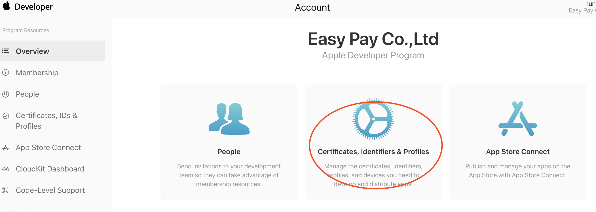
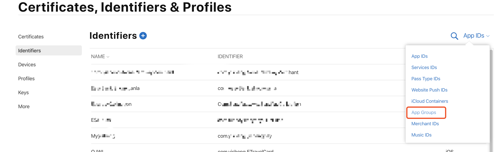
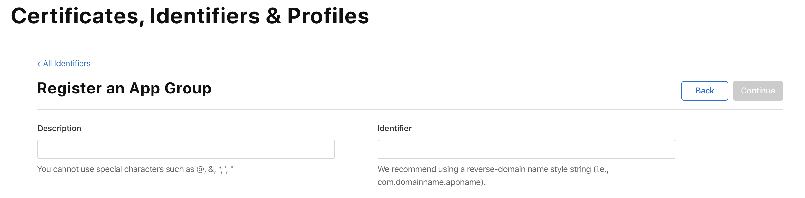
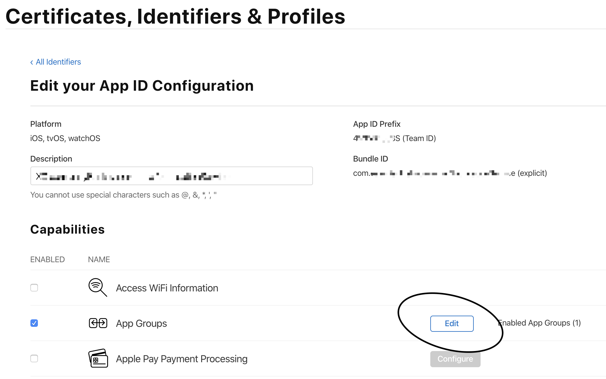
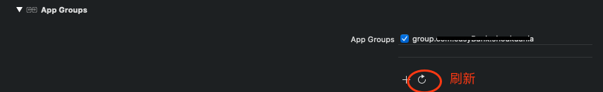

# App Group 跨 App、扩展服务共享数据

<details>
<summary>引用参考 - 2019年10月10日</summary>

- [App Group---APP 之间数据共享](https://www.jianshu.com/p/4b5a7b661aa5)
- [App Groups 简单使用](https://www.jianshu.com/p/f9c2a435a483)

</details>

## Why

需求

1. 公司两个 app，一个 app 登录之后，另一个 app 可以免登录
2. 同一个 app 使用通知扩展服务（Notification Service Extension），当 app 处于后台或被杀死之后，依然可以拿到 app 的共享数据（本文初衷就是为了拿到 app 的极光 regid）

## What

iOS8 之后添加了 App Groups，应用可以通过 App Groups 共享数据，原文如下：

> AppGroup allows data sharing between two different apps or even app and widgets by creating one common shared path (like document directory). Data saved over there can be accessed by any app which is associated with that particular AppGroup. It is an offline data sharing between apps.

## How

### 一、创建一个 Group Id

登录 Apple 开发者平台 https://developer.apple.com/




Identifiers + -> Register a New Identifier -> App Groups -> continue



这里一共有两个选项，第一个是我们这个 app group 的描述，第二个是我们 app group 的 id。这个 id 默认是要 group.打头，并且是不能去掉的。

### 二、关联 Group 配置

现在在 Identifiers App IDs 下找到需要关联的 app id，编辑 App Groups 选上刚才新建的 groud id



在 xcode 中找到 TARGETS -> Capabilities -> App Groups 选择 Group Id



## Usage

1. File 方式

```objectivec
//Main App 通过TextField来向共享文件appGroup.txt中写入数据
- (void)textFieldDidEndEditing:(UITextField *)textField {
    //获取App Group的共享目录
    NSURL *groupURL = [[NSFileManager defaultManager] containerURLForSecurityApplicationGroupIdentifier:@"group.com.simon.app.test"];
    NSURL *fileURL = [groupURL URLByAppendingPathComponent:@"appGroup.txt"];

    //写入文件
    [textField.text writeToURL:fileURL atomically:YES encoding:NSUTF8StringEncoding error:nil];
}

//Sub App 通过获取appGroup.txt中的数据，展现在label上

//获取App Group的共享目录
NSURL *groupURL = [[NSFileManager defaultManager] containerURLForSecurityApplicationGroupIdentifier:@"group.com.simon.app.test"];
NSURL *fileURL = [groupURL URLByAppendingPathComponent:@"appGroup.txt"];

//读取文件
NSString *str = [NSString stringWithContentsOfURL:fileURL encoding:NSUTF8StringEncoding error:nil];
self.shareLabel.text = str;
```

2. NSUserDefaults 方式

```objectivec
//初始化一个供App Groups使用的NSUserDefaults对象
NSUserDefaults *userDefaults = [[NSUserDefaults alloc] initWithSuiteName:@"group.company.appGroupName"];

//写入数据
[userDefaults setValue:@"value" forKey:@"key"];

//读取数据
NSLog(@"%@", [userDefaults valueForKey:@"key"]);
```
