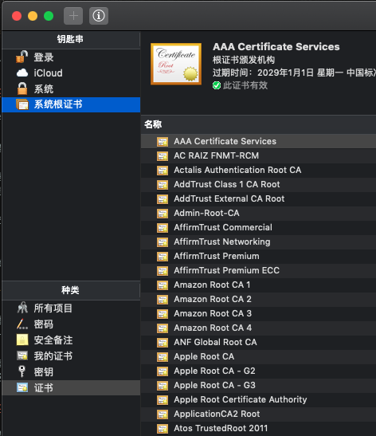
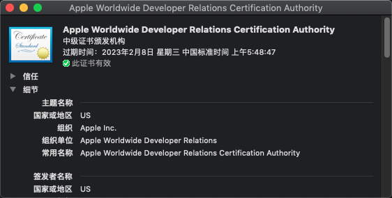
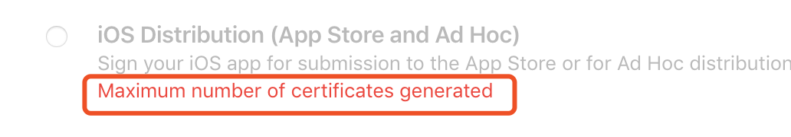
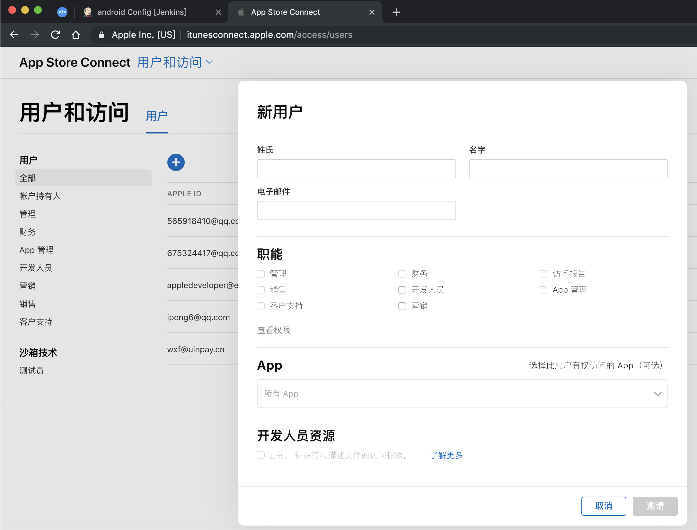

# 苹果账号证书

参考 - 2019年09月25日

- [深度长文：细说iOS代码签名](http://xelz.info/blog/2019/01/11/ios-code-signature/)
- [iOS证书签名原理分析](https://www.jianshu.com/p/fc56a70ee4fb)
- [iOS app签名证书和签名原理](https://zhuanlan.zhihu.com/p/53006952)

## 账户类型

目前，苹果开发者账号主要可分为三种类型：个人、公司、企业，且三者的费用以及权限等不尽相同。都需要创建 Apple ID 启用 [双重认证](https://support.apple.com/zh-cn/HT204915)。

1. 个人账号(Individual)

  (1) 费用：99 美元/年 
  (2) 协作人数：1, 仅限开发者自己 
  (3) 不需要填写公司的邓百氏编码（ D-U-N-S Number） 
  (4) 发布 App Store：允许 
  (5) 最大uuid支持数：100

1. 公司账号(Organization)

  (1) 费用：99 美元/年 
  (2) 协作人数：n, 允许多个开发者协作开发 
  (3) 需要填写公司的邓百氏编码（ D-U-N-S Number） 
  (4) 发布 App Store：允许 
  (5) 最大uuid支持数：100

2. 企业账号(Enterprise Program)

  (1) 费用：299 美元/年 
  (2) 协作人数：n, 允许多个开发者协作开发 
  (3) 需要填写公司的邓百氏编码（ D-U-N-S Number） 
  (4) 发布 App Store：不允许 
  (5) 最大uuid支持数：不限制

## 注册会员

[Apple Developer Program 注册](https://developer.apple.com/programs/)

参考： [如何注册AppStore开发者账号？（2019最新版）](https://zhuanlan.zhihu.com/p/62735807)

## 证书机制

在理解证书之前需要了解一些基础概念

### 信息摘要算法

也叫哈希算法、散列算法，可以将任意长度的数据，通过一个算法，得到一个固定长度的文本，这个值就被称为这段数据的哈希值(hash)，而且通常结果要比源短很多，所以称为“摘要”。特性：

- 哈希值不同，源数据必然不同
- 只要源不同，计算得到的哈希值必然不同
- 单向算法，无法从哈希值反推出源

典型的摘要算法，比如 MD5 和 SHA。摘要算法主要用于比对信息源是否一致，因为只要源发生变化，得到的摘要必然不同。

### 对称加密

对称加密，也叫 `私钥加密`，指加密和解密使用相同密钥的加密算法。对称算法的安全性依赖于密钥，泄漏密钥就意味着任何人都可以对他们发送或接收的消息解密，所以密钥的保密性对通信的安全性至关重要。特性：

- 加解密使用同一个密钥
- 算法公开、计算量小、加密速度快、加密效率高
- 密钥生成分发困难

常见的算法有 AES-CBC、DES、3DES、AES-GCM 等

### 非对称加密

非对称加密，就是加解密的密钥用的是两个不同的密钥，且一定是成对出现，非对称加密又叫 `公钥加密`，两个密钥会有一个对外公开称为`公钥`，与之对应的就是`私钥`，特性：

- 密钥对都是成对出现，一个公开为公钥，另一个绝对保密为私钥
- 通过公钥无法反推私钥（或者说极难反推，密钥越长时间越久，有生之年系列）
- 公钥加密的内容只能是对应的私钥解，同样私钥加密的内容只能是对应的公钥解
- 加解密速度慢

基于上述特性，非对称加密具有几个典型用法：

- **信息保密**：将明文通过接收方比如服务器提供的公钥加密后发送给你服务器，因为只有服务器拥有对应的私钥，就保证信息的安全性。常用于 `密钥交换`, 比如 ssl，因为非对称加密速度慢，不适合对大量数据加解密通信，其实对称加密既已足够，但对称加密的密钥容易泄漏，这时可以通过 非对称加密 来交换 对称加密 的密钥，即将 数据明文使用对称密钥加密(如DES)和非对称加密(如RSA)加密对称密钥后一起发送给服务器，服务器使用非对称私钥解密出 对称密钥，再对密文解密得到明文。

  DES(Data明) + RSA公(DESKey明)  ===> RSA私(DESKeyRSA密)(DataDES密)

- **身份验证和防止篡改**: 判断一段数据是否被篡改可以通过 信息摘要 算法作比对，而交换 摘要 可以通过非对称加密来进行，比如 `数字签名`。过程类似上面的密钥交换

  Data + RSA私(MD5(Data))  ===> RSA公(MD5摘要RSA密) =?= MD5(Data)

### 数字签名

通过上面的介绍，有了 非对称加密 和 信息摘要算法 的基础，就可以组建一个签名和验证签名的体系了，如下图所示

这里发送方A 要发送数据d 给接收方B，先求 哈希值 h = MD5(d)，再用私钥加密h RSA私(h) 就得到了 签名c，

这里可以看到 `签名` 其实就是给数据求 `加密哈希` : RSA私(MD5(d))

A 将 数据d 和签名c 一起发送给接收方B，B 使用公钥解密出 h，同时自己计算一遍 MD5(d) 对比 h 是否一致，就完成加签和签名验证的过程。

通过上述过程，我们可以理解，只要双方掌握了 密钥对 就可以通过签名的方式实现合法通信，而无论这交换的数据是一个密钥还是一个摘要。

> 但是问题是： 这个密钥对，谁来产生的？怎么分发的？谁来验证？

### 数字证书

上面的场景，可以 A 产生密钥对之后，将 公钥 一起发送给 B，但是这不是多此一举么？我邮寄一个加锁的包裹给你同时钥匙也给你，你自己开一下，那还不如直接发包裹。而且冒充的人也可以这么干，发送一个加锁的包裹同时给你钥匙，一打开是个炸弹💣。

所以这里就引入了第三方机构，给公钥盖个章保证其合法性，可以把 公钥 和 所有者的信息 让一个可信的第三者使用其私钥对这个数据进行签名，得到一个签了名的公钥文件，这个文件就叫做 `证书`。

这里可以看到 证书 = 公钥 + (申请信息 + 颁发者信息 + 有效期等信息) + 第三方机构私钥加签的签名

但是一提到签名本能的想到 密钥对，想到 验签。验签就需要 公钥，第三方机构也要将自己的公钥 盖个章 发给 A 吗？那么为了保证这个证书签名的合法性又会引入一个 更高的第三方机构 来保证证书签名公钥的合法性，这样一来就会进入无限循环，也就是证书链的概念。要打破这个循环 只要其中一步的 公钥 是存在本地的 预置好了的，不用实时分发的就可以打破循环。这样的可信的第三方机构被称为证书颁发机构(Certification Authority)，简称CA，而我们的电脑手机早已预置于这些公钥证书。

打开钥匙串就可以看到

所以通过以上，可以理解，证书是用于更好的分发密钥对中的 公钥的，证书的有效性是通过 CA 保证的。验证数据的合法性，我们迫切的想得到它的公钥，它的公钥就在 证书 里， 而想知道证书本身的合法性 又迫切的想得到它的 公钥， 它的公钥在更高一级的 证书里，直到自签名的根证书，自签名的公钥就写在证书里。

回答上面的问题：密钥对，谁来产生的？怎么分发的？谁来验证？

密钥对由需要使用的业务方生成，如服务器、苹果电脑打包时产生，分发通过 CA 给 公钥 盖章 直接和数据一起下发，验证由设备端验证比如：浏览器验证ssl，iOS设备验正app的有效性，因为不管是电脑设备还是iOS设备都内置了 CA 公钥证书。

### iOS 证书申请签名验证

普通用户从 App Store 下载 app

校验过程相对简单，因为苹果设备内置了苹果的公钥，经过苹果私钥加签的app只需要使用本地的公钥验证即可保证app是由苹果认证分发的。

但是作为开发者，我们的测试app会经常变动debug不可能每次都提交给苹果加签再安装到手机上验证。

这就需要一种 开发者自己签名app 下发到手机 并且还能通过苹果认证的机制，现在xcode可以自动管理证书签名，这个过程大概是：

1. 首先钥匙串里会生成一个本地密钥对M
2. 然后将 公钥M 通过 CSR（Certificate Signing Request） 去苹果申请开发证书，钥匙串会将密钥和证书关联

   

3. 开发编译 app 时，使用用本地私钥加签app 加上 证书（苹果私钥A加签的本地公钥M）一起打包安装到设备
4. 设备使用苹果公钥A验证 证书 取出 公钥M，验证app的签名

这个过程，通过 证书 关联了 苹果账号 + 苹果服务器 + 苹果设备，通过本地密钥对 关联了 苹果电脑 + 苹果手机

但是，这个过程仍然可以安装 任意app 到 任意设备，这个app的权限也可以是任意的（如果不加限制，我们就不需要越狱直接开发版app就可以任意权限分发了）

### 授权文件（Entitlements）

指iOS沙盒的配置文件，这个文件中声明了app所需的权限，如果app中使用到了某项沙盒限制的功能，但没有声明对应的权限，可能运行到相关的代码时会直接Crash。默认xcode看不到这个文件，如果修改了`Capabilities`就会生成xxx.entilements文件

### 描述文件（Provisioning Profile）

> A provisioning profile is a collection of digital entities that uniquely ties developers and devices to an authorized iPhone Development Team and enables a device to be used for testing.

Provisioning Profile 描述文件，将App ID、开发证书、开发者账号(Team)、Capabilities\Entitlements授权文件以及设备进行了绑定。并且经过苹果的私钥签名。

描述文件系统存放路径 `~/Library/MobileDevice/Provisioning Profiles`,可以空格预览描述文件。

打包App时，会作为`embedded.mobileprovision` 文件置于App根目录下，安装App时如果签名校验通过，这个文件会自动被拷贝到iOS设备的/Library/MobileDevice/Provisioning Profiles/路径下。因为签名校验通过既可以信任接下来就可以校验描述文件里的所有内容AppId，设备uuid，权限等

### 证书类型

| 类型        | Entitlements             | Provisioning Profile       | 证书           |
| ----------- | ------------------------ | -------------------------- | -------------- |
| AppStore    | 不可调试，推送为生产环境 | 无ProvisionedDevices       | 发布证书       |
| Ad Hoc      | 不可调试，推送为生产环境 | 允许安装到已注册的测试设备 | 发布证书       |
| Development | 可调试，推送为测试环境   | 允许安装到已注册的测试设备 | 开发证书       |
| Enterprise  | 不可调试，推送为生产环境 | ProvisionAllDevices        | 企业级发布证书 |

### 证书团队管理

#### 证书共享 why?

1. 发布证书是有生成数量限制的

2. 减少沟通成本，不需要添加每个团队的成员的Apple ID

#### 手动共享

通过上述过程的了解，一个新人在没有账号的情况下要加入开发，就得需要

1. 密钥对，用于给app加签的私钥和用于验签的公钥证书

   钥匙串中已经将两者自动关联，可以导出成`.p12`文件（需要密码，接收人凭密码安装）

   

2. 描述文件

   xcode 上可以直接 点击齿轮图标拖出来 `xxx.mobileprovision`

也可以通过网站在线下载导出

#### 自动管理

开发者账号我们是可以邀请团队成员的。在开发者账号的 People 选项中可以填写其他开发人员Apple ID的邮箱，邀请成为团队成员，开发人员接受邀请之后成为团队成员。

开发者账号团队成员可以登录自己的Apple ID生成开发证书，但是不能生成发布证书，也就是团队成员只具有开发权限，不具有发布权限。然后管理员可以生成开发描述文件，在这一步除了选择设备，还可以选择包含证书，这时勾选上其他开发人员的证书，其他开发人员就可以用自己的Apple ID和开发证书来匹配相应的开发描述文件，并且可以打测试包。对于只需要提供测试包的团队，这是一种很简洁的管理方式。既不用麻烦的导p12文件，也可以随时编辑、重生成证书，而不用担心影响其他开发人员，他们只需要及时更新描述文件就可以了。
