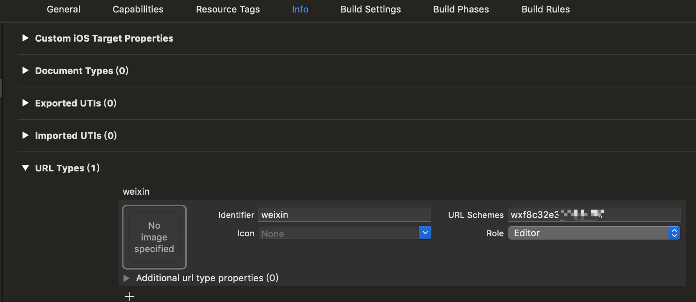

# React Native with wechat

<details>
<summary>参考 - 2019年6月19日</summary>

- [链接原生库](https://reactnative.cn/docs/linking-libraries-ios/)
- [react-native-wechat](https://github.com/yorkie/react-native-wechat)
- [使用react-native-wechat完成微信登录、分享和支付](https://juejin.im/entry/5b65baffe51d45348a3011b9)
</details>

## 账号

1. 申请微信开发平台的账户（https://open.weixin.qq.com/）
2. 管理中心 创建移动应用
   1. 填写基本信息
   2. 填写平台信息
      安卓应用先签名安装到设备，后安装官方获取签名 app，输入对应包名获取签名
   3. 提交等待审核 7 日内

## 安装

安装 `react-native-wechat` 库

```bash
# yarn 安装
yarn add react-native-wechat
react-native link react-native-wechat
```

### iOS

1. Build Phases ➜ Link Binary With Libraries 添加类库

```
SystemConfiguration.framework
CoreTelephony.framework
libsqlite3.0
libc++
libz
```

2. 点击 TARGET 下项目名 ➜ info 界面，添加 URL type
   

iOS 9 以上添加微信白名单 info.plist ➜ Open As Source Code 添加属性

```xml
<key>LSApplicationQueriesSchemes</key>
<array>
  <string>weixin</string>
  <string>wechat</string>
</array>
```

3. `AppDelegate.m` 中添加：

```Objective-c
#import <React/RCTLinkingManager.h>

// ios 9.0+
- (BOOL)application:(UIApplication *)application openURL:(NSURL *)url
            options:(NSDictionary<NSString*, id> *)options
{
  return [RCTLinkingManager application:application openURL:url options:options];
}
```

### android

android 在 link 后`android/settings.gradle`、`android/app/build.gradle`中就已经配置好了，`MainApplication.java`中也已经自动添加了`WeChatPackage`初始化代码。

1. `proguard-rules.pro` 中添加

```
-keep class com.tencent.mm.sdk.** {
  *;
}
```

2. `app/src/main/java/com/yourpackage`中 新建个 `wxapi` package 包, 然后在里面新建个 `WXEntryActivity` java 类

```java
package your.package.wxapi;

import android.app.Activity;
import android.os.Bundle;
import com.theweflex.react.WeChatModule;

public class WXEntryActivity extends Activity {
  @Override
  protected void onCreate(Bundle savedInstanceState) {
    super.onCreate(savedInstanceState);
    WeChatModule.handleIntent(getIntent());
    finish();
  }
}
```

3. `AndroidManifest.xml` 中添加 activity 配置

```xml
<manifest>
  <application>
    <activity
      android:name=".wxapi.WXEntryActivity"
      android:label="@string/app_name"
      android:exported="true"
    />
  </application>
</manifest>
```

## 使用

app.js 注册

```js
import * as WeChat from 'react-native-wechat'

WeChat.registerApp('wx517b1a5aaaaaaaa')
```

```js
<Button
  title='分享'
  onPress={() => {
    WeChat.isWXAppInstalled()
      .then(isInstalled => {
        if (isInstalled) {
          WeChat.shareToSession({
            // type: 'imageFile',
            type: 'imageUrl',
            title: '邀请好友',
            description: 'hehe',
            // imageUrl: Image.resolveAssetSource(shareImg).uri,
            imageUrl: 'https://user-images.githubusercontent.com/7380874/58780231-e61d8500-860a-11e9-873e-4414b0f842e1.png'
          }).catch(error => {
            Alert.alert(JSON.stringify(error))
          })
        } else {
          Alert.alert('您还没有安装微信，请安装微信之后再试')
        }
      })
      .catch(err => {
        Alert.alert(JSON.stringify(error))
      })
  }}
/>
```
