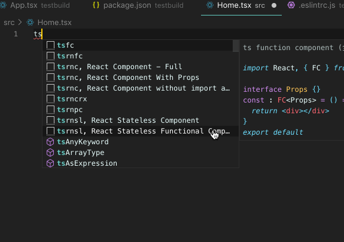

# 代码片段

<details>
<summary>参考 - 2019年09月10日</summary>

- [Snippets in Visual Studio Code](https://code.visualstudio.com/docs/editor/userdefinedsnippets)
</details>



vscode 设置 -> 用户代码片段 User Snippet -> 新建一个

```json
{
  // 快速新建页面
  "ts rn function component": {
    "prefix": "tsrnfc",
    "body": [
      "import React, { FC } from 'react'",
      "import { View, Text, StyleSheet } from 'react-native'",
      "",
      "interface $1Props {}",
      "",
      "const $1: FC<$1Props> = props => {",
      "  return (",
      "    <View>",
      "      <Text>$1</Text>",
      "    </View>",
      "  )",
      "}",
      "",
      "const s = StyleSheet.create({})",
      "",
      "export default $1",
      ""
    ],
    "description": "ts rn function component"
  },
  // hooks
  "useState string": {
    "prefix": "ust",
    "body": "const [$1, set${1/(.*)/${1:/capitalize}/}] = useState('')"
  },
  "useState boolean": {
    "prefix": "usf",
    "body": "const [$1, set${1/(.*)/${1:/capitalize}/}] = useState(${2|false,true|})"
  },
  "useState other": {
    "prefix": "uso",
    "body": "const [$1, set${1/(.*)/${1:/capitalize}/}] = useState($2)"
  }
}
```
