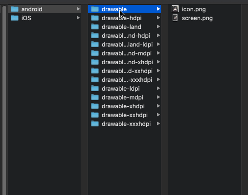

# 启动屏&应用图标

<details>
<summary>参考 - 2019年09月24日</summary>

- [Ape Tools - Image Gorilla](https://apetools.webprofusion.com/#/tools/imagegorilla)
- [图标工厂](https://icon.wuruihong.com/)
- [react-native-splash-screen](https://github.com/crazycodeboy/react-native-splash-screen)

</details>

## 获取素材

App 由于存在不同分辨率尺寸的问题，针对不同分辨率设计图标图片的工作量显然是巨大的并且很难记住需要哪些尺寸，我们可以在线生成图标、启动屏素材

如：

- [Ape Tools - Image Gorilla](https://apetools.webprofusion.com/#/tools/imagegorilla)
- [图标工厂](https://icon.wuruihong.com/)



将资源复制到对应工程目录下

- android: android/app/src/main/res
- ios: ios/project/Images.xcassets

## 启动屏

### android 启动屏

可以参考 [react-native-splash-screen](https://github.com/crazycodeboy/react-native-splash-screen) 使用，但启动屏相对轻量可以手动配置

1. 创建一个名为 launch_screen.xml 的布局文件来自定义你的启动屏幕。

app/src/main/res -> New -> XML -> Layout XML File -> launch_screen LinearLayout

```xml
<?xml version="1.0" encoding="utf-8"?>
<LinearLayout xmlns:android="http://schemas.android.com/apk/res/android"
    android:layout_width="match_parent"
    android:layout_height="match_parent">
    <ImageView android:layout_width="match_parent" android:layout_height="match_parent" android:src="@drawable/screen" android:scaleType="centerCrop" />
</LinearLayout>
```

2. 先定义几个颜色值

定位到 `android/app/src/main/res/values` -> New -> XML -> Values XML File

```xml
<?xml version="1.0" encoding="utf-8"?>
<resources>
    <color name="primary_dark">#000000</color>
    <color name="status_bar_color">#000000</color>
</resources>

```

3. 启用 app 主题透明选项来解决在 APP 启动时因主题原因导致的短暂白屏的问题

打开 `android/app/src/main/res/values/styles.xml 文件`

```xml
<resources>
    <!-- Base application theme. -->
    <style name="AppTheme" parent="Theme.AppCompat.Light.NoActionBar">
        <!-- Customize your theme here. -->
        <!--设置透明背景-->
        <item name="android:windowIsTranslucent">true</item>
    </style>
    <style name="SplashScreenTheme" parent="Theme.AppCompat.NoActionBar">
        <item name="colorPrimaryDark">@color/status_bar_color</item>
        <item name="android:windowExitAnimation">@android:anim/fade_out</item>
    </style>
</resources>
```

1. 创建 SplashScreen 模块

android/app/src/main/java -> new Package -> `dev.rn.splashscreen` 新建两个类

SplashScreen.java

```java
package dev.rn.splashscreen;

import android.app.Activity;
import android.app.Dialog;
import android.os.Build;

import com.testbuild.R;

import java.lang.ref.WeakReference;

public class SplashScreen {
    private static Dialog mSplashDialog;
    private static WeakReference<Activity> mActivity;

    /**
     * 打开启动屏
     */
    public static void show(final Activity activity) {
        if (activity == null) return;
        mActivity = new WeakReference<Activity>(activity);
        activity.runOnUiThread(new Runnable() {
            @Override
            public void run() {
                if (!activity.isFinishing()) {
                    mSplashDialog = new Dialog(activity, R.style.SplashScreenTheme);
                    mSplashDialog.setContentView(R.layout.launch_screen);
                    mSplashDialog.setCancelable(false);

                    if (!mSplashDialog.isShowing()) {
                        mSplashDialog.show();
                    }
                }
            }
        });
    }

    /**
     * 关闭启动屏
     */
    public static void hide(Activity activity) {
        if (activity == null) {
            if (mActivity == null) {
                return;
            }
            activity = mActivity.get();
        }

        if (activity == null) return;

        final Activity _activity = activity;

        _activity.runOnUiThread(new Runnable() {
            @Override
            public void run() {
                if (mSplashDialog != null && mSplashDialog.isShowing()) {
                    boolean isDestroyed = false;

                    if (Build.VERSION.SDK_INT >= Build.VERSION_CODES.JELLY_BEAN_MR1) {
                        isDestroyed = _activity.isDestroyed();
                    }

                    if (!_activity.isFinishing() && !isDestroyed) {
                        mSplashDialog.dismiss();
                    }
                    mSplashDialog = null;
                }
            }
        });
    }
}
```

SplashScreenModule.java 用于暴露 Native Module 给 RN JS 端调用，参考文档 [原生模块](https://reactnative.cn/docs/native-modules-android/)

```java
package dev.rn.splashscreen;

import com.facebook.react.bridge.ReactApplicationContext;
import com.facebook.react.bridge.ReactContextBaseJavaModule;
import com.facebook.react.bridge.ReactMethod;

public class SplashScreenModule extends ReactContextBaseJavaModule {
    public SplashScreenModule(ReactApplicationContext reactContext) {
        super(reactContext);
    }

    @Override
    public String getName() {
        return "SplashScreen";
    }

    /**
     * 打开启动屏
     */
    @ReactMethod
    public void show() {
        SplashScreen.show(getCurrentActivity());
    }

    /**
     * 关闭启动屏
     */
    @ReactMethod
    public void hide() {
        SplashScreen.hide(getCurrentActivity());
    }
}
```

5. MainActivity.java 一上来先调用显示 启动屏

```java
public class MainActivity extends ReactActivity {

    @Override
    protected void onCreate(Bundle savedInstanceState) {
        SplashScreen.show(this);
        super.onCreate(savedInstanceState);
    }
}
```

6. 启动后 画面会一直停留在启动屏 这时候 在 js 端 加载完成时需要隐藏启动屏

eg: App.tsx

```javascript
import { NativeModules } from 'react-native'

useEffect(() => {
  NativeModules.SplashScreen.hide()
}, [])
```

根据逻辑 可以适当 延迟隐藏

### iOS 启动屏

iOS 启动屏分两种，使用 `Launch Screen File` xib 动态布局，或者使用图片资源 `Launch Images Source`, 这个选项在 targets -> General -> App Icons and Launch Images 配置

默认使用的 LaunchScreen, 改成 Launch Images Source, use `LanunchImage`，清空 LaunchScreen 里的设置


## App 图标

### 安卓换图标

配置 `AndroidManifest.xml` 中的 `android:icon` 和 `android:roundIcon` 为之前添加的图标资源

```xml
<manifest xmlns:android="http://schemas.android.com/apk/res/android"
  package="com.shoukuanla_rn">
  <application
      android:name=".MainApplication"
      android:label="@string/app_name"
      android:icon="@drawable/icon"
      android:roundIcon="@drawable/icon"
      android:allowBackup="false"
      android:theme="@style/AppTheme">
      <activity
        android:name=".MainActivity"
        android:label="@string/app_name"
        android:configChanges="keyboard|keyboardHidden|orientation|screenSize"
        android:windowSoftInputMode="adjustResize">
        <intent-filter>
            <action android:name="android.intent.action.MAIN" />
            <category android:name="android.intent.category.LAUNCHER" />
        </intent-filter>
      </activity>
  </application>
</manifest>

```

**图形化配置**

首先将工程目录切换成 Android 视图，定位到 app 上右击 New -> Image Asset

Foreground Layer

- Path -> 选择图标文件
- Resize 调整切割

Background Layer

可以配置背景图片或者纯色， next 预览 Finish 完成

### iOS 换图标

默认替换资源即已替换，手动需配置 Images.xcassets 中的 AppIcon，拖入素材

检查下 Targets -> General -> App Icons and Launch Images -> App Icons Source 选择 AppIcon

换图标启动屏如果没有立即生效尝试卸载重装
