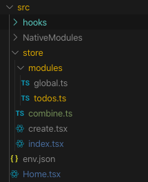
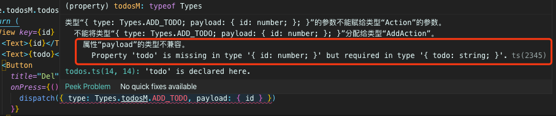
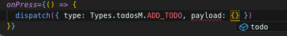
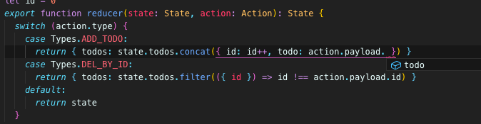

# 状态管理

## Why

为什么需要状态管理

- 全局状态例如：语言、主题、用户状态信息等
- 跨页面、跨组件、深度嵌套传参
- 统一的状态持久化和恢复
- 状态集中管理与组件分离更清晰
- 状态快照回溯跟踪便于debug

## What

使用 [React Hooks](https://reactjs.org/docs/hooks-intro.html) + [Context Api](https://reactjs.org/docs/context.html) 实现类 Redux 状态管理

## How

目录结构



```ts
// store/create.tsx

import React, { useReducer, createContext, FC } from 'react'

export default function createStore<S, T>(initialState: S, reducer: (state: S, action: T) => S) {
  const StateCtx = createContext(initialState)
  const DispatchCtx = createContext((() => {}) as React.Dispatch<T>)

  const Provider: FC = ({ children }) => {
    const [state, dispatch] = useReducer(reducer, initialState)
    return (
      <DispatchCtx.Provider value={dispatch}>
        <StateCtx.Provider value={state}>{children}</StateCtx.Provider>
      </DispatchCtx.Provider>
    )
  }
  return { StateCtx, DispatchCtx, Provider }
}
```

```ts
// store/index.ts

import { useContext } from 'react'
import { combineState, combineReducer, Types } from './combine'
import createStore from './create'

export const { StateCtx, DispatchCtx, Provider } = createStore(combineState, combineReducer)

// hook for funciton component
export function useStore() {
  const state = useContext(StateCtx)
  const dispatch = useContext(DispatchCtx)
  return { state, dispatch, Types }
}

// 因为 dispatch 是始终不变的，当不依赖state的时，可以避免 rerender
export function useDispatch() {
  const dispatch = useContext(DispatchCtx)
  return { dispatch, Types }
}
```

```ts
// store/modules/global.ts

export const initState = {
  login: '',
}

export type State = typeof initState

export enum Types {
  SET_USER,
}

type SetUserAction = {
  type: Types.SET_USER
  payload: { username: string }
}

export type Action = SetUserAction

export function reducer(state: State, action: Action): State {
  switch (action.type) {
    case Types.SET_USER:
      return { ...state, login: action.payload.username }
    default:
      return state
  }
}
```

```ts
// store/modules/todos.ts

export const initState = {
  todos: [] as Array<{ id: number; todo: string }>,
}

export type State = typeof initState

export enum Types {
  ADD_TODO,
  DEL_BY_ID,
}

type AddAction = {
  type: Types.ADD_TODO
  payload: { todo: string }
}

type DelAction = {
  type: Types.DEL_BY_ID
  payload: { id: number }
}

export type Action = AddAction | DelAction

let id = 0
export function reducer(state: State, action: Action): State {
  switch (action.type) {
    case Types.ADD_TODO:
      return { todos: state.todos.concat({ id: id++, todo: action.payload.todo }) }
    case Types.DEL_BY_ID:
      return { todos: state.todos.filter(({ id }) => id !== action.payload.id) }
    default:
      return state
  }
}
```

```ts
// store/combine.ts

// combine state & types & reducers
import * as globalM from './modules/global'
import * as todosM from './modules/todos'

export type State = globalM.State & {
  todosM: todosM.State
}

export const Types = {
  globalM: globalM.Types,
  todosM: todosM.Types,
}

export type Action = globalM.Action | todosM.Action

export const combineState: State = {
  ...globalM.initState,
  todosM: todosM.initState,
}

export function combineReducer(state: State, action: Action): State {
  return {
    ...globalM.reducer(state, action as globalM.Action),
    todosM: todosM.reducer(state.todosM, action as todosM.Action),
  }
}
```

## Usage

```ts
// App.tsx

import React from 'react'

import { Provider } from './src/store'
import Home from './src/Home'
const App = () => {
  return (
    <Provider>
      <Home />
    </Provider>
  )
}

export default App
```

```ts
// Home.tsx

const App = () => {
  const { state, dispatch, Types } = useStore()
  return (
    <SafeAreaView>
      {state.todosM.todos.map(({ id, todo }) => {
        return (
          <View key={id} style={s.todo}>
            <Text>{id}</Text>
            <Text>{todo}</Text>
            <Button
              title="Del"
              onPress={() => {
                dispatch({ type: Types.todosM.DEL_BY_ID, payload: { id } })
              }}
            />
          </View>
        )
      })}

      <Button
        title="Add"
        onPress={() => {
          dispatch({ type: Types.todosM.ADD_TODO, payload: { todo: 'dodo' + Math.random() } })
        }}
      />
    </SafeAreaView>
  )
}
```

源码 github: https://github.com/iPeng6/testbuild

因为配合上 Typescript + VSCode，当使用时可以受益于这种类型检查和智能提示 如：

我们将 dispatch 的 type 和 payload 写错



因为我们严格定义了 type 和 payload 类型，当 type 确定时 payload 类型也会被推断出来

```ts
type AddAction = {
  type: Types.ADD_TODO
  payload: { todo: string }
}

type DelAction = {
  type: Types.DEL_BY_ID
  payload: { id: number }
}
```

使用 Trigger Suggest 命令在编写时也能给出正确提示



编写 reducer 时，当case 到具体个 type 时，对应的 payload 类型也会被正确推断，给出正确的智能提示


