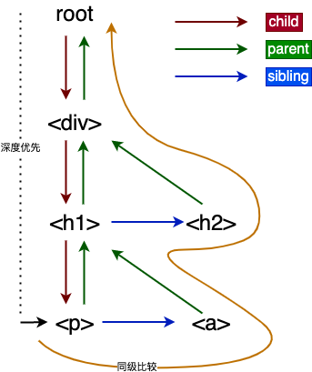

# fiber

1. 为什么需要fiber
  对于⼤大型项⽬目，组件树会很⼤大，这个时候递归遍历的 成本就会很⾼高，会造成主线程被持续占⽤用，结果就是主线程上的布局、动画等周期性任务就⽆无法⽴立即得到处理，造成视觉上的卡顿，影响⽤用户体验。
2. 任务分解的意义
  解决上⾯面的问题
3. 增量渲染(把渲染任务拆分成块，匀到多帧)
5. 更新时能够暂停，终⽌，复⽤用渲染任务
6. 给不同类型的更新赋予优先级
7. 并发⽅⾯新的基础能力
8. 更流畅

