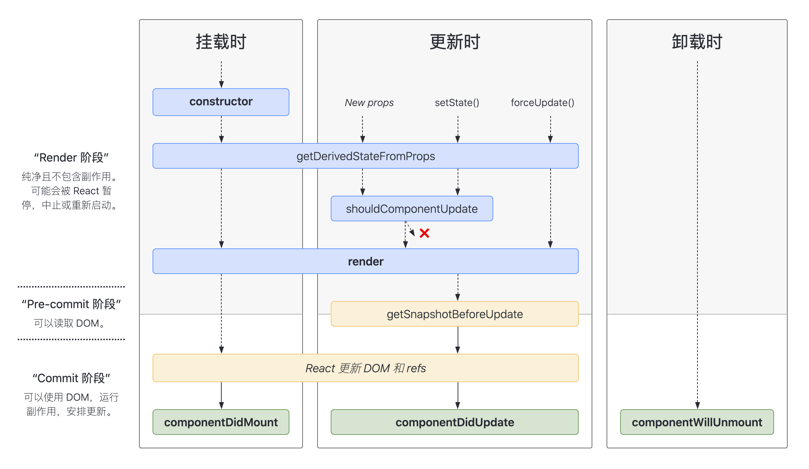

# React 生命周期

参考

- https://projects.wojtekmaj.pl/react-lifecycle-methods-diagram/

废除

- componentWillMount
- componentWillReceiveProps
- componentWillUpdate

新的

- static getDerivedStateFromProps
- getSnapshotBeforeUpdate
