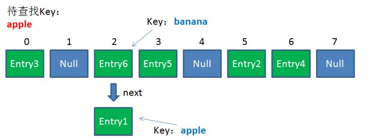

# 哈希表

参考 - 2020年01月06日

- [漫画：什么是 HashMap？](https://zhuanlan.zhihu.com/p/31610616)
- [HashMap 和 HashTable 到底哪不同？](https://www.cnblogs.com/xinzhao/p/5644175.html)

HashMap 或者 HashTable 都是一个用于存储 Key-Value 键值对的集合，每一个键值对也叫做 Entry。这些个键值对（Entry）分散存储在一个数组当中，这个数组就是 HashMap 的主干。HashMap 数组每一个元素的初始值都是 Null。

## 常用方法原理

对于 HashMap，我们最常使用的是两个方法：**Get** 和 **Put**。

### 1. Put 方法的原理

调用 Put 方法的时候发生了什么呢？

比如调用 hashMap.put("apple", 0) ，插入一个 Key 为“apple"的元素。这时候我们需要利用一个哈希函数来确定 Entry 的插入位置（index）：

`index = Hash（“apple”）`

假定最后计算出的 index 是 2，那么结果如下：

但是，因为 HashMap 的长度是有限的，当插入的 Entry 越来越多时，再完美的 Hash 函数也难免会出现 index 冲突的情况。比如下面这样：

这时候该怎么办呢？我们可以利用**链表**来解决。

HashMap 数组的每一个元素不止是一个 Entry 对象，也是一个链表的头节点。每一个 Entry 对象通过 Next 指针指向它的下一个 Entry 节点。当新来的 Entry 映射到冲突的数组位置时，只需要插入到对应的链表即可：

需要注意的是，新来的 Entry 节点插入链表时，使用的是“**头插法**”。至于为什么不插入链表尾部，后面会有解释。

### 2. Get 方法的原理

使用 Get 方法根据 Key 来查找 Value 的时候，发生了什么呢？

首先会把输入的 Key 做一次 Hash 映射，得到对应的 index：

`index = Hash（“apple”）`

由于刚才所说的 Hash 冲突，同一个位置有可能匹配到多个 Entry，这时候就需要顺着对应链表的头节点，一个一个向下来查找。假设我们要查找的 Key 是“apple”：

第一步，我们查看的是头节点 Entry6，Entry6 的 Key 是 banana，显然不是我们要找的结果。

第二步，我们查看的是 Next 节点 Entry1，Entry1 的 Key 是 apple，正是我们要找的结果。

之所以把 Entry6 放在头节点，是因为 HashMap 的发明者认为，**后插入的 Entry 被查找的可能性更大**。

## 常见问题

**1. HashMap 默认出事长度是多少？为什么这么规定？**

HashMap 的默认初始长度是 16，并且每次自动扩展或是手动初始化时，长度必须是 2 的幂。之所以选择 16， 是为了服务于从 Key 映射到 index 的 Hash 算法。

之前说过，从 Key 映射到 HashMap 数组的对应位置，会用到一个 Hash 函数：

`index = Hash（“apple”）`

如何实现一个尽量均匀分布的 Hash 函数呢？我们通过利用 Key 的 HashCode 值来做某种运算。将一个大数通过一种规则映射到 16 这个区间 很容易想到取模运算

`index = HashCode（Key） % Length`

但是取模运算的方式固然简单，但是效率很低。为了实现高效的 Hash 算法，HashMap 的发明者采用了位运算方式。

如何进行位运算呢？有如下的公式（Length 是 HashMap 的长度）：

`index = HashCode（Key） & （Length - 1）`

下面我们以值为“book”的 Key 来演示整个过程：

1.  计算 book 的 hashcode，结果为十进制的 3029737，二进制的 101110001110101110 1001。
2.  假定 HashMap 长度是默认的 16，计算 Length-1 的结果为十进制的 15，二进制的 1111。
3.  把以上两个结果做与运算，101110001110101110 1001 & 1111 = 1001，十进制是 9，所以 index=9。

可以说，Hash 算法最终得到的 index 结果，完全取决于 Key 的 Hashcode 值的最后几位。那为什么要是 2 的幂呢？如果是 10 通过运算会发现，索引的落点并不能均匀分布，有些出现的概率更大，有些则永远不会出现。

**2. 高并发情况下，为什么 HashMap 可能会出现死锁？**

默认存储的容量，迟早会不够用，冲突率越来越高，当达到一个临界点时就需要扩容处理，首先将原来的数组大小翻倍扩容，再遍历原来的数据重新 rehash 运算映射到新的数组，当两个线程一起操作时，头插法有时会出现循环引用的情况，
比如线程 A，执行了 Entry3->Entry2->Entry1,而线程 B 本打算将 Entry2 指向头 Entry1，但此时头已经变成了 Entry3，就会导致 Entry2->Entry3,Entry2<->Entry3 发生了循环引用，等 Get 操作遍历到此 Entry 的时候，就会发生死循环。

**3. 在 Java8 当中，HashMap 的结构有什么样的优化？**

数据结构使用了 红黑树

**4. Java 中 HashMap vs HashTable**

1. HashMap 不是同步的，非线程安全的，没有同步代码处理不能跨线程共享，而 HashTable 是同步，是线程安全的。
2. HashMap 是支持 null 键和 null 值的，而 HashTable 在遇到 null 时，会抛出 NullPointerException 异常。
3. HashTable 初始大小 11， 之后每次扩容为原来的 2n+1，而 HashMap 默认的初始化大小为 16，之后 HashMap 每次以 2 的幂次方扩容。
