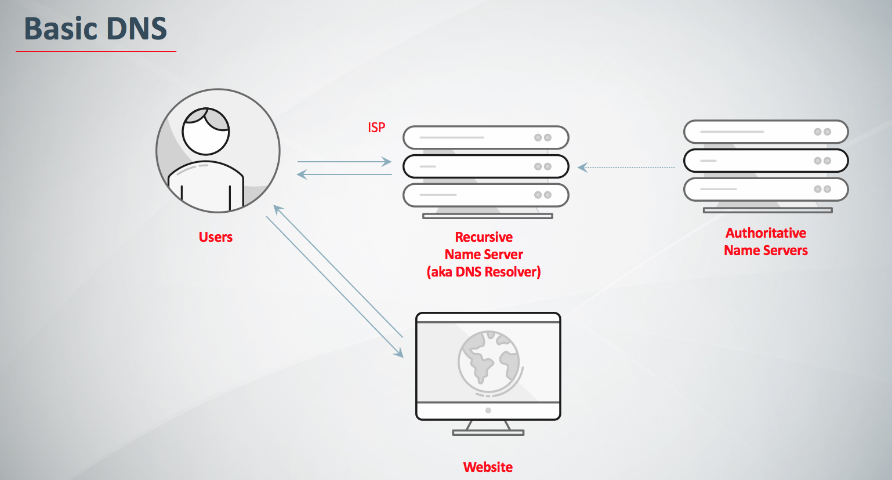

# DNS

引用参考 - 2019年04月14日

- [DNS: Why It’s Important and How It Works](https://baidu.com/blog/dns-why-its-important-how-it-works/)
- [What is DNS](https://aws.amazon.com/cn/route53/what-is-dns/)

**域名系统(又称 DNS)** 被用来解析像 www.baidu.com 这样的可读主机名，将其转换为机器可读的 IP 地址 180.101.49.11。 DNS 也是有关域名的重要信息目录，例如电子邮件服务器（MX 记录）和发送验证（DKIM，SPF，DMARC）、TXT 域所有权记录验证，甚至 SSH 指纹（SSHFP）。

智能 DNS 服务还可以操纵 DNS 响应，决定返回哪些 IP 以确保客户端的最佳性能和可靠性。但是为什么 DNS 这么重要呢？ 它是如何工作的？ 你还应该知道什么？

## 为什么 DNS 是重要的？

就像是互联网上的电话簿。 如果你知道一个人的名字但不知道他的电话号码，你可以直接在电话簿上查查。 DNS 为互联网提供了同样的服务。

当你访问 http://www.baidu.com 时，你的电脑使用 DNS 检索网站的 IP 地址 180.101.49.11。 如果没有 DNS，你只能直接访问 ip 地址了 http://180.101.49.11。

## DNS 是如何工作的？

当你访问像 baidu.com 这样的域名时，你的电脑会遵循一系列步骤，将人可读的网址转化为机器可读的 IP 地址。 每次你使用域名时都会发生这种情况，无论你是在浏览网站还是发送电子邮件。

### 步骤 1: 请求信息

一开始当你要求计算机解析一个主机名，例如访问 http://www.baidu.com。 你的电脑首先看到的是它的本地 DNS 缓存，该缓存存储计算机最近检索到的信息。

如果你的计算机还是不知道答案，那就需要执行一个 DNS 查询来找出答案。

### 步骤 2: 询问递归 DNS 服务器

如果信息不存储在本地，计算机联系您的 ISP（网络服务提供商） 的递归 DNS 服务器(resolvers)。 这些专用计算机为你执行一个 DNS 查询工作。 递归服务器有它们自己的缓存，鉴于许多 ISP 的客户使用相同的 DNS 服务器，一些常用域名很可能已经被缓存，如果是这种情况，这个过程通常在这里就完成了，并将信息返回给用户。

### 步骤 3: 询问根域名服务器

如果递归服务器没有找到，他们就会查询根域名服务器。 根域名服务器是一种计算机，它可以回答相关域名的问题，如 IP 地址。 13 个根域名服务器扮演着一种 DNS 的电话接线员的角色。 他们不知道答案，但可以将我们的疑问指向知道在哪里可以找到答案的人。

### 步骤 4: 询问 TLD 域名服务器

根域名服务器将查看请求的第一部分，按从右到左的顺序，从 www.baidu.com 找到.com，并将请求指向.com 对应的顶级域服务器(top-level domain，TLD)。每个 TLD，例如.com，.org，.us，拥有自己的顶级域名服务器，就像每个 TLD 的接线员。 这些服务器没有我们需要的信息，但是他们可以直接将我们引导到有信息的服务器。

### 步骤 5: 询问权威的 DNS 服务器

TLD 域名服务器会继续检查请求的下一部分（baidu）www.baidu.com ，并将查询指向负责此特定域名的服务器。 这些权威的服务器将负责了解关于特定域的所有信息，并将信息存储在 DNS 记录中。 有许多类型的记录，每种记录都包含一种不同的信息。 在这个例子中，我们想知道 www.baidu.com 的 IP 地址，因此我们请求权威的域名服务器提供地址记录。

### 步骤 6: 找回记录

递归服务器从权威服务器中检索 baidu.com 的记录，并将记录存储在本地缓存中。 如果其他任何人请求 baidu.com 的主机记录，递归服务器将已经有了答案，并且不需要再次进行查找。 所有的记录都有一个生存周期值（time-to-live，TTL），就像一个过期日期。 一段时间后，递归服务器需要请求一个新的记录副本，以确保信息不会过期。

### 步骤 7: 接受答案

有了这个答案，递归服务器将记录返回到计算机。 您的计算机将记录存储在其缓存中，从记录中读取 IP 地址，然后将这些信息传递给浏览器，浏览器打开与 Web 服务器的连接并接收网站。

整个过程，从开始到结束，只需要几毫秒就能完成。

大致流程

User -> 本地 DNS 记录 -> ISP DNS 解析器 -> 根域名服务器 -> 顶级域名服务器 -> 权威域名服务器 -> 返回给 ISP 缓存起来 -> 给本地缓存起来

## DNS 域名解析中添加的各项解析记录

- **A 记录**：将域名指向一个 IPv4 地址（例如：`100.100.100.100`），需要增加 A 记录

- **CNAME 记录**：如果将域名指向一个域名，实现与被指向域名相同的访问效果，需要增加 CNAME 记录。这个域名一般是主机服务商提供的一个域名

- **MX 记录**：建立电子邮箱服务，将指向邮件服务器地址，需要设置 MX 记录。建立邮箱时，一般会根据邮箱服务商提供的 MX 记录填写此记录

- **NS 记录**：域名解析服务器记录，如果要将子域名指定某个域名服务器来解析，需要设置 NS 记录

- **TXT 记录**：可任意填写，可为空。一般做一些验证记录时会使用此项，如：做 SPF（反垃圾邮件）记录

- **AAAA 记录**：将主机名（或域名）指向一个 IPv6 地址（例如：`ff03:0:0:0:0:0:0:c1`），需要添加 AAAA 记录

- **SRV 记录**：添加服务记录服务器服务记录时会添加此项，SRV 记录了哪台计算机提供了哪个服务。格式为：服务的名字.协议的类型（例如：\_example-server.\_tcp）。

- **SOA 记录**：SOA 叫做起始授权机构记录，NS 用于标识多台域名解析服务器，SOA 记录用于在众多 NS 记录中那一台是主服务器

- **PTR 记录**：PTR 记录是 A 记录的逆向记录，又称做 IP 反查记录或指针记录，负责将 IP 反向解析为域名

- **显性 URL 转发记录**：将域名指向一个 http(s)协议地址，访问域名时，自动跳转至目标地址。例如：将`www.baidu.cn`显性转发到`www.baidu.com`后，访问`www.baidu.cn`时，地址栏显示的地址为：`www.baidu.com`。

- **隐性 UR 转发记录**：将域名指向一个 http(s)协议地址，访问域名时，自动跳转至目标地址，隐性转发会隐藏真实的目标地址。例如：将`www.baidu.cn`隐性转发到`www.baidu.com`后，访问`www.baidu.cn`时，地址栏显示的地址仍然是：`www.baidu.cn`。
