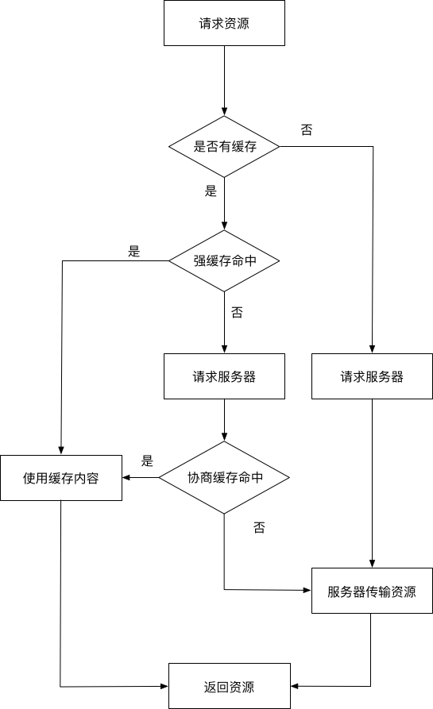

# HTTP 缓存

## 什么是 web 缓存

Web 缓存是指一个 Web 资源（如 html 页面，图片，js，数据等）存在于 Web 服务器和客户端（浏览器）之间的副本。缓存会根据进来的请求保存输出内容的副本；当下一个请求来到的时候，如果是相同的 URL，缓存会根据缓存机制决定是直接使用副本响应访问请求，还是向源服务器再次发送请求。比较常见的就是浏览器会缓存访问过网站的网页，当再次访问这个 URL 地址的时候，如果网页没有更新，就不会再次下载网页，而是直接使用本地缓存的网页。只有当网站明确标识资源已经更新，浏览器才会再次下载网页。

## web 缓存的作用

1. 减少网络带宽消耗
2. 降低服务器压力
3. 减少网络延迟，加快页面打开速度

浏览器 HTTP 缓存可以分为**强缓存**和**协商缓存**。强缓存和协商缓存最大区别是：强缓存命中的话不会发请求到服务器（比如 chrome 中的 200 from memory cache），协商缓存一定会发请求到服务器，通过资源的请求首部字段判断资源是否命中协商缓存，如果协商缓存命中，服务器会将这个请求返回，但是不会返回这个资源的实体，而是通知客户端可以从缓存中加载这个资源（304 not modifend）。流程图如下：



## http 报文中与缓存相关的首部字段

1、 通用首部字段（就是请求报文和响应都能用上的字段）

| 字段名称      | 说明                                             |
| ------------- | ------------------------------------------------ |
| Cache-Control | 控制缓存的行为                                   |
| Pragma        | http1.0 的旧社会遗留物，值为“no-cache”时禁用缓存 |

Cache-Control 和浏览器相关的命令

| 指令        | 参数   | 说明                                                                   |
| ----------- | ------ | ---------------------------------------------------------------------- |
| private     | 无     | 表明响应只能被单个用户缓存，不能作为共享缓存（即代理服务器不能缓存它） |
| public      | 可省略 | 表明响应可以被任何对象（包括：发送请求的客户端，代理服务器，等等）缓存 |
| no-cache    | 可省略 | 缓存前必需确认其有效性（协商缓存）                                     |
| no-store    | 无     | 不缓存请求或响应的任何内容                                             |
| max-age=[s] | 必需   | 响应的最大值                                                           |

- max-age（单位为 s）设置缓存的存在时间，相对于发送请求的时间。只有响应报文首部设置 Cache-Control 为非 0 的 max-age 或者设置了大于请求日期的 Expires（下文会讲）才有可能命中强缓存。当满足这个条件，同时响应报文首部中 Cache-Control 不存在 no-cache、no-store 且请求报文首部不存在 Pragma 字段，才会真正命中强缓存。
- no-cache 表示请求必须先与服务器确认缓存的有效性，如果有效才能使用缓存（协商缓存），无论是响应报文首部还是请求报文首部出现这个字段均一定不会命中强缓存。Chrome 硬性重新加载（Command+shift+R）会在请求的首部加上 Pragma：no-cache 和 Cache-Control：no-cache。
- no-store 表示禁止浏览器以及所有中间缓存存储任何版本的返回响应，一定不会出现强缓存和协商缓存，适合个人隐私数据或者经济类数据。
- public 表明响应可以被浏览器、CDN 等等缓存。
- private 响应只作为私有的缓存，不能被 CDN 等缓存。如果要求 HTTP 认证，响应会自动设置为 private。

2、 请求首部字段

| 字段名称            | 说明                             |
| ------------------- | -------------------------------- |
| if-Match            | 比较 ETag 是否一致               |
| if-None-Match       | 比较 ETag 是否不一致             |
| if-Modified-Since   | 比较资源最后更新的时间是否一致   |
| if-UnModified-Since | 比较资源最后更新的时间是否不一致 |

3、 响应首部字段

| 字段名称      | 说明                                                                                     |
| ------------- | ---------------------------------------------------------------------------------------- |
| ETag          | 资源的匹配信息                                                                           |
| Expires       | http1.0 的遗留物，实体主体过期时间，用于与客户端时间比较，存在缺陷因为客户端时间会被篡改 |
| Last-Modified | 资源的最后一次修改的时间                                                                 |

## 强制缓存

与强缓存相关的主要是 Pragma、Cache-Control 、Expires

```html
<meta http-equiv="Pragma" content="no-cache" />
<meta http-equiv="Expires" content="-1" />
```

注意上面两条指令的作用是不允许浏览器缓存当前页面以及页面上引用的资源，强制浏览器每次请求当前页面时都需要从服务器端获取最新版本。这种方式仅对部分浏览器有效，而且不影响代理服务器对该页面的缓存控制，原因是因为代理服务器并不会去解析页面上的内容。

只有响应报文首部设置 Cache-Control 为非 0 的 max-age 或者设置了大于请求日期的 Expires 才有可能命中强缓存。当满足这个条件，同时响应报文首部中 Cache-Control 不存在 no-cache、no-store 且请求报文首部不存在 Pragma 字段，才会真正命中强缓存。

**内存缓存(from memory cache)和硬盘缓存(from disk cache)**

- 内存缓存(from memory cache)：内存缓存具有两个特点，分别是快速读取和时效性：
  - 快速读取：内存缓存会将编译解析后的文件，直接存入该进程的内存中，占据该进程一定的内存资源，以方便下次运行使用时的快速读取。
  - 时效性：一旦该进程关闭，则该进程的内存则会清空。
- 硬盘缓存(from disk cache)：硬盘缓存则是直接将缓存写入硬盘文件中，读取缓存需要对该缓存存放的硬盘文件进行 I/O 操作，然后重新解析该缓存内容，读取复杂，速度比内存缓存慢。

在浏览器中，浏览器会在 js 和图片等文件解析执行后直接存入内存缓存中，那么当刷新页面时只需直接从内存缓存中读取(from memory cache)；而 css 文件则会存入硬盘文件中，所以每次渲染页面都需要从硬盘读取缓存(from disk cache)。

## 协商缓存

1. If-Modified-Since/Last-Modified

If-Modified-Since 是一个请求首部字段，并且只能用在 GET 或者 HEAD 请求中。Last-Modified 是一个响应首部字段，包含服务器认定的资源作出修改的日期及时间。当带着 If-Modified-Since 头访问服务器请求资源时，服务器会检查 Last-Modified，如果 Last-Modified 的时间早于或等于 If-Modified-Since 则会返回一个不带主体的 304 响应，否则将重新返回资源。

2. If-None-Match/ETag

ETag 是一个响应首部字段，它是根据实体内容生成的一段 hash 字符串，标识资源的状态，由服务端产生。If-None-Match 是一个条件式的请求首部。如果请求资源时在请求首部加上这个字段，值为之前服务器端返回的资源上的 ETag，则当且仅当服务器上没有任何资源的 ETag 属性值与这个首部一致时，服务器才会返回带有所请求资源实体的 200 响应，否则服务器会返回不带实体的 304 响应。ETag 优先级比 Last-Modified 高，同时存在时会以 ETag 为准。


ETag 属性之间的比较采用的是弱比较算法，即两个文件除了每个比特都相同外，内容一致也可以认为是相同的。例如，如果两个页面仅仅在页脚的生成时间有所不同，就可以认为二者是相同的。

因为 ETag 的特性，所以相较于 Last-Modified 有一些优势：

1. 某些情况下服务器无法获取资源的最后修改时间
2. 资源的最后修改时间变了但是内容没变，使用 ETag 可以正确缓存
3. 如果资源修改非常频繁，在秒以下的时间进行修改，Last-Modified 只能精确到秒

## 整体流程


## 用户行为对浏览器的影响


