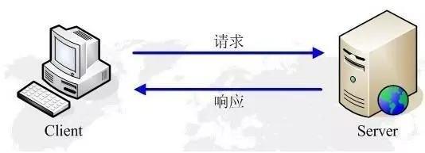
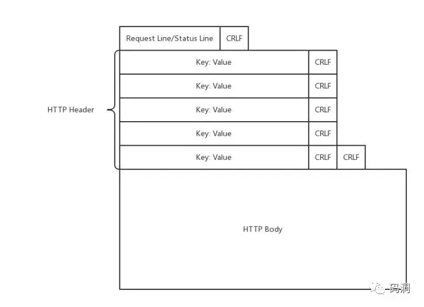
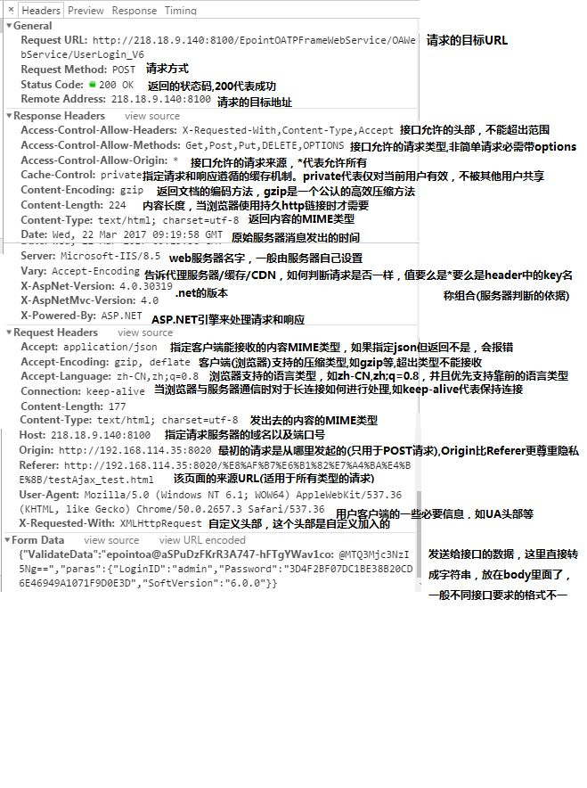

# HTTP

<details>
<summary>引用参考 - 2019年04月17日</summary>

- [标准规范文档](https://httpwg.org/specs/)
- [MDN HTTP 的发展](https://developer.mozilla.org/zh-CN/docs/Web/HTTP/Basics_of_HTTP/Evolution_of_HTTP)
- [MDN HTTP 概述](https://developer.mozilla.org/zh-CN/docs/Web/HTTP/Overview)
- [HTTP 协议入门](http://www.ruanyifeng.com/blog/2016/08/http.html)
- [HTTP 和 HTTPS 详解](https://juejin.im/post/5af557a3f265da0b9265a498)
  </details>

**HTTP（HyperText Transfer Protocol）超文本传输协议** 是一种能够获取如 HTML 这样的网络资源的通讯协议。它是在 Web 上进行数据交换的基础，是一种 client-server 协议，也就是说，请求通常是由像浏览器这样的接受方发起的。一个完整的 Web 文档通常是由不同的子文档拼接而成的，像是文本、布局描述、图片、视频、脚本等等。


## HTTP 请求响应模型

HTTP 由请求和响应构成，是一个标准的客户端服务器模型（B/S）。HTTP 协议永远都是客户端发起请求，服务器回送响应。见下图:



HTTP 是一个无状态的协议。无状态是指客户机（Web 浏览器）和服务器之间不需要建立持久的连接，这意味着当一个客户端向服务器端发出请求，然后服务器返回响应(response)，连接就被关闭了，在服务器端不保留连接的有关信息。HTTP 遵循请求(Request)/应答(Response)模型。客户机（浏览器）向服务器发送请求，服务器处理请求并返回适当的应答。所有 HTTP 连接都被构造成一套请求和应答。

HTTP 请求流程：


## HTTP 历史

HTTP 被设计于 20 世纪 90 年代初期，是一种可扩展的协议。它是应用层的协议，通过 TCP 或者是 TLS 加密的 TCP 连接来发送，理论上任何可靠的传输协议都可以使用。因为其良好的扩展性，时至今日，它不仅被用来传输超文本文档，还用来传输图片、视频或者向服务器发送如 HTML 表单这样的信息。HTTP 还可以根据网页需求，仅获取部分 Web 文档内容更新网页。


### HTTP/0.9 - 单行协议

HTTP 是基于 TCP/IP 协议的应用层协议。它不涉及数据包（packet）传输，主要规定了客户端和服务器之间的通信格式，默认使用 80 端口。

最早版本是 1991 年发布的 0.9 版。该版本极其简单，只有一个命令`GET`。

```
GET /index.html
```

协议规定，服务器只能回应 HTML 格式的字符串，不能回应别的格式。也没有 HTTP 头，状态码或错误码

```html
<html>
  <body>
    Hello World
  </body>
</html>
```

服务器发送完毕，就关闭 TCP 连接。

### HTTP/1.0 - 构建可扩展性

1996 年 5 月，HTTP/1.0 版本发布，内容大大增加。

- 引入了`HTTP头`的概念，无论是对于请求还是响应，允许传输元数据，使协议变得非常灵活，更具扩展性。
- `协议版本`信息现在会随着每个请求发送（HTTP/1.0 被追加到了 GET 行）
- `状态码`会在响应开始时发送，使浏览器能了解请求执行成功或失败，并相应调整行为（如更新或使用本地缓存）
- 在新 HTTP 头`Content-Type`的帮助下，任何格式的内容都可以发送。这使得互联网不仅可以传输文字，还能传输图像、视频、二进制文件。这为互联网的大发展奠定了基础。
- 除了 GET 命令，还引入了`POST`命令和`HEAD`命令，丰富了浏览器与服务器的互动手段。
- 其他的新增功能还包括 多字符集支持、多部分发送（multi-part type）、权限（authorization）、缓存（cache）、内容编码（content encoding）等。

#### 缺点

HTTP/1.0 版的主要缺点是，每个 TCP 连接只能发送一个请求。发送数据完毕，连接就关闭，如果还要请求其他资源，就必须再新建一个连接。

为了解决这个问题，有些浏览器在请求时，用了一个非标准的 Connection 字段。`Connection: keep-alive` 这个字段要求服务器不要关闭 TCP 连接，以便其他请求复用。服务器同样回应这个字段。但是，这不是标准字段，不同实现的行为可能不一致，因此不是根本的解决办法。

### HTTP/1.1 - 标准化的协议

1997 年 1 月，HTTP/1.1 版本发布，就在 HTTP/1.0 发布的几个月后。

#### 持久连接

1.1 版的最大变化，就是引入了持久连接（`persistent connection`），即 TCP 连接默认不关闭，可以被多个请求复用，不用声明 Connection: keep-alive。

目前，对于同一个域名，大多数浏览器允许同时建立 6~8 个持久连接。

#### 管道机制

1.1 版还引入了管道机制（`pipelining`），即在同一个 TCP 连接里面，客户端可以同时发送多个请求。这样就进一步改进了 HTTP 协议的效率。

举例来说，客户端需要请求两个资源。以前的做法是，在同一个 TCP 连接里面，先发送 A 请求，然后等待服务器做出回应，收到后再发出 B 请求。管道机制则是允许浏览器同时发出 A 请求和 B 请求，但是服务器还是按照顺序，先回应 A 请求，完成后再回应 B 请求。

#### 分块传输

使用 Content-Length 字段的前提条件是，服务器发送回应之前，必须知道回应的数据长度。

对于一些很耗时的动态操作来说，这意味着，服务器要等到所有操作完成，才能发送数据，显然这样的效率不高。更好的处理方法是，产生一块数据，就发送一块，采用"流模式"（stream）取代"缓存模式"（buffer）。

因此，1.1 版规定可以不使用 Content-Length 字段，而使用"分块传输编码"（chunked transfer encoding）。只要请求或回应的头信息有`Transfer-Encoding` 字段，就表明回应将由数量未定的数据块组成。

每个非空的数据块之前，会有一个 16 进制的数值，表示这个块的长度。最后是一个大小为 0 的块，就表示本次回应的数据发送完了。下面是一个例子。

```
HTTP/1.1 200 OK
Content-Type: text/plain
Transfer-Encoding: chunked

25
This is the data in the first chunk

1C
and this is the second one

8
sequence

0
```

#### Content-Length 字段

一个 TCP 连接现在可以传送多个回应，势必就要有一种机制，区分数据包是属于哪一个回应的。这就是 Content-Length 字段的作用，声明本次回应的数据长度。

#### Host 字段

客户端请求的头信息新增了 `Host` 字段，用来指定服务器的域名。

```
Host: www.example.com
```

有了 Host 字段，就可以将请求发往同一台服务器上的不同网站，为虚拟主机的兴起打下了基础。

#### 其他功能

新增了许多动词方法：PUT、PATCH、 OPTIONS、DELETE、CONNECT

引入更多缓存控制机制：如 etag，cache-control

#### 缺点

虽然 1.1 版允许复用 TCP 连接，但是同一个 TCP 连接里面，所有的数据通信是`按次序`进行的。服务器只有处理完一个回应，才会进行下一个回应。要是前面的回应特别慢，后面就会有许多请求排队等着。这称为"`队头堵塞`"（Head-of-line blocking）。

为了避免这个问题，只有两种方法：一是减少请求数，二是同时多开持久连接。这导致了很多的网页优化技巧，比如合并脚本和样式表、将图片嵌入 CSS 代码、域名分片（domain sharding）等等。

### HTTP/2 - 性能提升

2015 年，HTTP/2 发布。它不叫 HTTP/2.0，是因为标准委员会不打算再发布子版本了。 HTTP/2 带来了下列改进

- Binary Format，使用二进制格式传输，更高效、更紧凑
- MultiPlexing，多路复用，一个网络连接实现并行请求
- 报头压缩，降低开销
- server push，服务端推送，允许服务器在客户端缓存中填充数据，减少请求
- 请求优先级
- 默认使用加密

### HTTP/3 - 完全颠覆

- 由 google 创造 原名叫 HTTP-over-QUIC
- 基于 QUIC 协议，基于 UDP
- HTTP3 不是 HTTP2 的扩展
- HTTP3 将是一个全新的协议 目前处于测试阶段

## HTTP 的基本性质

<details>
<summary>CLICK ME</summary>

### HTTP 是简单的

虽然下一代 HTTP/2 协议将 HTTP 消息封装到了帧（frames）中，HTTP 大体上还是被设计得简单易读。HTTP 报文能够被人读懂，还允许简单测试，降低了门槛，对新人很友好。

### HTTP 是可扩展的

在 HTTP/1.0 中出现的 HTTP headers 让协议扩展变得非常容易。只要服务端和客户端就新 headers 达成语义一致，新功能就可以被轻松加入进来。

### HTTP 是无状态，有会话的

HTTP 是无状态的：在同一个连接中，两个执行成功的请求之间是没有关系的。这就带来了一个问题，用户没有办法在同一个网站中进行连续的交互，比如在一个电商网站里，用户把某个商品加入到购物车，切换一个页面后再次添加了商品，这两次添加商品的请求之间没有关联，浏览器无法知道用户最终选择了哪些商品。而使用 HTTP 的头部扩展，HTTP Cookies 就可以解决这个问题。把 Cookies 添加到头部中，创建一个会话让每次请求都能共享相同的上下文信息，达成相同的状态。

注意，HTTP 本质是无状态的，使用 Cookies 可以创建有状态的会话。

### HTTP 连接

一个连接是由传输层来控制的，这从根本上不属于 HTTP 的范围。HTTP 并不需要其底层的传输层协议是面向连接的，只需要它是可靠的，或不丢失消息的（至少返回错误）。在互联网中，有两个最常用的传输层协议：TCP 是可靠的，而 UDP 不是。因此，HTTP 依赖于面向连接的 TCP 进行消息传递，但连接并不是必须的。

HTTP/1.0 为每一个请求/响应都打开一个 TCP 连接，导致了 2 个缺点：打开一个 TCP 连接需要多次往返消息传递，因此速度慢。但当多个消息周期性发送时，这样就变得更加高效：暖连接比冷连接更高效。

为了减轻这些缺陷，HTTP/1.1 引入了 pipelining（被证明难以实现）和持久连接的概念：底层的 TCP 连接可以通过 Connection 头部来被部分控制。HTTP/2 则发展得更远，通过在一个连接复用消息的方式来让这个连接始终保持为暖连接。

为了更好的适合 HTTP，设计一种更好传输协议的进程一直在进行。Google 就研发了一种以 UDP 为基础，能提供更可靠更高效的传输协议 QUIC。

</details>

## HTTP 协议格式

HTTP/1.1 以及更早的 HTTP 协议报文都是语义可读的。在 HTTP/2 中，这些报文被嵌入到了一个新的二进制结构，帧。帧允许实现很多优化，比如报文头部的压缩和复用。即使只有原始 HTTP 报文的一部分以 HTTP/2 发送出来，每条报文的语义依旧不变，客户端会重组原始 HTTP/1.1 请求。因此用 HTTP/1.1 格式来理解 HTTP/2 报文仍旧有效。

HTTP 的请求和响应的消息协议是一样的，分为三个部分，起始行、消息头和消息体。这三个部分以 CRLF（Carriage-Return Line-Feed，回车换行\r\n）作为分隔符。最后一个消息头有两个 CRLF，用来表示消息头部的结束。



### 请求

请求行、请求头和请求体


#### URL 结构

使用 HTTP 协议访问资源是通过 URL（Uniform Resource Locator）统一资源定位符来实现的。URL 的格式如下：

```
scheme://host:port/path?query#a

scheme: 协议头，譬如有http，ftp等
host: 主机域名或IP地址
port: 端口号
path: 目录路径
query: 查询参数
fragment: #后的hash值，一般用来定位到某个位置
```

#### 请求方法

- GET: 获取 URL 指定的资源
- POST：传输实体信息附加新数据
- PUT：上传资源更新数据
- DELETE：删除资源
- HEAD：获取报文首部，与 GET 相比，不返回报文主体部分
- OPTIONS：询问支持的方法、CORS 中的预检
- TRACE：请求服务器回送收到的请求信息，主要用于测试 debug
- CONNECT：要求在与代理服务器通信时建立隧道，使用隧道进行 TCP 通信。主要使用 SSL 和 TLS 将数据加密后通过网络隧道进行传输
- PATCH：用于对资源进行部分修改

#### 请求头

| 名称              | 作用                                                                                                                                                                                                                   |
| ----------------- | ---------------------------------------------------------------------------------------------------------------------------------------------------------------------------------------------------------------------- |
| Accept            | 接收类型，表示浏览器支持的 [MIME](https://developer.mozilla.org/en-US/docs/Web/HTTP/Basics_of_HTTP/MIME_types) 类型（对标服务端返回的 Content-Type）多个值逗号分割如：`Accept: text/html, application/xml; q=0.9, */*` |
| Content-Encoding  | 浏览器支持的压缩类型，如：gzip, deflate                                                                                                                                                                                |
| Content-Type      | 客户端发送出去实体内容的类型                                                                                                                                                                                           |
| Cache-Control     | 指定请求和响应遵循的缓存机制，如 no-cache                                                                                                                                                                              |
| If-Modified-Since | 对应服务端的 Last-Modified，用来匹配看文件是否变动，只能精确到秒，http1.0 中                                                                                                                                           |
| Expires           | 缓存控制，在这个时间内不会请求，直接使用缓存，http1.0，而且是服务端时间，用客户端时间与之比对                                                                                                                          |
| If-None-Match     | 对应服务端的 ETag，用来匹配文件内容是否改变（非常精确），http1.1 中                                                                                                                                                    |
| Cookie            | 有 cookie 并且同域访问时会自动带上                                                                                                                                                                                     |
| Connection        | 当浏览器与服务器通信时对于长连接如何进行处理,如 keep-alive                                                                                                                                                             |
| Host              | 请求的服务器 URL                                                                                                                                                                                                       |
| Origin            | 最初的请求是从哪里发起的（只会精确到端口）,Origin 比 Referer 更尊重隐私                                                                                                                                                |
| Referer           | 该页面的来源 URL(适用于所有类型的请求，会精确到详细页面地址，csrf 拦截常用到这个字段)                                                                                                                                  |
| User-Agent        | 用户客户端的一些必要信息，如 UA 头部等                                                                                                                                                                                 |

### 响应

状态行、响应头和响应体


#### 状态码

| 状态码 | 类别                        | 描述                                     |
| ------ | --------------------------- | ---------------------------------------- |
| 1xx    | Informational(信息性状态码) | 指示信息，表示请求已接收，继续处理       |
| 2xx    | Success(成功状态码)         | 成功，表示请求已被成功接收、理解、接受   |
| 3xx    | Redirection(重定向状态码)   | 重定向，要完成请求必须进行更进一步的操作 |
| 4xx    | Client Error(客户端状态码)  | 客户端错误，请求有语法错误或请求无法实现 |
| 5xx    | Server Error(服务端状态码)  | 服务器端错误，服务器未能实现合法的请求   |

具体如下：

| CODE | MESSAGE                         | 描述                                                                                          |
| ---- | ------------------------------- | --------------------------------------------------------------------------------------------- |
| 100  | Continue                        |                                                                                               |
| 101  | Switching Protocol              |                                                                                               |
| 200  | OK                              | 请求成功                                                                                      |
| 201  | Created                         |                                                                                               |
| 202  | Accepted                        |                                                                                               |
| 203  | Non-Authoritative Information   |                                                                                               |
| 204  | No Content                      | 请求成功，但客户端不需要更新其现有页面，如 PUT、OPTIONS                                       |
| 205  | Reset Content                   |                                                                                               |
| 206  | Partial Content                 | 请求成功，返回部分内容，配合 Content-Range 使用，如: `Content-Range：bytes 21010-47021/47022` |
| 300  | Multiple Choices                |                                                                                               |
| 301  | Moved Permanently               | 永久重定向                                                                                    |
| 302  | Found                           | 临时重定向                                                                                    |
| 303  | See Other                       |                                                                                               |
| 304  | Not Modified                    | 请求资源未修改，请使用本地缓存                                                                |
| 307  | Temporary Redirect              |                                                                                               |
| 308  | Permanent Redirect              |                                                                                               |
| 400  | Bad Request                     | 客户端请求语法错误，服务器无法理解该请求                                                      |
| 401  | Unauthorized                    | 客户端错误，缺少身份认证凭证                                                                  |
| 403  | Forbidden                       | 禁止访问，如授权验证没通过，密码不对等                                                        |
| 404  | Not Found                       | 资源未找到                                                                                    |
| 405  | Method Not Allowed              | 请求 method 不允许                                                                            |
| 406  | Not Acceptable                  |                                                                                               |
| 407  | Proxy Authentication Required   |                                                                                               |
| 408  | Request Timeout                 |                                                                                               |
| 409  | Conflict                        |                                                                                               |
| 410  | Gone                            |                                                                                               |
| 411  | Length Required                 |                                                                                               |
| 412  | Precondition Failed             |                                                                                               |
| 413  | Payload Too Large               |                                                                                               |
| 414  | URI Too Long                    |                                                                                               |
| 415  | Unsupported Media Type          |                                                                                               |
| 416  | Range Not Satisfiable           |                                                                                               |
| 417  | Expectation Failed              |                                                                                               |
| 418  | I'm a teapot                    |                                                                                               |
| 422  | Unprocessable Entity            |                                                                                               |
| 425  | Too Early                       |                                                                                               |
| 426  | Upgrade Required                |                                                                                               |
| 428  | Precondition Required           |                                                                                               |
| 429  | Too Many Requests               |                                                                                               |
| 431  | Request Header Fields Too Large |                                                                                               |
| 451  | Unavailable For Legal Reasons   |                                                                                               |
| 500  | Internal Server Error           | 服务器内部错误                                                                                |
| 501  | Not Implemented                 |                                                                                               |
| 502  | Bad Gateway                     | 表示作为网关或代理角色的服务器，从上游服务器中接收到的响应是无效的                            |
| 503  | Service Unavailable             | 服务不可用，如服务器停机维护或者已超载                                                        |
| 504  | Gateway Timeout                 | 网关超时                                                                                      |
| 505  | HTTP Version Not Supported      |                                                                                               |
| 511  | Network Authentication Required |                                                                                               |

#### 响应头

| 名称                         | 作用                                                                 |
| ---------------------------- | -------------------------------------------------------------------- |
| Access-Control-Allow-Headers | 服务器端允许的请求 Headers                                           |
| Access-Control-Allow-Method  | 服务器端允许的请求方法                                               |
| Access-Control-Allow-Origin  | 服务器端允许的请求 Origin 头部（譬如为\*）                           |
| Content-Type                 | 服务端返回的实体内容的类型，与请求头 Accept 相对应                   |
| Date                         | 数据从服务器发送的时间                                               |
| Cache-Control                | 告诉浏览器或其他客户，什么环境可以安全的缓存文档                     |
| Last-Modified                | 请求资源的最后修改时间，对应请求头 If-Modified-Since                 |
| Expires                      | 应该在什么时候认为文档已经过期,从而不再缓存它                        |
| ETag                         | 请求变量的实体标签的当前值，资源的唯一标识，对应请求头 If-None-Match |
| Set-Cookie                   | 设置和页面关联的 cookie，服务器通过这个头部把 cookie 传给客户端      |
| Keep-Alive                   | 如果客户端有 keep-alive，服务端也会有响应（如 timeout=38）           |
| Server                       | 服务器的一些相关信息                                                 |

看个实际例子


