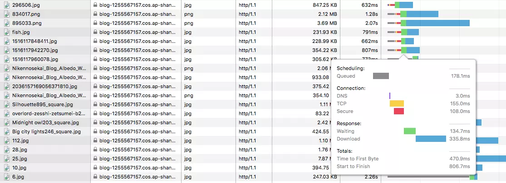
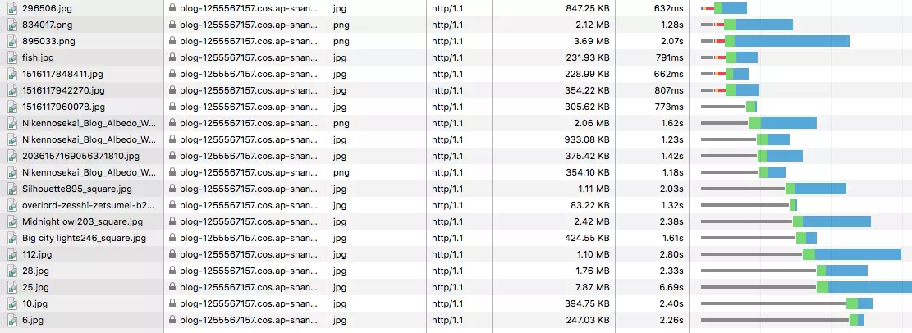
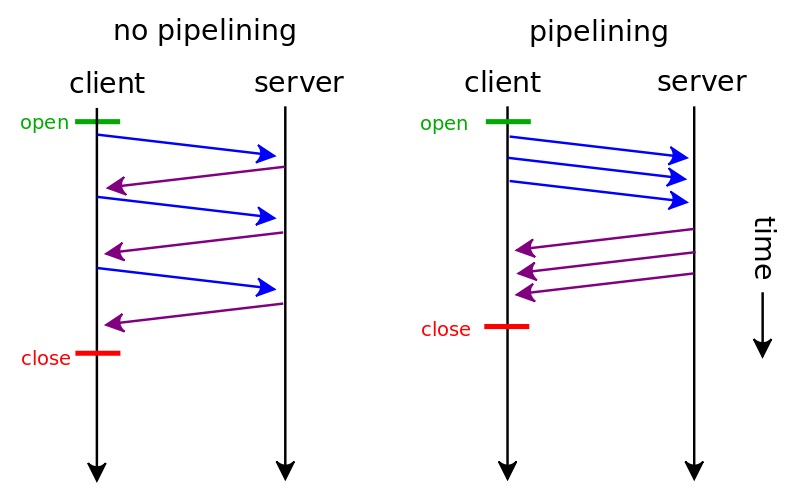
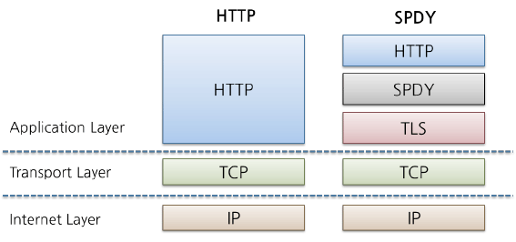
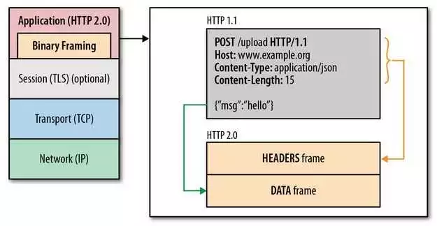
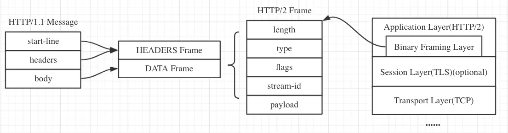

# HTTP/2

<details>
<summary>参考 - 2019年04月17日</summary>

- [标准规范 RFC 7540](https://httpwg.org/specs/rfc7540.html)
- [HTTP2 详解](https://juejin.im/post/5b88a4f56fb9a01a0b31a67e)
- [HTTP 的前世今生：一次性搞懂 HTTP、HTTPS、SPDY、HTTP2](https://juejin.im/post/5be935f2e51d4570813b8cf0)
- [http2 简介](https://juejin.im/post/5aaccf8f51882555784dbabc)
- [HTTP1.0、HTTP1.1 和 HTTP2.0 的区别](https://mp.weixin.qq.com/s/GICbiyJpINrHZ41u_4zT-A?)

</details>

## HTTP/1.1 存在的问题

**1. TCP 连接数限制**

对于同一个域名，浏览器最多只能同时创建 6~8 个 TCP 连接 (不同浏览器不一样)。为了解决数量限制，出现了 `域名分片(Domain sharding)` 技术，其实就是资源分域，将资源放在不同域名下 (比如二级子域名下)，这样就可以针对不同域名创建连接并请求，以一种讨巧的方式突破限制，但是滥用此技术也会造成很多问题，比如每个 TCP 连接本身需要经过 DNS 查询、三步握手、慢启动等，还占用额外的 CPU 和内存，对于服务器来说过多连接也容易造成网络拥挤、交通阻塞等，对于移动端来说问题更明显




在图中可以看到新建了六个 TCP 连接，每次新建连接 DNS 解析需要时间(几 ms 到几百 ms 不等)、TCP 慢启动也需要时间、TLS 握手又要时间，而且后续请求都要等待队列调度

**2. 队头阻塞 (Head Of Line Blocking) 问题**

HTTP/1.0 每个 TCP 连接同时只能处理一个请求响应，浏览器按 FIFO 原则处理请求，如果上一个响应没返回，后续请求响应都会受阻。为了解决此问题，HTTP/1.1 出现了 [pipelining](https://zh.wikipedia.org/wiki/HTTP%E7%AE%A1%E7%B7%9A%E5%8C%96) 技术，但是 pipelining 存在诸多问题，比如第一个响应慢还是会阻塞后续响应、服务器为了按序返回相应需要缓存多个响应占用更多资源、浏览器中途断连重试服务器可能得重新处理多个请求、还有必须客户端-代理-服务器都支持 pipelining，事实已经证明 pipelining 难以实现，因为现有网络中有很多老旧的软件与现代版本的软件共存



**3. Header 内容多，而且每次请求 Header 不会变化太多，重复，没有相应的压缩传输优化方案**

**4. 明文传输不安全**

## SPDY

2012 年 google 如一声惊雷提出了 SPDY 的方案，优化了 HTTP1.X 的请求延迟，解决了 HTTP1.X 的安全性，具体如下：

1. **多路复用降低延迟**。针对 HTTP 高延迟的问题，SPDY 优雅的采取了多路复用（multiplexing）。多路复用通过多个请求 stream 共享一个 tcp 连接的方式，解决了对头阻塞 的问题，降低了延迟同时提高了带宽的利用率。

2. **请求优先级（request prioritization）**。多路复用带来一个新的问题是，在连接共享的基础之上有可能会导致关键请求被阻塞。SPDY 允许给每个 request 设置优先级，这样重要的请求就会优先得到响应。比如浏览器加载首页，首页的 html 内容应该优先展示，之后才是各种静态资源文件，脚本文件等加载，这样可以保证用户能第一时间看到网页内容。

3. **header 压缩**。前面提到 HTTP1.x 的 header 很多时候都是重复多余的。选择合适的压缩算法可以减小包的大小和数量。

4. **基于 HTTPS 的加密协议传输**，大大提高了传输数据的可靠性。

5. **服务端推送（server push）**，采用了 SPDY 的网页，例如我的网页有一个 sytle.css 的请求，在客户端收到 sytle.css 数据的同时，服务端会将 sytle.js 的文件推送给客户端，当客户端再次尝试获取 sytle.js 时就可以直接从缓存中获取到，不用再发请求了。

SPDY 构成图：



其实 SPDY 并不是新的一种协议，而是在 HTTP 之前做了一层会话层。SPDY 位于 HTTP 之下，TCP 和 SSL 之上，这样可以轻松兼容老版本的 HTTP 协议(将 HTTP1.x 的内容封装成一种新的 frame 格式)，同时可以使用已有的 SSL 功能

## HTTP/2

HTTP/2 的前身是由 Google 领导开发的 SPDY，后来 Google 把整个成果交给互联网工程任务组 IETF，IETF 把 SPDY 标准化之后变成 HTTP/2。google 也很大方的废弃掉 SPDY，转向支持 HTTP/2。HTTP/2 是完全兼容 HTTP/1.x 的，可以说是 SPDY 的升级版，但是，HTTP/2 跟 SPDY 仍有不同的地方，如下：

**HTTP/2 和 SPDY 的区别：**

- HTTP/2 支持明文 HTTP 传输，而 SPDY 强制使用 HTTPS

  HTTPS 和 HTTP/2 的恩怨很有趣。Google 在开发 SPDY 的时候是强制使用 HTTPS 的，按照道理基于 SPDY 的 HTTP/2 也应该是强制 HTTPS 的，但是由于社区的阻碍 HTTP/2 可以不使用 HTTPS 协议。但是 chrome 和 firefox 都表示只会开发基于 HTTPS 的 HTTP/2，所以基本意味着使用 HTTP/2 的前提是必须是 HTTPS。

- HTTP/2 消息头的压缩算法采用 [HPACK](http://http2.github.io/http2-spec/compression.html)，而非 SPDY 采用的 [DEFLATE](http://zh.wikipedia.org/wiki/DEFLATE)

**HTTP/2 与 HTTP/1.X 的区别：**

### 二进制分帧 (Binary Framing Layer)

HTTP/1.x 是一个文本协议，而 HTTP/2 是一个彻彻底底的二进制协议，这也是 HTTP/2 可以折腾出那么多新花样的原因。HTTP/2 的二进制协议被称之为`二进制分帧`。

在二进制分帧层上，HTTP/2 会将所有传输的信息分割为更小的消息和帧，并对它们采用二进制格式的编码，其中 HTTP/1.x 的首部信息会被封装到 HEADERS 帧，而我们的 request body 则封装到 DATA 帧里面。




帧的报文格式如下：

```
+--------------------------------------------------------------+   ^
|                   Length (24)                                |   |
+----------------------+---------------------------------------+   +
|        Type (8)      |     Flag (8)                          |  Frame Header
+----+-----------------+---------------------------------------+   +
| R  |                  Stream Identifier (31)                 |   |
+----+---------------------------------------------------------+   v
|                            Frame Payload                     |
+--------------------------------------------------------------+
```

帧由 Frame Header 和 Frame Payload 组成。之前不管是 HEADERS 帧还是 DATA 帧，其原来的 headers 信息 body 信息都放在 Frame Payload 中。

- Type 字段用来表示该帧中的 Frame Payload 保存的是 header 数据还是 body 数据。除了用于标识 header/body，还有一些额外的 Frame Type。
- Length 字段用来表示 Frame Payload 数据大小。
- Frame Payload 用来保存 header 或者 body 的数据。
- **Stream Identifier 用来标识该 frame 属于哪个 stream。** 这句话可能感觉略突兀，这里要明白 Stream Identifier 的作用，需要引出 HTTP/2 的第二个特性`『多路复用』`。

### 多路复用 (MultiPlexing)

在一个 TCP 连接上，我们可以向对方不断发送帧，每帧的 stream identifier 的标明这一帧属于哪个流，然后在对方接收时，根据 stream identifier 拼接每个流的所有帧组成一整块数据。

把 HTTP/1.1 每个请求都当作一个流，那么多个请求变成多个流，请求响应数据分成多个帧，不同流中的帧交错地发送给对方，这就是 HTTP/2 中的多路复用。

流的概念实现了单连接上多请求响应并行，解决了队头阻塞的问题，减少了 TCP 连接数量和 TCP 连接慢启动造成的问题

所以 HTTP2 对于同一域名只需要创建一个连接，而不是像 HTTP/1.1 那样创建 6~8 个连接

#### HTTP/2 的多路复用和 HTTP/1.1 中的长连接复用有什么区别？


- HTTP/1.0 一次请求-响应，建立一个连接，用完关闭；每一个请求都要建立一个连接；
- HTTP/1.1 pipelining 实现了一次性发送多个请求，然而，这种技术在接收响应时，要求必须按照发送请求的顺序返回。一旦有某请求超时等，后续请求只能被阻塞，毫无办法，也就是队头阻塞；
- HTTP/2 多个请求可同时在一个连接上并行执行，某个请求任务耗时严重，不会影响到其它连接的正常执行；

### Header 压缩 (HPACK)

在 HTTP/1.x 协议中，每次请求都会携带 header 数据，而类似 User-Agent, Accept-Language 等信息在每次请求过程中几乎是不变的，那么这些信息在每次请求过程中就变成了浪费。所以， HTTP/2 中提出了一个 [HPACK](https://httpwg.org/specs/rfc7541.html) 的压缩方式，用于减少 http header 在每次请求中消耗的流量。

在客户端和服务器同时维护一张头信息表，所有字段都会存入这个表，生成一个索引号，以后就不发送同样字段了，只发送索引号，这样就提高速度。


### 服务端推送 (Server Push)

同 SPDY 一样，HTTP/2 也具有 server push 功能。允许服务器在客户端缓存中填充数据。比如请求一个网页，还有一些静态资源，服务器根据配置会在请求 html 内容时一起把其他需要的资源推送到客户端缓存中，那么当页面解析需要这个资源时可以直接从本地缓存中读取而避免了再次请求。


### 请求优先级设置

HTTP/2 里的每个 stream 都可以设置依赖 (Dependency) 和权重，可以按依赖树分配优先级，解决了关键请求被阻塞的问题
