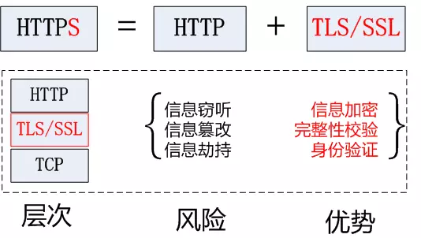
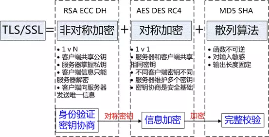
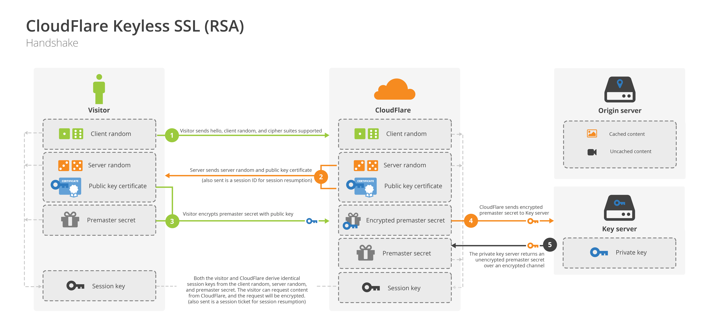
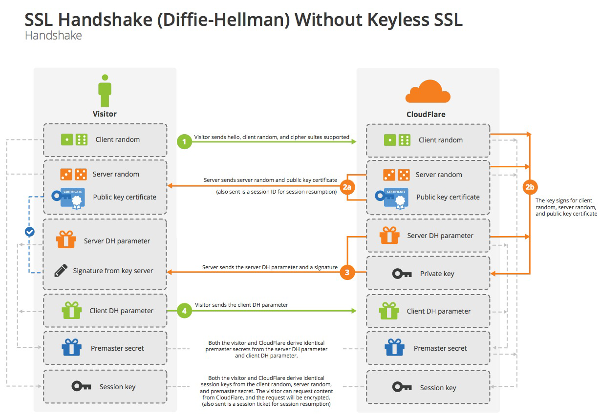
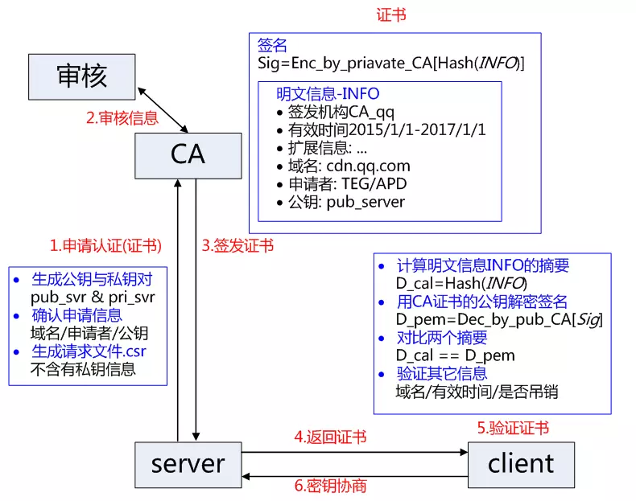
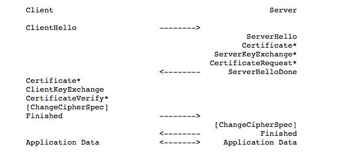
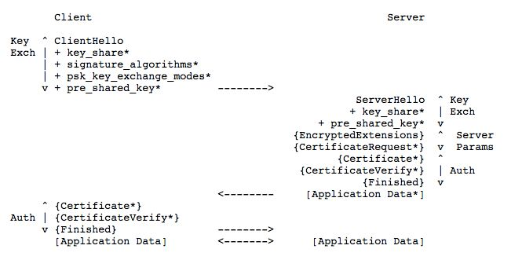

# HTTPS

<details>
<summary>参考 - 2019年5月5日</summary>

- [SSL 协议详解](http://www.cnblogs.com/zhuqil/archive/2012/10/06/2712768.html)
- [图解 SSL/TLS 协议](http://www.ruanyifeng.com/blog/2014/09/illustration-ssl.html)
- [SSL/TLS 协议运行机制的概述](http://www.ruanyifeng.com/blog/2014/02/ssl_tls.html)
- [HTTP 和 HTTPS 详解](https://juejin.im/post/5af557a3f265da0b9265a498#heading-29)
- [详解 TLS1.3 的握手过程](https://blog.csdn.net/zk3326312/article/details/80245756)
- [TLS1.3 VS TLS1.2，让你明白 TLS1.3 的强大](https://zhuanlan.zhihu.com/p/44980381)
- [浅谈 TLS 1.3](https://juejin.im/post/5c21f5b16fb9a049d13229f0)

</details>

## 概念

[HTTPS](https://zh.wikipedia.org/wiki/%E8%B6%85%E6%96%87%E6%9C%AC%E4%BC%A0%E8%BE%93%E5%AE%89%E5%85%A8%E5%8D%8F%E8%AE%AE) 超文本传输安全协议（Hypertext Transfer Protocol Secure，缩写：HTTPS，常称为 HTTP over TLS，HTTP over SSL 或 HTTP Secure）是一种通过计算机网络进行安全通信的传输协议。HTTPS 经由 HTTP 进行通信，但利用 SSL/TLS 来加密数据包。HTTPS 开发的主要目的，是提供对网站服务器的身份认证，保护交换数据的隐私与完整性。这个协议由网景公司（Netscape）在 1994 年首次提出，随后扩展到互联网上。

## VS HTTP

不使用 SSL/TLS 的 HTTP 通信，就是不加密的通信。所有信息明文传播，带来了三大风险。

1. 窃听风险（eavesdropping）：第三方可以获知通信内容。
2. 篡改风险（tampering）：第三方可以修改通信内容。
3. 冒充风险（pretending）：第三方可以冒充他人身份参与通信。

SSL/TLS 协议是为了解决这三大风险而设计的，希望达到：

1. 保密性：所有信息都是加密传播，第三方无法窃听。
2. 完整性：具有校验机制，一旦被篡改，通信双方会立刻发现。
3. 合法性：配备身份证书，防止身份被冒充。



## 历史

1994 年，NetScape 公司设计了 SSL 协议（Secure Sockets Layer）的 1.0 版，但是未发布。

1995 年，NetScape 公司发布 SSL 2.0 版，很快发现有严重漏洞。

1996 年，SSL 3.0 版问世，得到大规模应用。

1999 年，互联网标准化组织 ISOC 接替 NetScape 公司，发布了 SSL 的升级版 TLS 1.0 版。

2006 年和 2008 年，TLS 进行了两次升级，分别为 TLS 1.1 版和 TLS 1.2 版。

2018 年 8 月， TLS 1.3 版发表

在 SSL 更新到 3.0 时，IETF 对 SSL3.0 进行了标准化，并添加了少数机制(但是几乎和 SSL3.0 无差异)，标准化后的 IETF 更名为 TLS1.0(Transport Layer Security 安全传输层协议)，可以说 TLS 1.0 就是 SSL 的新版本 3.1，TLS 是 SSL 标准化后的另一个名称。

## 工作原理

基本思路：要想通信安全那就得对数据加密，加解密就需要协商出一致的密钥，但是密钥直接传输不安全，又需要对密钥本身再加一层难破的非对称加密，但是非对称加密的公钥容易被中间人截获，所以需要一个证书认证确保公钥的安全性。

### 密码学基础

1、密码学的相关概念

**密码学(cryptography)**：目的是通过将信息编码使其不可读，从而达到安全性。<br/>
**明文(plain text)**：发送人、接受人和任何访问消息的人都能理解的消息。<br/>
**密文(cipher text)**：明文消息经过某种编码后，得到密文消息。<br/>
**加密(encryption)**：将明文消息变成密文消息。<br/>
**解密(decryption)**：将密文消息变成明文消息。<br/>
**算法**：取一个输入文本，产生一个输出文本。<br/>
**加密算法**：发送方进行加密的算法。<br/>
**解密算法**：接收方进行解密的算法。<br/>
**密钥(key)**：只有发送方和接收方理解的消息<br/>
**对称密钥加密(Symmetric Key Cryptography)**：加密与解密使用相同密钥。<br/>
**非对称密钥加密(Asymmetric Key Cryptography)**：加密与解密使用不同密钥。<br/>

2、对称加密

对称加密(也叫私钥加密)指加密和解密使用相同密钥的加密算法。对称算法的安全性依赖于密钥，泄漏密钥就意味着任何人都可以对他们发送或接收的消息解密，所以密钥的保密性对通信的安全性至关重要。常见的算法有 AES-CBC、DES、3DES、AES-GCM 等

在 SSL 中会用到 DES、3DES 算法等加密算法对数据进行加密。当然可以选用其他非 DES 加密算法，视情况而定

3、非对称加密

密钥成对出现，一般称为公钥(公开)和私钥(保密)，公钥加密的信息只能私钥解开，私钥加密的信息只能公钥解开。因此掌握公钥的不同客户端之间不能互相解密信息，只能和掌握私钥的服务器进行加密通信，服务器可以实现 1 对多的通信，客户端也可以用来验证掌握私钥的服务器身份。
非对称加密的特点是信息传输 1 对多，服务器只需要维持一个私钥就能够和多个客户端进行加密通信，但服务器发出的信息能够被所有的客户端解密，且该算法的计算复杂，加密速度慢。

使用对称加密算法时，密钥交换是个大难题，所以 Diffie 和 Hellman 提出了著名的 Diffie-Hellman 密钥交换算法。

Diffie-Hellman 密钥交换算法原理：

```
（1）Alice与Bob确定两个大素数n和g，这两个数不用保密
（2）Alice选择另一个大随机数x，并计算A如下：A=g^x mod n
（3）Alice将A发给Bob
（4）Bob 选择另一个大随机数y，并计算B如下：B=g^y mod n
（5）Bob将B发给Alice
（6）计算秘密密钥K1如下：K1=B^x mod n
（7）计算秘密密钥K2如下：K2=A^y mod n

K1=K2，因此Alice和Bob可以用其进行加解密
```

RSA 加密算法是基于这样的数学事实：两个大素数相乘容易，而对得到的乘积求因子则很难。加密过程如下：

```
(1)选择两个大素数P、Q
(2)计算 N=P*Q
(3)选择一个公钥（加密密钥）E，使其不是(P-1)与(Q-1)的因子
(4)选择私钥（解密密钥）D，满足如下条件：
          (D*E) mod (P-1)(Q-1)=1
(5)加密时，明文PT计算密文CT如下：
          CT=PTE mod N
(6)解密时，从密文CT计算明文PT如下：
          PT=CTD mod N 这也是SSL中会用一种密钥交换算法。

```

4、散列算法

主要用于验证数据的完整性也叫信息摘要算法，保证消息在发送之后和接收之前没有被篡改，对于 SSL 中使用到的散列算法有 MD5、SHA-1、SHA-256。

5、数字证书

数字证书其实就是一个小的计算机文件，其作用类似于我们的身份证、护照，用于证明身份，在 SSL 中，使用数字证书来证明自己的身份，而不是伪造的。

HTTPS 协议的主要功能基本都依赖于 TLS/SSL 协议，TLS/SSL 的功能实现主要依赖于三类基本算法：散列函数 Hash、对称加密和非对称加密，其利用非对称加密实现身份认证和密钥协商，对称加密算法采用协商的密钥对数据加密，基于散列函数验证信息的完整性。



### 握手过程

开始加密通信之前，客户端和服务器首先必须建立连接和交换参数，这个过程叫做握手（handshake）。假定客户端叫做爱丽丝，服务器叫做鲍勃，整个握手过程可以用下图说明。


握手阶段分成五步。

```
第一步，爱丽丝给出协议版本号、一个客户端生成的随机数（Client random），以及客户端支持的加密方法。

第二步，鲍勃确认双方使用的加密方法，并给出数字证书、以及一个服务器生成的随机数（Server random）。

第三步，爱丽丝确认数字证书有效，然后生成一个新的随机数（Premaster secret），并使用数字证书中的公钥，加密这个随机数，发给鲍勃。

第四步，鲍勃使用自己的私钥，获取爱丽丝发来的随机数（即Premaster secret）。

第五步，爱丽丝和鲍勃根据约定的加密方法，使用前面的三个随机数，生成"对话密钥"（session key），用来加密接下来的整个对话过程。
```

上面的五步，画成一张图，就是下面这样。



DH 算法的握手阶段

采用 DH 算法后，Premaster secret 不需要传递，双方只要交换各自的参数，就可以算出这个随机数。



上图中，第三步和第四步由传递 Premaster secret 变成了传递 DH 算法所需的参数，然后双方各自算出 Premaster secret。这样就提高了安全性。

### 身份验证 CA 和证书

CA 负责审核信息，然后对关键信息利用私钥进行"签名"，公开对应的公钥，客户端可以利用公钥验证签名。CA 也可以吊销已经签发的证书，基本的方式包括两类 CRL 文件和 OCSP。CA 使用具体的流程如下：



1. 服务方 S 向第三方机构 CA 提交公钥、组织信息、个人信息(域名)等信息并申请认证;
2. CA 通过线上、线下等多种手段验证申请者提供信息的真实性，如组织是否存在、企业是否合法，是否拥有域名的所有权等;
3. 如信息审核通过，CA 会向申请者签发认证文件-证书。
   证书包含以下信息：申请者公钥、申请者的组织信息和个人信息、签发机构 CA 的信息、有效时间、证书序列号等信息的明文，同时包含一个签名;
   签名的产生算法：首先，使用散列函数计算公开的明文信息的信息摘要，然后，采用 CA 的私钥对信息摘要进行加密，密文即签名;
4. 客户端 C 向服务器 S 发出请求时，S 返回证书文件;
5. 客户端 C 读取证书中的相关的明文信息，采用相同的散列函数计算得到信息摘要，然后，利用对应 CA 的公钥解密签名数据，对比证书的信息摘要，如果一致，则可以确认证书的合法性，即公钥合法;
6. 客户端然后验证证书相关的域名信息、有效时间等信息;
7. 客户端会内置信任 CA 的证书信息(包含公钥)，如果 CA 不被信任，则找不到对应 CA 的证书，证书也会被判定非法。

在这个过程注意几点：

1. 申请证书不需要提供私钥，确保私钥永远只能服务器掌握;
2. 证书的合法性仍然依赖于非对称加密算法，证书主要是增加了服务器信息以及签名;
3. 内置 CA 对应的证书称为根证书，颁发者和使用者相同，自己为自己签名，即自签名证书（为什么说"部署自签 SSL 证书非常不安全"）
4. 证书=公钥+申请者与颁发者信息+签名;

## TLS 1.3

TLS 1.3 是时隔九年对 TLS 1.2 等之前版本的新升级，也是迄今为止改动最大的一次。

TLS 1.3 与之前的协议有较大差异，主要在于：

- 相比过去的的版本，引入了新的密钥协商机制 — PSK
- 支持 0-RTT 数据传输，在建立连接时节省了往返时间
- 废弃了 3DES、RC4、AES-CBC 等加密组件，废弃了 SHA1、MD5 等哈希算法
- ServerHello 之后的所有握手消息采取了加密操作，可见明文大大减少
- 不再允许对加密报文进行压缩、不再允许双方发起重协商
- DSA 证书不再允许在 TLS 1.3 中使用
- 对比旧协议中的不足，TLS 1.3 确实可以称得上是向前迈了一大步。既避免之前版本出现的缺陷，也减少了 TLS 握手的时间。

总结一下，TLS 1.3 与以前的版本相比具有如下两个大的优势，分别是：

### 更快的访问速度

为了对比 TLS 1.3 在 TLS 握手阶段的变化， 这里将 TLS 1.2 和 TLS 1.3 在 TLS 握手阶段进行对比。



从上图可以看出，使用 TLS 1.2 需要两次往返（ 2-RTT ）才能完成握手，然后才能发送请求。



TLS 1.3 的握手不再支持静态的 RSA 密钥交换，这意味着必须使用带有前向安全的 Diffie-Hellman 进行全面握手。从上图可以看出，使用 TLS 1.3 协议只需要一次往返（ 1-RTT ）就可以完成握手。

相比 TLS 1.2，TLS 1.3 的握手时间减半。这意味着访问一个移动端网站，使用 TLS 1.3 协议，可能会减少将近 100ms 的时间。

### 更强的安全性

TLS 的发展有 20 多年的历史，在之前的版本中，TLS 1.2 是高度可配置的，为了更好的兼容旧版本的浏览器，这意味着那些易受攻击的站点始终在运行着不安全的加密算法，这让互联网黑客有可乘之机。

TLS 1.3 在之前版本的基础上删除了那些不安全的加密算法，这些加密算法包括：

- RSA 密钥传输 —— 不支持前向安全性
- CBC 模式密码 —— 易受 BEAST 和 Lucky 13 攻击
- RC4 流密码 —— 在 HTTPS 中使用并不安全
- SHA-1 哈希函数 —— 建议以 SHA-2 取而代之
- 任意 Diffie-Hellman 组—— CVE-2016-0701 漏洞
- 输出密码 —— 易受 FREAK 和 LogJam 攻击

TLS 1.3 版本是对规范的重大修改，一些工作方式也非常不同：

- 有一些新的密码套件仅在 TLS 1.3 下工作。一些旧的密码套件无法用于 TLS 1.3 连接。
- 新的密码套件定义方式不同，且并未详细规定证书类型(如 RSA、DSA、ECDSA)或密钥交换机制(如 DHE 或 ECHDE)。这对密码套件的配置有暗示作用。
- 客户端在客户问候消息(ClientHello)中提供一个“key_share”。这会对“组”配置产生影响。
- 直到主握手完成以后，会话才会建立。在握手结束和会话建立之间可能会有一个间隙(理论上，会话可能根本不会建立)，并可能对会话恢复代码产生影响。
- 在 TLS 1.3 版本中，重新磋商是不可能的。
- 现在大部分握手都会被加密。
- 更多类型的消息现在可以有扩展(这对定制扩展 API 和证书透明系统有影响)。
- 在 TLS 1.3 连接中不再允许使用 DSA 证书。

### TLS 1.3 发展情况

- 2017 年 4 月 25 日，nginx 1.13.0 发布，增加了 TLS 1.3 支持。
- 2018 年 3 月 21 日，IESG 批准了 TLS 1.3 草案。
- 2018 年 4 月 17 日，Chrome 66 默认开启了对 TLS 1.3 草案的支持。
- 2018 年 5 月 9 日，Firefox 60 默认开启了对 TLS 1.3 草案的支持。
- 2018 年 8 月 10 日，IETF 发布了 TLS 1.3 标准。
- 2018 年 9 月 11 日，OpenSSL 1.1.1 (LTS) 版本发布，提供 TLS 1.3 支持。TLS 1.3 超过 TLS 1.0 成为 Cloudflare 上使用率排名第二的 TLS 版本。
- 2018 年 10 月 16 日，Chrome 70 支持 TLS 1.3 正式标准。
- 2018 年 10 月 23 日，Firefox 63 支持 TLS 1.3 正式标准。

[Can I Use?](https://caniuse.com/#feat=tls1-3)
