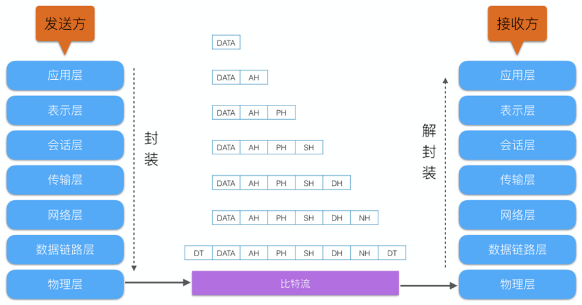
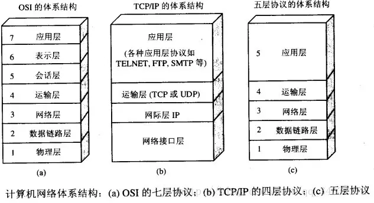

# 网络

引用参考 - 2019年04月14日

- [OSI 与 TCP/IP 各层的结构与功能，都有哪些协议](https://juejin.im/post/5ac04e8e6fb9a028dd4e5ca5)
- [漫谈网络通信——从 OSI 网络模型到 TCP/IP 协议族](https://juejin.im/entry/584f9c04b123db00662890de)

## OSI 七层模型

**OSI** (Open System Interconnection，开放系统互联) 七层网络模型成为开放式系统互联参考模型，是一个网络通信在逻辑上的定义，也可以理解成为定义了通用的网络通信规范。而我们的数据在网络中传输的过程，实际上就是如下图的封装和解封装的过程，发送方通过各种封装处理，把数据转换成比特流的形式，比特流在信号传输的硬件媒介中传输，接收方再把比特流进行解封装处理。

OSI 的七层体系结构概念清楚理论也很完整，但是它比较复杂而且不实用，最终失败原因有：

1. OSI 的专家缺乏实际经验，他们在完成 OSI 标准时缺乏商业驱动力
2. OSI 的协议实现起来过分复杂，而且运行效率很低
3. OSI 制定标准的周期太长，因而使得按 OSI 标准生产的设备无法及时进入市场（20 世纪 90 年代初期，虽然整套的 OSI 国际标准都已经制定出来，但基于 TCP/IP 的互联网已经抢先在全球相当大的范围成功运行了）
4. OSI 的层次划分不太合理，有些功能在多个层次中重复出现

## 五层协议的体系结构

学习计算机网络时我们一般采用折中的办法，也就是中和 OSI 和 TCP/IP 的优点，采用一种只有五层协议的体系结构，这样既简洁又能将概念阐述清楚。

### 1）应用层（application layer）

**应用层的任务是通过应用进程间的交互来完成特定网络应用。**应用层协议定义的是`应用进程间的通信`和交互的规则。对于不同的网络应用需要不同的应用层协议。在互联网中应用层协议很多，如域名系统 DNS，支持万维网应用的 HTTP 协议，支持电子邮件的 SMTP 协议等等。我们把应用层交互的数据单元称为`报文`。

#### DNS 域名系统（Domain Name System）

域名系统是因特网的一项核心服务，它作为可以将域名和 IP 地址相互映射的一个分布式数据库，能够使人更方便的访问互联网，而不用去记住能够被机器直接读取的 IP 数串。

#### HTTP 协议

超文本传输协议（HTTP，HyperText Transfer Protocol)是互联网上应用最为广泛的一种网络协议。所有的 WWW 文件都必须遵守这个标准。设计 HTTP 最初的目的是为了提供一种发布和接收 HTML 页面的方法。

### 2）传输层（transport layer）

**负责总体的数据传输和数据控制，提供端到端的交换数据的机制**。传输层对数据(段)进行分割和重组，并且进行`流量控制`和根据接收方的接收数据能力`确定适当的传输速率`。例如以太网无法处理大于 1500 字节的数据包，传输层将数据分割成数据片段，并对小数据片段进行序列编号。接收方的传输层将根据序列编号对数据进行重组。

传输层主要使用以下两种协议：

#### TCP 传输控制协议（Transmisson Control Protocol）

提供面向连接的，可靠的数据传输服务。

TCP 的主要特点：

1. TCP 是`面向连接`的
2. 每一条 TCP 连接只能有两个端点，每一条 TCP 连接只能是`点对点的`（`一对一`）
3. TCP 提供`可靠交付`的服务。通过 TCP 连接传送的数据，无差错、不丢失、不重复、并且按序到达
4. TCP 提供`全双工通信`。TCP 允许通信双方的应用进程在任何时候都能发送数据。TCP 连接的两端都设有发送缓存和接收缓存，用来临时存放双方通信的数据
5. `面向字节流`。TCP 中的“流”（stream）指的是流入进程或从进程流出的字节序列。“面向字节流”的含义是：虽然应用程序和 TCP 的交互是一次一个数据块（大小不等），但 TCP 把应用程序交下来的数据仅仅看成是一连串的无结构的字节流。

#### UDP 用户数据报协议 （User Datagram Protocol）

提供无连接的，尽最大努力的数据传输服务（不保证数据传输的可靠性）。

UDP 的主要特点：

1. UDP 是`无连接`的；
2. UDP 使用尽最大努力交付，即`不保证可靠交付`，因此主机不需要维持复杂的链接状态（这里面有许多参数）；
3. UDP 是`面向报文`的；
4. UDP `没有拥塞控制`，因此网络出现拥塞不会使源主机的发送速率降低（对实时应用很有用，如 IP 电话，实时视频会议等）；
5. UDP 支持一对一、一对多、多对一和`多对多`的交互通信；
6. UDP 的首部`开销小`，只有 `8` 个字节，比 TCP 的 20 个字节的首部要短。

### 3）网络层（network layer）

**网络层负责为分组交换网上的不同主机提供通信服务。在发送数据时，网络层把传输层产生的报文段或用户数据报封装成分组和包进行传送。**在 TCP/IP 体系结构中，由于网络层使用 IP 协议，因此分组也叫`IP数据报`，简称`数据报`。

这里要注意：不要把传输层的“用户数据报 UDP”和网络层的“IP 数据报”弄混。另外，无论是哪一层的数据单元，都可笼统地用“分组”来表示。

网络层的另一个任务就是选择合适的路由，使源主机传输层所传下来的分组，能通过网络层中的路由器找到目的主机。
这里强调指出，网络层中的“网络”二字已经不是我们通常谈到的具体网络，而是指计算机网络体系结构模型中第三层的名称。
互联网是由大量的异构（heterogeneous）网络通过路由器（router）相互连接起来的。互联网使用的网络层协议是无连接的网际协议（Intert Prococol）和许多路由选择协议，因此互联网的网络层也叫做`网际层`或 `IP 层`。

### 4）数据链路层（data link layer）

**数据链路层通常简称为链路层。两台主机之间的数据传输，总是在一段一段的链路上传送的，这就需要使用专门的链路层的协议。** 在两个相邻节点之间传送数据时，数据链路层将网络层交下来的 IP 数据报组装成`帧`，在两个相邻节点间的链路上传送`帧`。每一帧包括数据和必要的控制信息（如同步信息，地址信息，差错控制等）。

在接收数据时，控制信息使接收端能够知道一个帧从哪个比特开始和到哪个比特结束。这样，数据链路层在收到一个帧后，就可从中提出数据部分，上交给网络层。

控制信息还使接收端能够检测到所收到的帧中有无差错。如果发现差错，数据链路层就简单地丢弃这个出了差错的帧，以避免继续在网络中传送下去白白浪费网络资源。如果需要改正数据在链路层传输时出现差错（这就是说，数据链路层不仅要检错，而且还要`纠错`），那么就要采用可靠性传输协议来纠正出现的差错。这种方法会使链路层的协议复杂些。

### 5）物理层（physical layer）

在物理层上所传送的数据单位是比特。
**物理层的作用是实现相邻计算机节点之间比特流的透明传送，尽可能屏蔽掉具体传输介质和物理设备的差异。**使其上面的数据链路层不必考虑网络的具体传输介质是什么。“透明传送比特流”表示经实际电路传送后的比特流没有发生变化，对传送的比特流来说，这个电路好像是看不见的。

在互联网使用的各种协议栈，最重要和最著名的就是 TCP/IP 两个协议。现在人们经常提到的 TCP/IP 并不一定单指 TCP 和 IP 这两个具体的协议，而往往表示互联网所使用的整个 TCP/IP 协议族。

上面我们对计算机网络的五层体系结构有了初步的了解，下面附送一张七层体系结构图总结一下。

