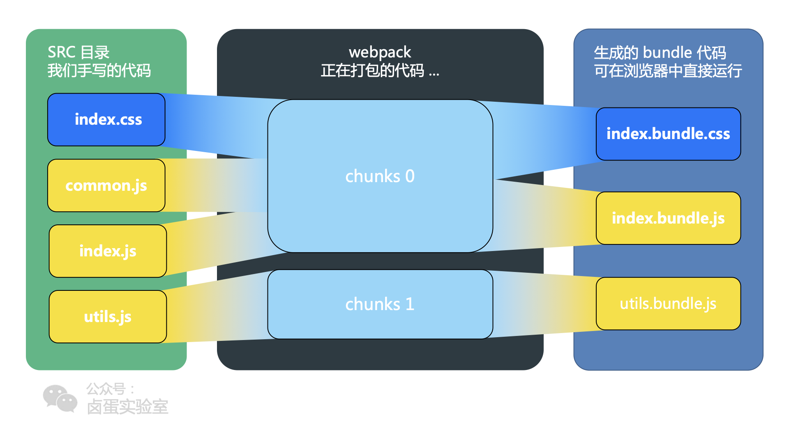

# webpack QA

## module、chunk、bundle 概念及关系

1. 对于一份同逻辑的代码，当我们手写下一个一个的文件，它们无论是 ESM 还是 commonJS 或是 AMD，他们都是 module ；
2. 当我们写的 module 源文件传到 webpack 进行打包时，webpack 会根据文件引用关系生成 chunk 文件，webpack 会对这个 chunk 文件进行一些操作；
3. webpack 处理好 chunk 文件后，最后会输出 bundle 文件，这个 bundle 文件包含了经过加载和编译的最终源文件，所以它可以直接在浏览器中运行。

module 就是我们写源码模块，webpack 将所有引用模块打包为一个整体就是chunk，将chunk再输出到磁盘文件时就叫bundle，但输出不一定就是一个bundle文件，可能会有拆分处理。
