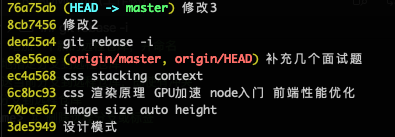
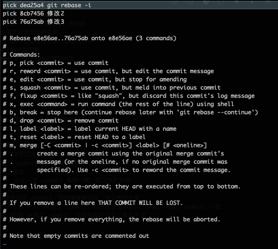
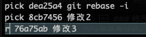
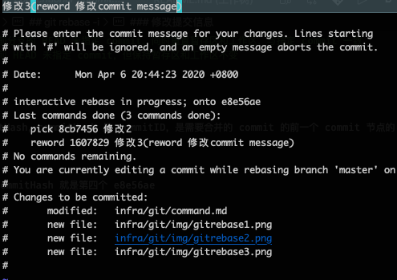
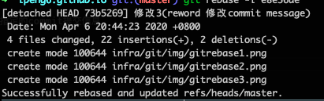
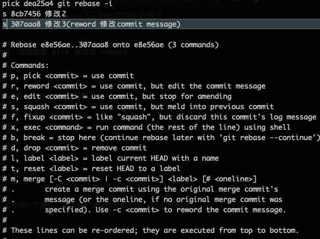
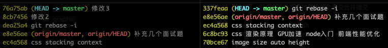

# Git 常用命令

<details>
<summary>引用参考 - 2020年04月06日</summary>

- [Git 提交历史的修改删除合并等实践](https://zhuanlan.zhihu.com/p/31989869)

</details>

## 一、新建代码库

```bash
git init  # 在当前目录新建一个Git代码库
git init [project-name]  # 在当前目录新建一个目录，将其初始化为Git代码库
git clone [url]  # 下载一个项目和它的整个代码历史
```

## 二、配置

Git 的设置文件为.gitconfig，它可以在用户主目录下（全局配置），也可以在项目目录下（项目配置）。

```bash
# 查看
git config --list  # 显示当前的Git配置
git config user.name # 查看某一项的值

# 直接编辑配置文件
git config -e [--global]  # 显示Git配置文件

# 配置用户信息
git config [--global] user.name "[name]"  # 设置提交代码时的用户名
git config [--global] user.email "[email address]"  # 设置提交代码时的用户邮箱

# 设置alias别名
git config --global alias.co 'checkout'
git config --global alias.master 'checkout master'
git config --global alias.develop 'checkout develop'
git config --global alias.s 'status'
git config --global alias.a '!git add . && git status'
git config --global alias.au '!git add -u . && git status'
git config --global alias.aa '!git add . && git add -u . && git status'
git config --global alias.c 'commit'
git config --global alias.cm 'commit -m'
git config --global alias.ca 'commit --amend'
git config --global alias.ac '!git add . && git commit'
git config --global alias.acm '!git add . && git commit -m'
git config --global alias.l 'log --decorate --oneline --graph'
git config --global alias.la 'log --all --decorate --oneline --graph'
git config --global alias.lg 'log --color --graph --pretty=format:'%Cred%h%Creset -%C(yellow)%d%Creset %s %Cgreen(%cr) %C(bold blue)<%an>%Creset' --abbrev-commit'

# 设置pull默认rebase模式
git config --global pull.rebase true
```

## 三、增加/删除/修改文件

```bash
git add [file1] [file2] ... # 添加指定文件到暂存区
git add [dir] # 添加指定目录到暂存区，包括子目录
git add . # 添加当前目录的所有文件到暂存区
git add -p # 添加每个变化前，都会要求确认，对于同一个文件的多处变化，可以实现分次提交
git rm [file1][file2] ... # 删除工作区文件，并且将这次删除放入暂存区
git rm --cached [file] # 停止追踪指定文件，但该文件会保留在工作区
git mv [file-originname][file-newname] # 改名文件，并且将这个改名放入暂存区
```

## 四、代码提交

```bash
git commit -m [message] # 提交暂存区到本地仓库
git commit [file1][file2] ... -m [message] # 提交暂存区指定文件到本地仓库
git commit -a # 提交工作区自上次 commit 之后的变化，直接到本地仓库
git commit -v # 提交时显示所有 diff 信息
git commit --amend -m [message] # 使用一次新的 commit，替代上一次提交，如果代码没有任何变化，则用来改写上一次 commit 的提交信息
git commit --amend [file1][file2] ... # 重做上一次 commit，并包括指定文件的新变化
```

## 五、分支

```bash
git branch # 显示所有本地分支
git branch -r # 列出所有远程分支
git branch -a # 列出所有本地分支和远程分支
git branch [branch-name] # 新建一个分支，但 head 依然停留在当前分支
git branch --track [branch][remote-branch] # 新建一个分支，与指定的远程分支建立追踪关系
git branch -d [branch-name] # 删除指定分支
git checkout -b [branch-name] # 新建一个分支，并切换 head 到该分支
git checkout [branch-name] # 切换 head 到指定分支，并更新工作区
git checkout - # 切换到上一个分支
git branch --set-upstream [branch][remote-branch] # 建立追踪关系，在现有分支与指定的远程分支之间
git merge [branch] # 合并指定分支到当前分支
git rebase <branch> # 衍合指定分支到当前分支
git cherry-pick [commit] # 选择一个 commit，合并进当前分支
git branch -m oldBranch newBranch # 重命名分支
```

## 六、标签

```bash
git tag # 列出所有本地标签
git tag <tagname> # 基于最新提交创建标签
git tag -d <tagname> # 删除标签
git push origin :refs/tags/[tagName] # 删除远程 tag
git show [tag] # 查看 tag 信息
git push [remote] [tag] # 提交指定 tag
git push [remote] --tags # 提交所有 tag
git checkout -b [branch] [tag] # 新建一个分支，指向某个 tag
```

## 七、查看信息

```bash
git status # 查看当前工作区状态(与暂存区对比，增加删除或修改)
git log # 显示当前分支的版本历史
git log --stat # 显示 commit 历史，以及每次 commit 发生变更的文件
git log -S [keyword] # 根据关键字搜索提交历史
git log [tag] HEAD --pretty=format:%s # 显示某个 commit 之后的变动，每个 commit 占据一行。我记得--pretty=online 也行
git log -p [file] # 显示指定文件相关的每一个 diff
git log -5 --pretty --oneline # 显示过去 5 次提交
git shortlog -sn # 显示所有提交过的用户，按提交次数排序
git blame [file] # 显示指定文件是什么人在什么时间修改过，这个 blame 很生动形象
git diff # 显示暂存区和工作区的差异
git diff --cached [file] # 显示暂存区和上一个 commit 的差异
git diff HEAD # 显示工作区与当前分支最新 commit 之间的差异
git diff [first-branch]...[second-branch] # 显示两次提交之间的差异
git diff --shortstat "@{0 day agp}" # 显示今天你写了多少航代码
git show [commit] # 显示某次提交的元数据和内容变化
git show --name-only [commit] # 显示某次提交发生变化的文件
git show [commit]:[filename] # 显示某次提交时，某个文件的内容
git reflog # 查看当前分支所有操作历史，诸如历史提交记录，撤销，合并提交等详细历史记录
```

## 八、远程操作

```bash
git fetch [remote] # 下载远程仓库的所有变动，注意这个时候是不会修改本地文件的
git pull [remote][branch] # 拉取远程仓库的变化，并与本地分支合并
git pull --rebase # 以 rebase 模式拉取
git remote -v # 显示所有远程仓库
git remote show [remote] # 显示某个远程仓库的信息
git remote add [shortname][url] # 增加一个新的远程仓库，并命名
git push [remote][branch] # 上传本地指定分支到远程仓库
git push [remote] --force # 强行推送当前分支到远程仓库，即使有冲突
git push [remote] --all # 推送所有分支到远程仓库
git push <remote> :<branch/tag-name> # 删除远程分支或标签
git push --tags # 上传所有标签
```

## 九、撤销

```bash
git reset --hrad HEAD # 撤销工作目录中所有未提交文件的修改内容
git checkout HEAD <file> # 撤销指定的未提交文件的修改内容
git revert <commit> # 撤销指定的提交
git log --before="1 days" # 退回到之前 1 天的版本
git checkout [file] # 恢复暂存区的指定文件到工作区
git checkout [commit][file] # 恢复某个 commit 的指定文件到暂存区和工作区
git checkout . # 恢复暂存区的所有文件到工作区
git reset [file] # 重置暂存区的指定文件，与上一次 commit 保持一致，但工作区不变
git reset --hard # 重置暂存区与工作区，与上一次 commit 保持一致
git reset [commit] # 重置当前分支的指针未指定 commit，同时重置暂存区，但工作区不变
git reset --hard [commit] # 重置当前分支的 HEAD 未指定 commit，同时重置暂存区和工作区，与指定 commit 一致
git reset --keep [commit] # 重置当前 HEAD 未指定 commit，但保持暂存区和工作区不变
```

## 十、交互式编辑提交信息 git rebase -i

需要用到的指令是 git rebase -i commitHash，commitHash 是 commitID，是需要合并的 commit 的前一个 commit 节点的 ID，



比如要修改最后三个 commit，那么这里的 commitHash 就是第四个 e8e56ae

```bash
git rebase -i e8e56ae
```

命令行终端会输出如下内容：



由远及近列出了我们期望处理的三个提交，前面 pick 代表的默认使用该提交 commit，我们现在可以按 i 进入编辑模式，修改该字段值，值可以如图中描述，经常使用的如下：

1. pick：简写 p，启用该 commit；
2. reword：简写 r，使用该 commit，但是修改提交信息，修改后可以继续编辑后面的提交信息；
3. edit：简写 e，使用 commit，停止合并该 commit；
4. squash：简写 s，使用该 commit，并将该 commit 并入前一 commit；
5. drop：简写 d，移除该 commit；

### 修改提交信息

我们现在尝试修改最近一次的提交 commit 信息，将其前面 pick 修改成 reword：



esc 退出编辑 :wq 保存之后，即可修改之前指定的 commit 提交信息



保存之后会提示成功



### 合并历史提交

前面修改 commit 成功，如果期望将多个提交合并成一个提交，使得整个提交历史更干净，如何处理呢？

如果要将最后三个提交合并提交

```bash
git rebase -i e8e56ae

# 或者

git rebase -i head～3
```

然后修改 pick 值为 squash：



保存退出，会进入最终合并提交 commit 信息编辑状态，在这里会列出合并 commit 的所有 message，我们可以只保留第一次的 message

保存之后提示成功，这样我们就将最后三条 commit 提交 压缩成一个提交，达到了整理提交信息的目的，不至于那么细碎。


