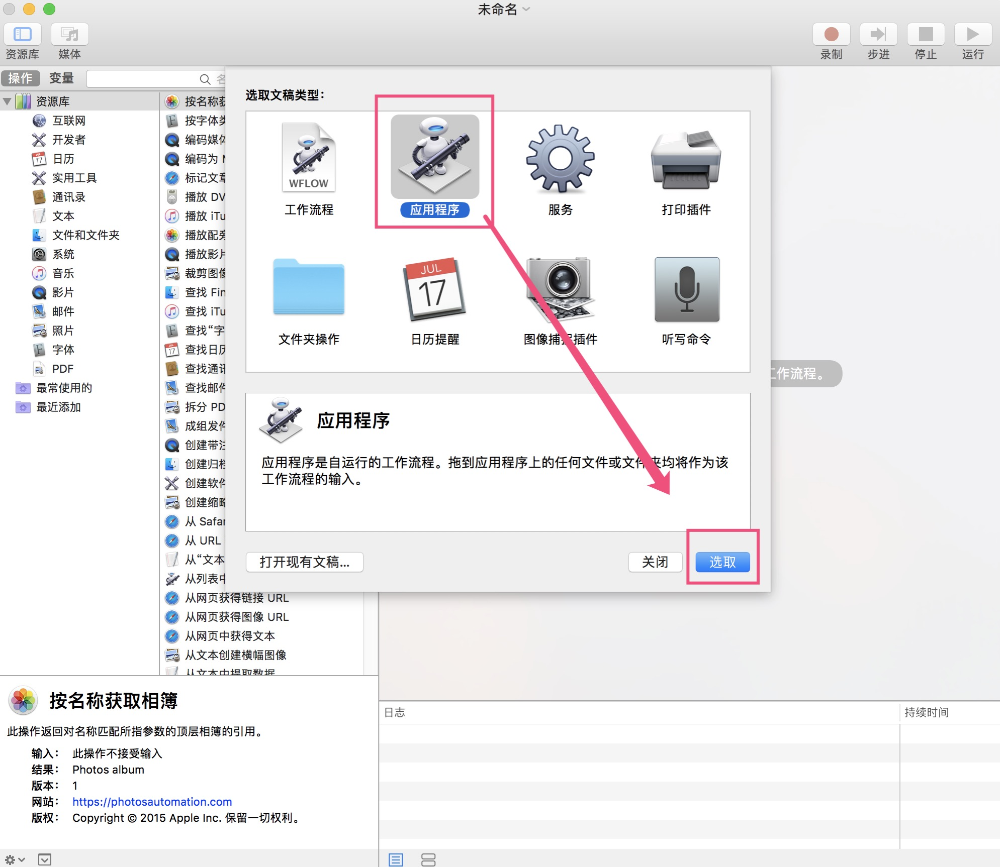
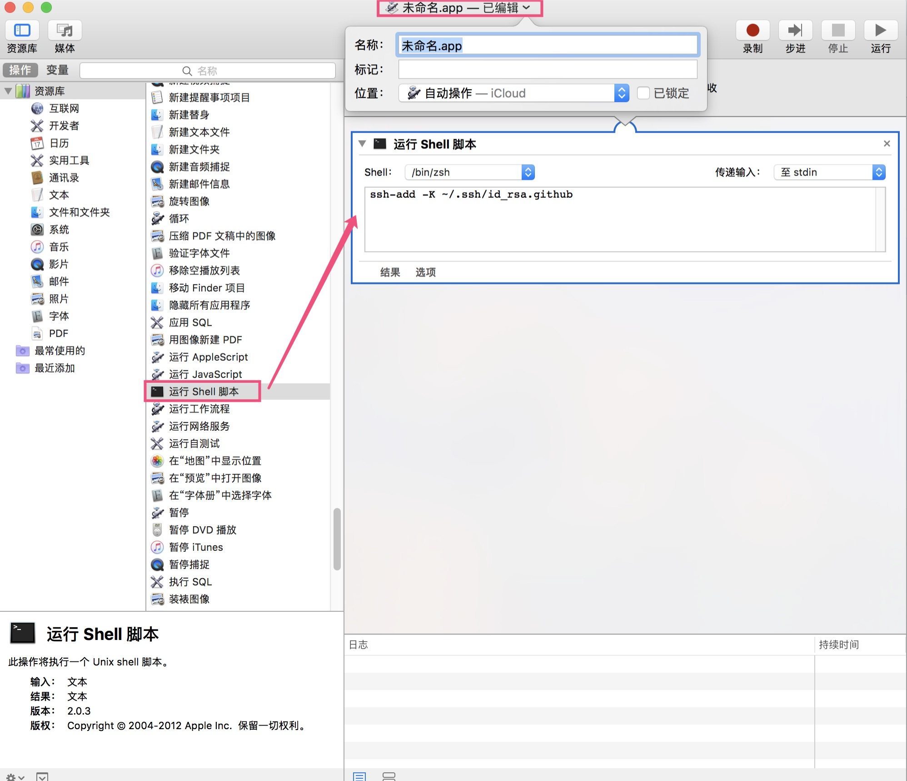

# ssh

使用 SSH 协议可以连接和校验远程服务器及服务。使用 SSH keys,你就可以免密连接 GitHub 等远程仓库

1. 生成 SSH key

   ```bash
   ssh-keygen -t rsa -b 4096 -C "your_email@example.com"

   Enter file in which to save the key (/Users/lls/.ssh/id_rsa): [直接回车]
   # 直接回车 默认会在 ~/.ssh/下生成名为 id_rsa 和 id_rsa.pub 密钥对
   # 输入名称如 id_rsa.github, 则会生成 id_rsa.github 和 id_rsa.github.pub 密钥对

   Enter passphrase (empty for no passphrase): [输入密码 一般不用 直接回车]
   Enter same passphrase again: [直接回车]
   ```

2. 拷贝.pub 公钥到剪贴板或手动拷贝

   ```bash
   pbcopy < ~/.ssh/id_rsa.pub
   ```

3. 添加到 git 仓库网站的个人配置里

   如 github：点击头像->Settings->SSH and GPG keys-> New SSH key 按钮，将内容粘贴在 key 输入框中添加

> 注意：mac 下如果 key 不是用的默认的 id_rsa 则还需要 ssh-add

```bash
ssh-add -K ~/.ssh/id_rsa.github
```

> 使用 macOS Sierra 10.12.2 以上版本 需要修改配置文件 `~/.ssh/config`

AddKeysToAgent 自动加载到 ssh-agent\
UseKeychain 使用 keychain 管理密码

```text
Host github
    HostName github.com
    User ipeng6@qq.com
    AddKeysToAgent yes
    UseKeychain yes
    IdentityFile /Users/you/.ssh/id_rsa.github
Host gitlab
    Hostname git.gitlab.com
    User yuliang.peng@company.com
    AddKeysToAgent yes
    UseKeychain yes
    IdentityFile /Users/you/.ssh/id_rsa
```

> mac 每次重启都要 ssh-add 一次，解决方案：创建 Automator 任务加载私钥，然后放到开机启动中。

1. 找到系统应用程序 Automator

   

2. 选择 应用程序 -> 选取

   

3. 选择 运行 Shell 脚本，点击标题可重命名，保存

   

4. 打开 系统偏好 -> 用户与群组 -> 选择登录项 -> 选择保存的.app 文件为开机自启

   

然后开机运行 `ssh-add -l` 就可以看到 shell 脚本里添加的 key 已经在缓存列表中了。
