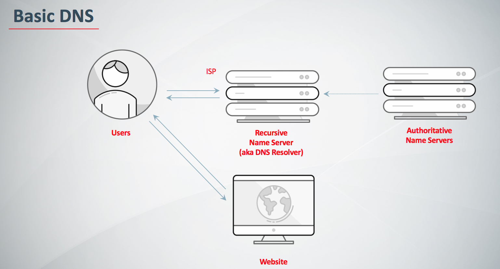

# DNS

参考 - 2019年04月14日

- [DNS: Why It’s Important and How It Works](https://dyn.com/blog/dns-why-its-important-how-it-works/)
- [What is DNS](https://aws.amazon.com/cn/route53/what-is-dns/)

**域名系统(又称 DNS)** 被用来解析像 www.dyn.com 这样的可读主机名, 将其转换为机器可读的 IP 地址, 如 204.13.248.115。 DNS 也是关于域名的重要信息的目录，例如电子邮件服务器（MX 记录）和发送验证（DKIM，SPF，DMARC），域名所有权的 TXT 记录验证，甚至 SSH 指纹（SSHFP）。

智能 DNS 服务还可以操纵 DNS 响应，决定返回哪些 IP 以确保客户端的最佳性能和可靠性。但是为什么 DNS 这么重要呢？ 它是如何工作的？ 你还应该知道什么？

## 为什么 DNS 是重要的？

就像是互联网上的电话簿。 如果你知道一个人的名字但不知道他的电话号码, 你可以直接在电话簿上查查。 DNS 为互联网提供了同样的服务。

当你访问 http://dyn.com 时, 你的电脑使用 DNS 检索网站的 IP 地址 204.13.248.115。 如果没有 DNS, 你只能直接访问我们的网站(或任何网站) , 比如 http://204.13.248.115。

## DNS 是如何工作的？

当你访问像 dyn.com 这样的域名时, 你的电脑会遵循一系列步骤, 将人可读的网址转化为机器可读的 IP 地址。 每次你使用域名时都会发生这种情况, 无论你是在浏览网站, 发送电子邮件, 还是听 Pandora 这样的网络电台。

### 步骤 1: 请求信息

一开始当你要求计算机解析一个主机名, 例如访问 http://dyn.com。 你的电脑首先看到的是它的本地 DNS 缓存, 该缓存存储计算机最近检索到的信息。

如果你的计算机还是不知道答案, 那就需要执行一个 DNS 查询来找出答案。

### 步骤 2: 询问递归 DNS 服务器

如果信息不存储在本地, 计算机联系您的 ISP（网络服务提供商） 的递归 DNS 服务器(resolvers)。 这些专用计算机为你执行一个 DNS 查询工作。 递归服务器有它们自己的缓存，鉴于许多 ISP 的客户使用相同的 DNS 服务器，一些常用域名很可能已经被缓存， 如果是这种情况，这个过程通常在这里就完成了, 并将信息返回给用户。

### 步骤 3: 询问根域名服务器

如果递归服务器没有找到, 他们就会查询根域名服务器。 根域名服务器是一种计算机，它可以回答相关域名的问题, 如 IP 地址。 13 个根域名服务器扮演着一种 DNS 的电话接线员的角色。 他们不知道答案, 但可以将我们的疑问指向知道在哪里可以找到答案的人。

### 步骤 4: 询问 TLD 域名服务器

根域名服务器将查看请求的第一部分, 按从右到左的顺序，从 www.dyn.com 找到.com, 并将请求指向.com 对应的顶级域服务器(top-level domain,TLD). 每个 TLD, 例如.com，.org, .us，拥有自己的顶级域名服务器, 就像每个 TLD 的接线员。 这些服务器没有我们需要的信息, 但是他们可以直接将我们引导到有信息的服务器。

### 步骤 5: 询问权威的 DNS 服务器

TLD 域名服务器会继续检查请求的下一部分（dyn）www.dyn.com, 并将查询指向负责此特定域名的服务器。 这些权威的服务器将负责了解关于特定域的所有信息, 并将信息存储在 DNS 记录中。 有许多类型的记录, 每种记录都包含一种不同的信息。 在这个例子中, 我们想知道 www.dyndns.com 的 IP 地址, 因此我们请求权威的域名服务器提供地址记录。

### 步骤 6: 找回记录

递归服务器从权威服务器中检索 dyn.com 的记录, 并将记录存储在本地缓存中。 如果其他任何人请求 dyn.com 的主机记录, 递归服务器将已经有了答案, 并且不需要再次进行查找。 所有的记录都有一个生存周期值（time-to-live,TTL）, 就像一个过期日期。 一段时间后, 递归服务器需要请求一个新的记录副本, 以确保信息不会过期。

### 步骤 7: 接受答案

有了这个答案, 递归服务器将记录返回到计算机。 您的计算机将记录存储在其缓存中, 从记录中读取 IP 地址, 然后将这些信息传递给浏览器，浏览器打开与 Web 服务器的连接并接收网站。

整个过程, 从开始到结束, 只需要几毫秒就能完成。

大致流程

User -> 本地 DNS 记录 -> ISP DNS 解析器 -> 根域名服务器 -> 顶级域名服务器 -> 权威域名服务器 -> 返回给 ISP 缓存起来 -> 给本地缓存起来

