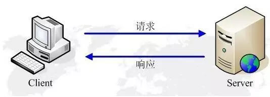
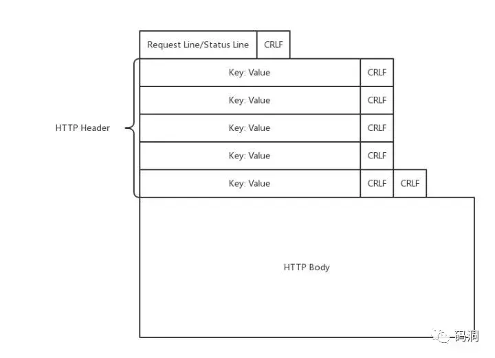

# HTTP

参考

- [MDN HTTP 概述](https://developer.mozilla.org/zh-CN/docs/Web/HTTP/Overview)
- [HTTP 协议入门](http://www.ruanyifeng.com/blog/2016/08/http.html)
- [HTTP 和 HTTPS 详解](https://juejin.im/post/5af557a3f265da0b9265a498)

**HTTP（HyperText Transfer Protocol）** 是一种能够获取如 HTML 这样的网络资源的通讯协议。它是在 Web 上进行数据交换的基础，是一种 client-server 协议，也就是说，请求通常是由像浏览器这样的接受方发起的。一个完整的 Web 文档通常是由不同的子文档拼接而成的，像是文本、布局描述、图片、视频、脚本等等。


## HTTP 请求响应模型

HTTP 由请求和响应构成，是一个标准的客户端服务器模型（B/S）。HTTP 协议永远都是客户端发起请求，服务器回送响应。见下图:



HTTP 是一个无状态的协议。无状态是指客户机（Web 浏览器）和服务器之间不需要建立持久的连接，这意味着当一个客户端向服务器端发出请求，然后服务器返回响应(response)，连接就被关闭了，在服务器端不保留连接的有关信息。HTTP 遵循请求(Request)/应答(Response)模型。客户机（浏览器）向服务器发送请求，服务器处理请求并返回适当的应答。所有 HTTP 连接都被构造成一套请求和应答。

HTTP 请求流程：


## HTTP 历史

HTTP 被设计于 20 世纪 90 年代初期，是一种可扩展的协议。它是应用层的协议，通过 TCP，或者是 TLS－加密的 TCP 连接来发送，理论上任何可靠的传输协议都可以使用。因为其良好的扩展性，时至今日，它不仅被用来传输超文本文档，还用来传输图片、视频或者向服务器发送如 HTML 表单这样的信息。HTTP 还可以根据网页需求，仅获取部分 Web 文档内容更新网页。


### HTTP/0.9

HTTP 是基于 TCP/IP 协议的应用层协议。它不涉及数据包（packet）传输，主要规定了客户端和服务器之间的通信格式，默认使用 80 端口。

最早版本是 1991 年发布的 0.9 版。该版本极其简单，只有一个命令`GET`。

```
GET /index.html
```

上面命令表示，TCP 连接（connection）建立后，客户端向服务器请求（request）网页 index.html。

协议规定，服务器只能回应 HTML 格式的字符串，不能回应别的格式。

```html
<html>
  <body>
    Hello World
  </body>
</html>
```

服务器发送完毕，就关闭 TCP 连接。

### HTTP/1.0

1996 年 5 月，HTTP/1.0 版本发布，内容大大增加。

- 首先，任何格式的内容都可以发送。这使得互联网不仅可以传输文字，还能传输图像、视频、二进制文件。这为互联网的大发展奠定了基础。
- 其次，除了 GET 命令，还引入了`POST`命令和`HEAD`命令，丰富了浏览器与服务器的互动手段。
- 再次，HTTP 请求和回应的格式也变了。除了数据部分，每次通信都必须包括头信息（HTTP header），用来描述一些元数据。
- 其他的新增功能还包括状态码（status code）、多字符集支持、多部分发送（multi-part type）、权限（authorization）、缓存（cache）、内容编码（content encoding）等。

#### 缺点

HTTP/1.0 版的主要缺点是，每个 TCP 连接只能发送一个请求。发送数据完毕，连接就关闭，如果还要请求其他资源，就必须再新建一个连接。

为了解决这个问题，有些浏览器在请求时，用了一个非标准的 Connection 字段。`Connection: keep-alive` 这个字段要求服务器不要关闭 TCP 连接，以便其他请求复用。服务器同样回应这个字段。但是，这不是标准字段，不同实现的行为可能不一致，因此不是根本的解决办法。

### HTTP/1.1

1997 年 1 月，HTTP/1.1 版本发布，只比 1.0 版本晚了半年。其后发布了一系列的 RFC ，其中最著名的是 1999 年 6 月公布的 RFC 2616，定义了 HTTP 协议中现今广泛使用的一个版本——HTTP 1.1。

#### 持久连接

1.1 版的最大变化，就是引入了持久连接（persistent connection），即 TCP 连接默认不关闭，可以被多个请求复用，不用声明 Connection: keep-alive。

目前，对于同一个域名，大多数浏览器允许同时建立 6 个持久连接。

#### 管道机制

1.1 版还引入了管道机制（pipelining），即在同一个 TCP 连接里面，客户端可以同时发送多个请求。这样就进一步改进了 HTTP 协议的效率。

举例来说，客户端需要请求两个资源。以前的做法是，在同一个 TCP 连接里面，先发送 A 请求，然后等待服务器做出回应，收到后再发出 B 请求。管道机制则是允许浏览器同时发出 A 请求和 B 请求，但是服务器还是按照顺序，先回应 A 请求，完成后再回应 B 请求。

#### Content-Length 字段

一个 TCP 连接现在可以传送多个回应，势必就要有一种机制，区分数据包是属于哪一个回应的。这就是 Content-length 字段的作用，声明本次回应的数据长度。

#### 分块传输编码

使用 Content-Length 字段的前提条件是，服务器发送回应之前，必须知道回应的数据长度。

对于一些很耗时的动态操作来说，这意味着，服务器要等到所有操作完成，才能发送数据，显然这样的效率不高。更好的处理方法是，产生一块数据，就发送一块，采用"流模式"（stream）取代"缓存模式"（buffer）。

因此，1.1 版规定可以不使用 Content-Length 字段，而使用"分块传输编码"（chunked transfer encoding）。只要请求或回应的头信息有`Transfer-Encoding` 字段，就表明回应将由数量未定的数据块组成。

每个非空的数据块之前，会有一个 16 进制的数值，表示这个块的长度。最后是一个大小为 0 的块，就表示本次回应的数据发送完了。下面是一个例子。

```

HTTP/1.1 200 OK
Content-Type: text/plain
Transfer-Encoding: chunked

25
This is the data in the first chunk

1C
and this is the second one

8
sequence

0
```

#### 其他功能

1.1 版还新增了许多动词方法：PUT、PATCH、HEAD、 OPTIONS、DELETE。

另外，客户端请求的头信息新增了 Host 字段，用来指定服务器的域名。

```
Host: www.example.com
```

有了 Host 字段，就可以将请求发往同一台服务器上的不同网站，为虚拟主机的兴起打下了基础。

#### 缺点

虽然 1.1 版允许复用 TCP 连接，但是同一个 TCP 连接里面，所有的数据通信是按次序进行的。服务器只有处理完一个回应，才会进行下一个回应。要是前面的回应特别慢，后面就会有许多请求排队等着。这称为"队头堵塞"（Head-of-line blocking）。

为了避免这个问题，只有两种方法：一是减少请求数，二是同时多开持久连接。这导致了很多的网页优化技巧，比如合并脚本和样式表、将图片嵌入 CSS 代码、域名分片（domain sharding）等等。如果 HTTP 协议设计得更好一些，这些额外的工作是可以避免的。

### HTTP/2

2015 年，HTTP/2 发布。它不叫 HTTP/2.0，是因为标准委员会不打算再发布子版本了。 HTTP/2 带来了下列改进

- 二进制协议 Binary Format
- 多路复用 MultiPlexing
- 头信息压缩
- 服务端推送 server push

## HTTP 的基本性质

### HTTP 是简单的

虽然下一代 HTTP/2 协议将 HTTP 消息封装到了帧（frames）中，HTTP 大体上还是被设计得简单易读。HTTP 报文能够被人读懂，还允许简单测试，降低了门槛，对新人很友好。

### HTTP 是可扩展的

在 HTTP/1.0 中出现的 HTTP headers 让协议扩展变得非常容易。只要服务端和客户端就新 headers 达成语义一致，新功能就可以被轻松加入进来。

### HTTP 是无状态，有会话的

HTTP 是无状态的：在同一个连接中，两个执行成功的请求之间是没有关系的。这就带来了一个问题，用户没有办法在同一个网站中进行连续的交互，比如在一个电商网站里，用户把某个商品加入到购物车，切换一个页面后再次添加了商品，这两次添加商品的请求之间没有关联，浏览器无法知道用户最终选择了哪些商品。而使用 HTTP 的头部扩展，HTTP Cookies 就可以解决这个问题。把 Cookies 添加到头部中，创建一个会话让每次请求都能共享相同的上下文信息，达成相同的状态。

注意，HTTP 本质是无状态的，使用 Cookies 可以创建有状态的会话。

### HTTP 连接

一个连接是由传输层来控制的，这从根本上不属于 HTTP 的范围。HTTP 并不需要其底层的传输层协议是面向连接的，只需要它是可靠的，或不丢失消息的（至少返回错误）。在互联网中，有两个最常用的传输层协议：TCP 是可靠的，而 UDP 不是。因此，HTTP 依赖于面向连接的 TCP 进行消息传递，但连接并不是必须的。

HTTP/1.0 为每一个请求/响应都打开一个 TCP 连接，导致了 2 个缺点：打开一个 TCP 连接需要多次往返消息传递，因此速度慢。但当多个消息周期性发送时，这样就变得更加高效：暖连接比冷连接更高效。

为了减轻这些缺陷，HTTP/1.1 引入了 pipelining（被证明难以实现）和持久连接的概念：底层的 TCP 连接可以通过 Connection 头部来被部分控制。HTTP/2 则发展得更远，通过在一个连接复用消息的方式来让这个连接始终保持为暖连接。

为了更好的适合 HTTP，设计一种更好传输协议的进程一直在进行。Google 就研发了一种以 UDP 为基础，能提供更可靠更高效的传输协议 QUIC。

## HTTP 协议格式

HTTP/1.1 以及更早的 HTTP 协议报文都是语义可读的。在 HTTP/2 中，这些报文被嵌入到了一个新的二进制结构，帧。帧允许实现很多优化，比如报文头部的压缩和复用。即使只有原始 HTTP 报文的一部分以 HTTP/2 发送出来，每条报文的语义依旧不变，客户端会重组原始 HTTP/1.1 请求。因此用 HTTP/1.1 格式来理解 HTTP/2 报文仍旧有效。

HTTP 的请求和响应的消息协议是一样的，分为三个部分，起始行、消息头和消息体。这三个部分以 CRLF（Carriage-Return Line-Feed，回车换行\r\n）作为分隔符。最后一个消息头有两个 CRLF，用来表示消息头部的结束。



### 请求

请求行、请求头和请求体


#### URL的结构

使用HTTP协议访问资源是通过URL（Uniform Resource Locator）统一资源定位符来实现的。URL的格式如下：

```
scheme://host:port/path?query#a

scheme: 协议头，譬如有http，ftp等
host: 主机域名或IP地址
port: 端口号
path: 目录路径
query: 查询参数
fragment: #后的hash值，一般用来定位到某个位置
```

#### 请求方法

- GET: 获取URL指定的资源
- POST：传输实体信息附加新数据
- PUT：上传资源更新数据
- DELETE：删除资源
- HEAD：获取报文首部，与GET相比，不返回报文主体部分
- OPTIONS：询问支持的方法、CORS 中的预检
- TRACE：请求服务器回送收到的请求信息，主要用于测试debug
- CONNECT：要求在与代理服务器通信时建立隧道，使用隧道进行TCP通信。主要使用SSL和TLS将数据加密后通过网络隧道进行传输
- PATCH：用于对资源进行部分修改

#### 请求头

| 名称              | 作用                                                                                                                                 |
| ----------------- | ------------------------------------------------------------------------------------------------------------------------------------ |
| Accept            | 接收类型，表示浏览器支持的MIME类型（对标服务端返回的Content-Type）多个值逗号分割如：`Accept: text/html, application/xml; q=0.9, */*` |
| Content-Encoding  | 浏览器支持的压缩类型，如：gzip, deflate                                                                                              |
| Content-Type      | 客户端发送出去实体内容的类型                                                                                                         |
| Cache-Control     | 指定请求和响应遵循的缓存机制，如no-cache                                                                                             |
| If-Modified-Since | 对应服务端的Last-Modified，用来匹配看文件是否变动，只能精确到秒，http1.0中                                                           |
| Expires           | 缓存控制，在这个时间内不会请求，直接使用缓存，http1.0，而且是服务端时间，用客户端时间与之比对                                        |
| If-None-Match     | 对应服务端的ETag，用来匹配文件内容是否改变（非常精确），http1.1中                                                                    |
| Cookie            | 有cookie并且同域访问时会自动带上                                                                                                     |
| Connection        | 当浏览器与服务器通信时对于长连接如何进行处理,如keep-alive                                                                            |
| Host              | 请求的服务器URL                                                                                                                      |
| Origin            | 最初的请求是从哪里发起的（只会精确到端口）,Origin比Referer更尊重隐私                                                                 |
| Referer           | 该页面的来源URL(适用于所有类型的请求，会精确到详细页面地址，csrf拦截常用到这个字段)                                                  |
| User-Agent        | 用户客户端的一些必要信息，如UA头部等                                                                                                 |

### 响应

状态行、响应头和响应体


#### 状态码

#### 响应头

| 名称                         | 作用                                                                |
| ---------------------------- | ------------------------------------------------------------------- |
| Access-Control-Allow-Headers | 服务器端允许的请求Headers                                           |
| Access-Control-Allow-Method  | 服务器端允许的请求方法                                              |
| Access-Control-Allow-Origin  | 服务器端允许的请求Origin头部（譬如为*）                             |
| Content-Type                 | 服务端返回的实体内容的类型，与请求头Accept相对应                    |
| Date                         | 数据从服务器发送的时间                                              |
| Cache-Control                | 告诉浏览器或其他客户，什么环境可以安全的缓存文档                    |
| Last-Modified                | 请求资源的最后修改时间，对应请求头If-Modified-Since                 |
| Expires                      | 应该在什么时候认为文档已经过期,从而不再缓存它                       |
| ETag                         | 请求变量的实体标签的当前值，资源的唯一标识，对应请求头If-None-Match |
| Set-Cookie                   | 设置和页面关联的cookie，服务器通过这个头部把cookie传给客户端        |
| Keep-Alive                   | 如果客户端有keep-alive，服务端也会有响应（如timeout=38）            |
| Server                       | 服务器的一些相关信息                                                |


看个实际例子


