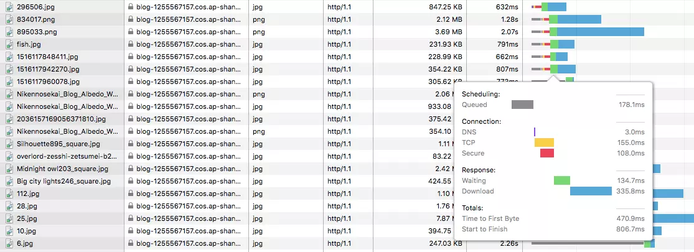
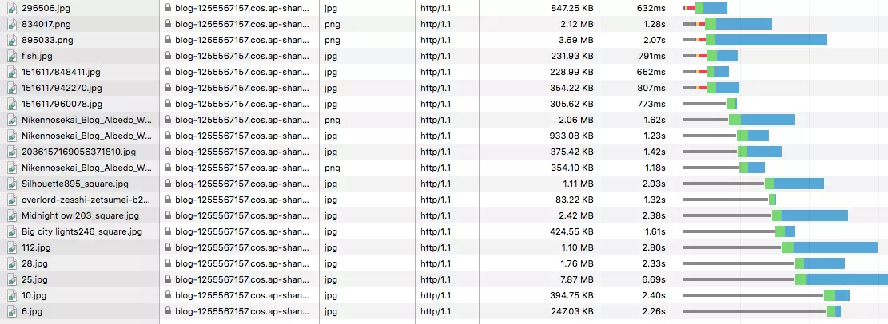

# HTTP/2

参考

- [标准规范 RFC 7540](https://httpwg.org/specs/rfc7540.html)

## HTTP/1.1 存在的问题

**1. TCP 连接数限制**

对于同一个域名，浏览器最多只能同时创建 6~8 个 TCP 连接 (不同浏览器不一样)。为了解决数量限制，出现了 `域名分片(Domain sharding)` 技术，其实就是资源分域，将资源放在不同域名下 (比如二级子域名下)，这样就可以针对不同域名创建连接并请求，以一种讨巧的方式突破限制，但是滥用此技术也会造成很多问题，比如每个 TCP 连接本身需要经过 DNS 查询、三步握手、慢启动等，还占用额外的 CPU 和内存，对于服务器来说过多连接也容易造成网络拥挤、交通阻塞等，对于移动端来说问题更明显，

在图中可以看到新建了六个 TCP 连接，每次新建连接 DNS 解析需要时间(几 ms 到几百 ms 不等)、TCP 慢启动也需要时间、TLS 握手又要时间，而且后续请求都要等待队列调度

**2. 队头阻塞 (Head Of Line Blocking) 问题**

HTTP/1.0 每个 TCP 连接同时只能处理一个请求响应，浏览器按 FIFO 原则处理请求，如果上一个响应没返回，后续请求响应都会受阻。为了解决此问题，HTTP/1.1 出现了 [pipelining](https://zh.wikipedia.org/wiki/HTTP%E7%AE%A1%E7%B7%9A%E5%8C%96) 技术，但是 pipelining 存在诸多问题，比如第一个响应慢还是会阻塞后续响应、服务器为了按序返回相应需要缓存多个响应占用更多资源、浏览器中途断连重试服务器可能得重新处理多个请求、还有必须客户端-代理-服务器都支持 pipelining，事实已经证明 pipelining 难以实现，因为现有网络中有很多老旧的软件与现代版本的软件共存

**3. Header 内容多，而且每次请求 Header 不会变化太多，没有相应的压缩传输优化方案**

**4. 明文传输不安全**
