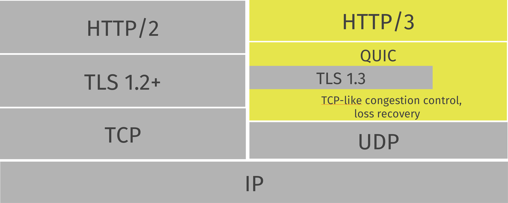
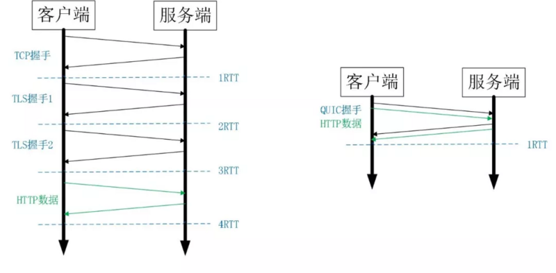
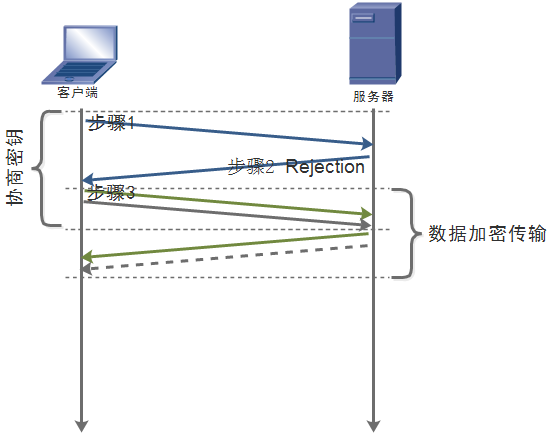
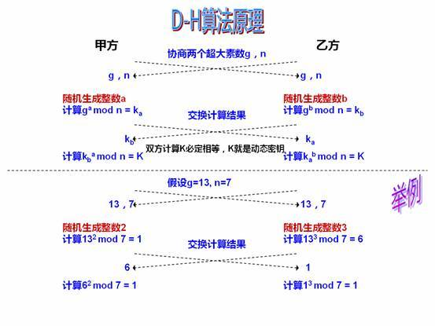
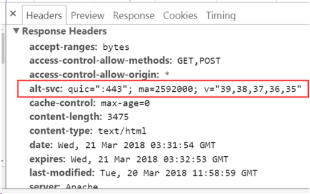

# HTTP/3

参考 - 2019年04月18日

- [维基百科](https://zh.wikipedia.org/wiki/%E5%BF%AB%E9%80%9FUDP%E7%BD%91%E7%BB%9C%E8%BF%9E%E6%8E%A5)
- [HTTP/3 已经箭在弦上，你准备好了吗？](https://liudanking.com/performance/http-3-explained-are-you-ready/)
- [HTTP/3 详解](https://http3-explained.haxx.se/zh/)
- [Web 通信协议，你还需要知道： SPDY 和 QUIC](https://segmentfault.com/a/1190000016265991)

HTTP/3 目前还没有正式发布，在这之前我们首先需要了解下 QUIC。

**QUIC（Quick UDP Internet Connections）** 是一种实验性的传输层网络传输协议，由 Google 开发，在 2013 年实现。QUIC 使用 UDP 协议，它在两个端点间创建连接，且支持多路复用。在设计之初，QUIC 希望能够提供等同于 SSL/TLS 层级的网络安全保护，减少数据传输及创建连接时的延迟，双向控制带宽，以避免网络拥塞。Google 希望使用这个协议来取代 TCP 协议，使网页传输速度加快，计划将 QUIC 提交至互联网工程任务小组（IETF），让它成为下一代的正式网络规范。2015 年 6 月，QUIC 的网络草案被正式提交至互联网工程任务组。2018 年 10 月，互联网工程任务组 HTTP 及 QUIC 工作小组正式将基于 QUIC 协议的 HTTP (HTTP over QUIC) 重命名为 `HTTP/3` 以为确立下一代规范做准备。

## 与 HTTP/2 相同之处

- 这两个协议为客户端提供了几乎相同的功能集。
- 两者都提供数据流
- 两者都提供服务器推送
- 两者都有头部压缩，QPACK 与 HPACK 的设计非常类似
- 两者都通过单一连接上的数据流提供复用
- 两者都提供数据流的优先度设置

## 特性

### 1. 基于 UDP 建立的连接：

我们知道，基于 TCP 的协议，如 HTTP/2，在首次建立连接的时候需要进行三次握手，即至少需要 3 个 RTT（round-trip time），而考虑安全 HTTPS 的
TLS 层，又需要至少 2 次的通信才能协商出密钥。这在短连接的场景中极大的增加了网络延迟，而这种延迟是无法避免的。

而基于 UDP 的 QUIC 协议，则不需要 3 次握手的过程，甚至在安全协商阶段只需要进行 1~2 次的协商通信，即可建立安全稳定的连接，极大的减少了网络延迟。

### 2. 0/1 RTT 基于 Diffie-Hellman 的加密算法

HTTPS 使用的是 TLS + SSL 的加密手段，在交换证书、协商密钥的过程中，至少需要 2 次 RTT 进行协商通信。而 QUIC 使用了 Diffie-Hellman 算法，算法的原理使得客户端和浏览器之间只需要 1 次的协商就能获得通信密钥，QUIC 建立安全链接的详细过程:

- 客户端发起 Inchoate client hello
- 服务器返回 Rejection，包括密钥交换算法的公钥信息，算法信息，证书信息等被放到 server config 中传给客户端
- 客户端发起 client hello，包括客户端公钥信息

后续发起连接的过程中，一旦客户端缓存或持久化了 server config，就可以复用并结合本地生成的私钥进行加密数据传输了，不需要再次握手，从而实现 `0RTT` 建立连接。

**Diffie-Hellman 算法原理**

D-H 算法的数学基础是离散对数的数学难题，其加密过程如下：

- 1）客户端与服务端确定两个大素数 n 和 g，这两个数不用保密
- 2）客户端选择另一个大随机数 x，并计算 A 如下：A = g^x mod n
- 3）客户端将 A 发给服务端
- 4）服务端选择另一个大随机数 y，并计算 B 如下：B = g^y mod n
- 5）服务端将 B 发给客户端
- 7）计算秘密密钥 K1 如下：K1=B^2 mod n ， 计算秘密密钥 K2 如下：K2=A^y mod n , K1=K2，因此服务端和客户端可以用其进行加解密

攻击者知道 n 和 g，并且截获了 A 和 B，但是当它们都是非常大的数的时候，依靠这四个数来计算 k1 和 k2 非常困难，这就是离散对数数学难题。

### 3. 改进的多路复用

我们知道，无论是 HTTP/2 还是 SPDY,基于 TCP 的协议尽管实现了多路复用，但仍然没有彻底避免队头阻塞的问题，这个问题是由于 TCP 底层的实现造成的，即 TCP 的包有严格的顺序控制，前序包如果丢失，则后续包即使返回了也不会通知到应用层协议，从而导致了前序包阻塞。而 QUIC 基于 UDP 则天然的避免了这个问题，由于 UDP 没有严格的包顺序，一个包的阻塞只会影响它自身，并不会影响到其他资源，且 QUIC 也实现了类似 HTTP/2 的多路复用，这种没有队头阻塞的多路复用对延迟的降低是显而易见的。

### 4. 连接的迁移

在以往的基于 TCP 的协议中，往往使用四元组（源 IP，源端口，目的 IP，目的端口）来标识一条连接，当四元组中的 IP 或端口任一个发生变化了连接就需要重新建立，从而不具备连接迁移的能力。

而 QUIC 使用了 connection id 对连接进行唯一标识。即使网络从 4G 变成了 wifi，只要两次连接中的 connection id 不变，并且客户端或者服务器能通过校验，就不需要重新建立连接，连接迁移就能成功。

这在移动端场景的优势极为明显，因为手机经常会在 wifi 和 4g 中切换，使用 QUIC 协议降低了重建连接的成本。

### 5. 协商的升级

在 chorme 浏览器中，发起一个 TCP 请求，这个请求会同时与服务器开始建立 TCP 和 QUIC 的连接（前提是服务器支持），如果 QUIC 连接先建立成功，则使用 QUIC 建立的连接通信，反之，则使用 TCP 建立的连接进行通信。具体步骤如下：

- 1、客户端发出 TCP 请求
- 2、服务端如果支持 QUIC 可以通过响应头 alt-svc 告知客户端
- 3、客户端同时发起 TCP 连接和 QUIC 连接竞赛
- 4、一旦 QUIC 建立连接获胜则采用 QUIC 协议发送请求
- 5、如遇网络或服务器不支持 quic/udp，客户端标记 QUIC 为 broken
- 6、传输中的请求通过 TCP 重发
- 7、5min 后尝试重试 quic，下一次尝试增大到 10min
- 8、一旦再次成功采用 QUIC 并把 broken 标记取消

其中，支持 QUIC 的 alt-svc 头部信息如下图示：

### 6. 其他特性：

- 改进的拥塞控制
- 丢包恢复
- 底层的连接持久化
- head stream 保证包顺序
- 双级别流量控制
