# TCP/IP

参考

- [漫谈网络通信——从 OSI 网络模型到 TCP/IP 协议族](https://juejin.im/entry/584f9c04b123db00662890de)

## 什么是 TCP/IP 协议？

TCP/IP 协议定义了今天的电子设备如何连入 internet 网络，以及数据如何在他们之间传输的标准。从“TCP/IP”名字上来看，貌似这只是 tcp 协议和 ip 协议，但是实际上，这是很多协议的集合。

从概念上来讲，TCP/IP 协议族则把 7 层网络模型合并成 4 层，其对应关系如下：

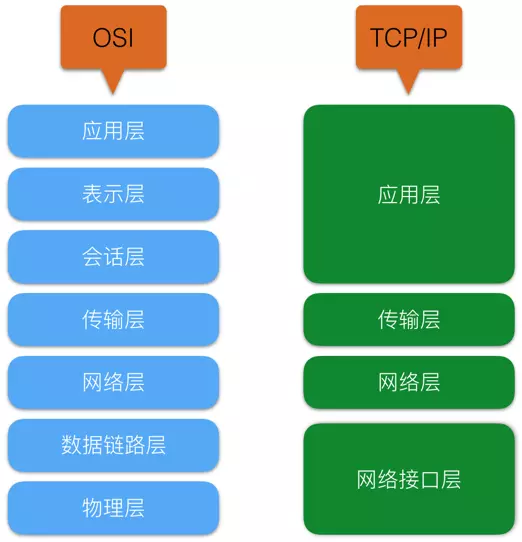

各层协议举例

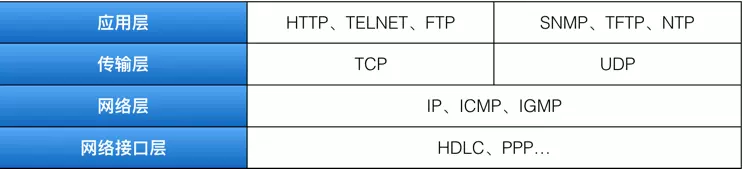

## 网络接口层

### 主要作用一：数据封装/解封装成帧(frame)

为了保证可靠传输，网络层传过来的数据在这里被加工成了可被物理层传输的结构包——`帧`。帧中除了包括需要传输的数据外，还包括发送方和接收方的`物理地址`以及`检错`和`控制信息`。其中的物理地址确定了帧将发送到何处，检错和控制信息则是用来保证数据的无差错到达。数据帧结构如下(Address 均为 mac 地址)：

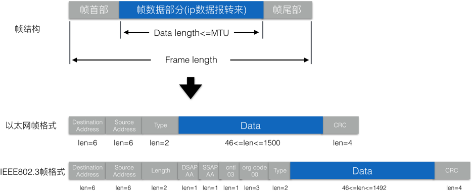

### 主要作用二：控制帧传输

控制帧的传输主要体现在`反馈重发`、`计时器`、`帧序号`方面。接收方通过对帧的差错编码(奇偶校验码或 CRC 码)的检查，来判断帧在传输过程中是否出错，并向发送发进行反馈，如果传输发生差错，则需要重发纠正。作为发送方，在发送帧后，会同时启动定时器，如果帧发送后在一定时间内没有收到反馈，为了避免传输停滞不前，则在计时器 Timeou 后认为帧传输出错，自动重发。为了避免多次收到同一帧并将其递交给网络层的情况发生，则需要对每个发送的帧进行编号，接收方以此来判断该帧是否重复接受了。

### 主要作用三：流量控制

由于收发双方各自使用的设备工作速率和缓冲存储空间的差异，可能出现发送方的发送能力大于接收方接收能力的现象，此时若不对发送方的发送速率做适当的限制，前面来不及接收的帧将被后面不断发送来的帧“淹没”，从而造成帧的丢失而出错。由此可见，`流量控制实际上是对发送方数据流量的控制`，使其发送速率不超过接收方的速率。所以需要一些规则使得发送方知道在什么情况下可以接着发送下一帧，而在什么情况下必须暂停发送，以等待收到某种反馈信息后再继续发送。

## 网络层

说到网络层不得不提的就是 IP 协议，它是 TCP/IP 协议族中最为核心的协议。所有的 TCP、UDP、ICMP、IGMP 协议数据都以 IP 数据报格式传输。IP 协议提供的是`不可靠`的、`无连接`的数据报传输服务。不可靠是指 IP 协议不会保证数据报能否成功到达目的地，仅提供传输服务，传输出错，则会丢弃出错的数据报。无连接是指 IP 协议对数据报的处理是独立的，这也意味着接收方不一定会按照发送顺序接收数据报。

IP 数据报格式如下：

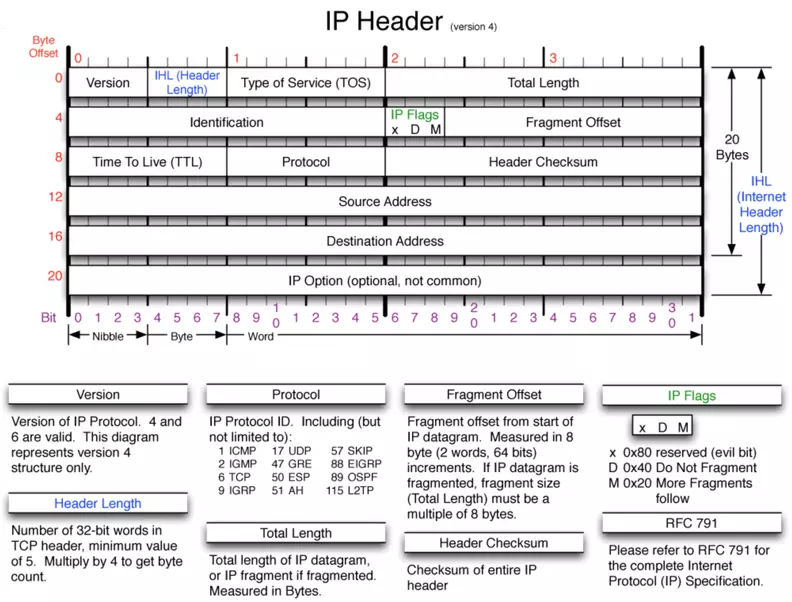

## 传输层

无论参考 OSI 还是 TCP/IP 的网络模型，我们从传输层向更底层看，各层的协议都是在直接或间接的服务于主机与主机之间的通信，而传输层则是在`进程与进程通信`层面上的。传输层有两个重要的协议——TCP 协议和 UDP 协议。不同的应用进程则使用不同的传输层协议。

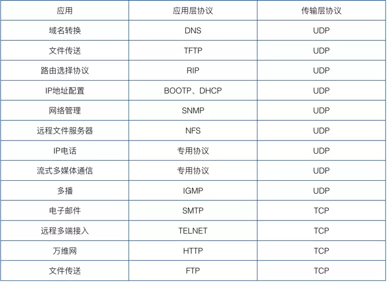

端口的作用则正是体现在传输层的。用来区分网络消息由主机上的那一个进程处理。端口号有 0 ～ 65535 的编号，其中 0 ～ 1023 为系统端口号。

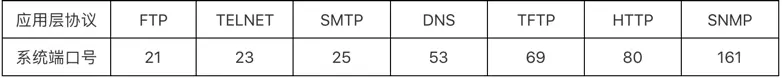

### UDP 协议

UDP(User Datagram Protocol)即用户数据报协议，其传输机制决定了它的最大优点——快，同时也决定了它最大的缺点——不可靠、不稳定。

- UDP 是无连接的，发送数据之前不需要建立连接(TCP 需要)。减少了开销和延时。
- UDP 是面向报文的，对 IP 数据报只做简单封装(8 字节 UDP 报头)。减少报头开销。
- UDP 没有阻塞机制，宁愿阻塞时丢弃数据不传，也不阻塞造成延时。
- UDP 支持一对一、一对多、多对一、多对多通信。

UDP 报文结构：

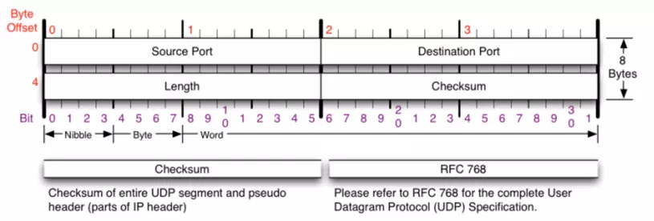

### TCP 协议

TCP(Transmission Control Protocol)传输控制协议，相对于 UDP，TCP 是面向连接的、提供可靠的数据传输服务。同时也是较 UDP 开销较大的、传输速度较慢的。

- TCP 提供可靠的、面向连接的数据传输服务。使用 TCP 通信之前，需要进行“三次握手”建立连接，通信结束后还要使用“四次挥手”断开连接。
- TCP 是点对点的连接。一条 TCP 连接只能连接两个端点。
- TCP 提供可靠传输，无差错、不丢失、不重复、按顺序。
- TCP 提供全双工通信，允许通信双方任何时候都能发送数据，发送方设有发送缓存，接收方设有接收缓存。
- TCP 面向字节流 。TCP 并不知道所传输的数据的含义，仅把数据看作一连串的字节序列，它也不保证接收方收到的数据块和发送方发出的数据块具有大小对应关系。

TCP 报文结构：

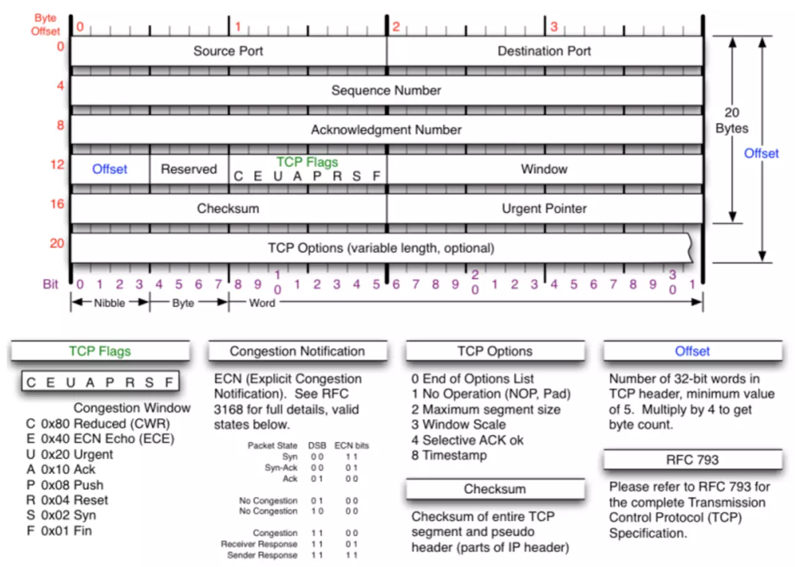

TCP 是面向字节流的，通过 TCP 传送的字节流中的每个字节都按顺序编号，而报头中的 Sequence Number 字段值则指的是本报文段数据的第一个字节的序号。Acknowledgment Number 是期望收到对方下个报文段的第一个数据字节的序号。

- Offset：占 4 位，指 TCP 报文段的报头长度，包括固定的 20 字节和 TCP Options 字段。
- Reserved：占 6 位，保留为今后使用，目前为 0。
- TCP flags 的 C、E、U、A、P、R、S、F 字段用来说明该报文的性质。意义如下：

  - C(CWR)和 E(ECE)用来支持 ECN(显示阻塞通告)。
  - U(URGENT)：当 URG=1 时，它告诉系统此报文中有紧急数据，应优先传送(比如紧急关闭)，这要与紧急指针字段配合使用。
  - A(ACK)：仅当 ACK=1 时确认号字段才有效。建立 TCP 连接后，所有报文段都必须把 ACK 字段置为 1。
  - P(PUSH)：若 TCP 连接的一端希望另一端立即响应，PSH 字段便可以“催促”对方，不再等到缓存区填满才发送。
  - R(RESET)：若 TCP 连接出现严重差错，RST 置为 1，断开 TCP 连接，再重新建立连接。
  - S(SYN)：用于建立和释放连接，当 SYN=1 时，表示建立连接。
  - F(FIN)：用于释放连接，当 FIN=1，表明发送方已经发送完毕，要求释放 TCP 连接。

- Window：占 2 个字节。窗口值是指发送者自己的接收窗口大小，因为接收缓存的空间有限。
- CheckSum：占 2 个字节。和 UDP 报文一样，有一个检验和，用于检查报文是否在传输过程中出差错。
- Urgent Pointer：占 2 字节。当 URG=1 时才有效，指出本报文段紧急数据的字节数。

#### TCP建立连接的三次握手：

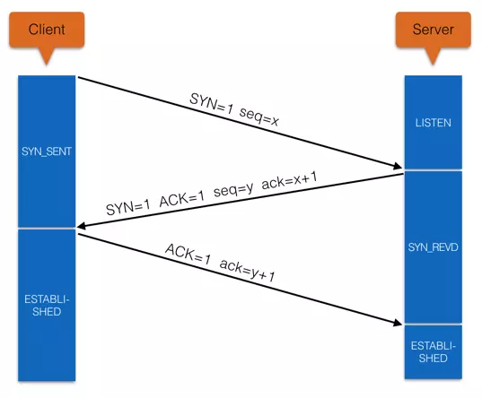

(1) Client首先向Server发送连接请求报文段，同步自己的seq(x)，Client进入SYN_SENT状态。

(2) Server收到Client的连接请求报文段，返回给Client自己的seq(y)以及ack(x+1)，Server进入SYN_REVD状态。

(3) Client收到Server的返回确认，再次向服务器发送确认报文段ack(y+1)，这个报文段已经可以携带数据了。Client进入ESTABLISHED状态。

(4) Server再次收到Client的确认信息后，进入ESTABLISHED状态。

#### TCP断开连接的四次挥手：

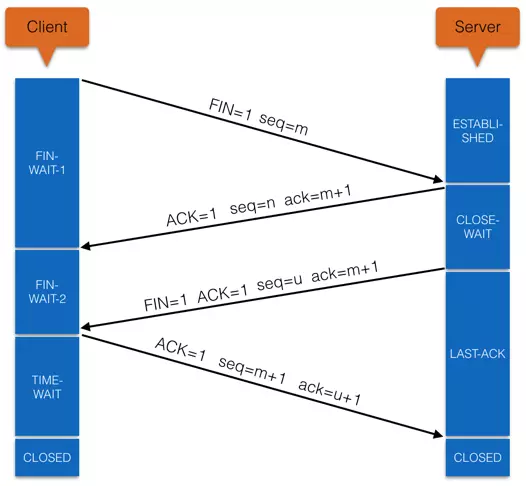

(1) Client向Server发送断开连接请求的报文段，seq=m(m为Client最后一次向Server发送报文段的最后一个字节序号加1)，Client进入FIN-WAIT-1状态。

(2) Server收到断开报文段后，向Client发送确认报文段，seq=n(n为Server最后一次向Client发送报文段的最后一个字节序号加1)，ack=m+1，Server进入CLOSE-WAIT状态。此时这个TCP连接处于半开半闭状态，Server发送数据的话，Client仍然可以接收到。

(3) Server向Client发送断开确认报文段，seq=u(u为半开半闭状态下Server最后一次向Client发送报文段的最后一个字节序号加1)，ack=m+1，Server进入LAST-ACK状态。

(4) Client收到Server的断开确认报文段后，向Server发送确认断开报文，seq=m+1，ack=u+1，Client进入TIME-WAIT状态。

(5) Server收到Client的确认断开报文，进入CLOSED状态，断开了TCP连接。

(6) Client在TIME-WAIT状态等待一段时间(时间为2*MSL((Maximum Segment Life))，确认Client向Server发送的最后一次断开确认到达(如果没有到达，Server会重发步骤(3)中的断开确认报文段给Client，告诉Client你的最后一次确认断开没有收到)。如果Client在TIME-WAIT过程中没有再次收到Server的报文段，就进入CLOSES状态。TCP连接至此断开。

#### 完整的流程如下

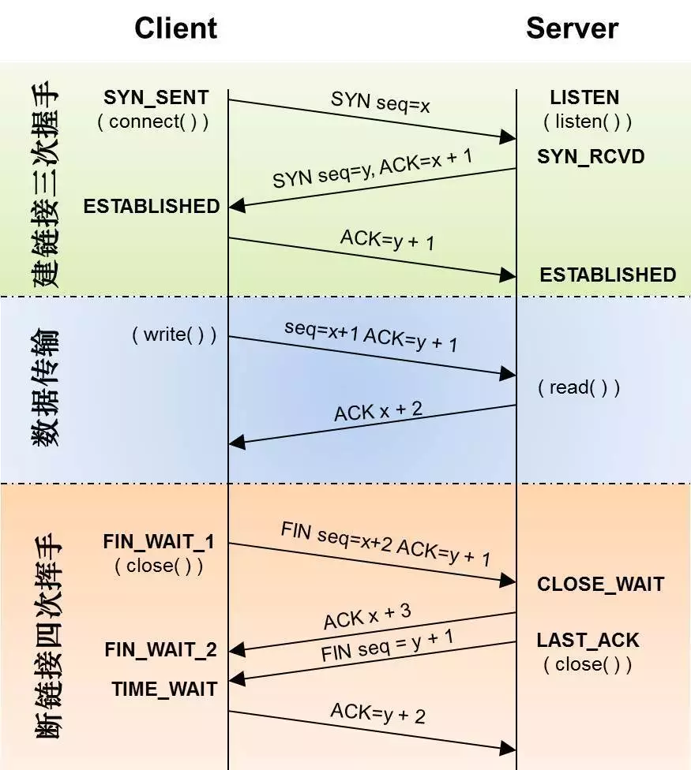
