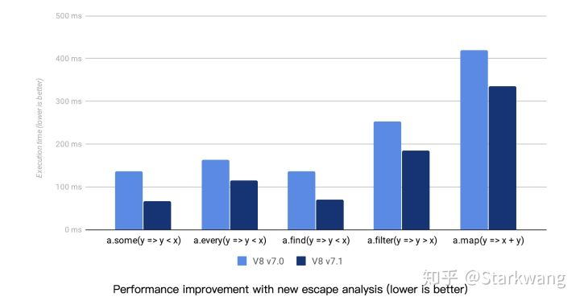
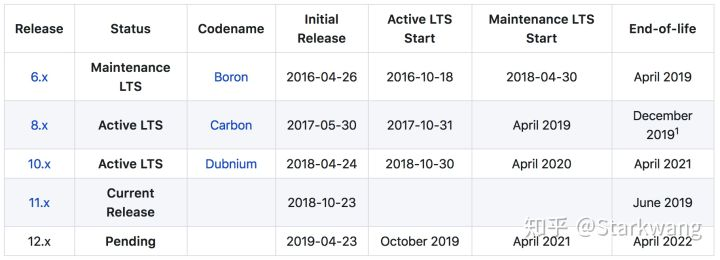
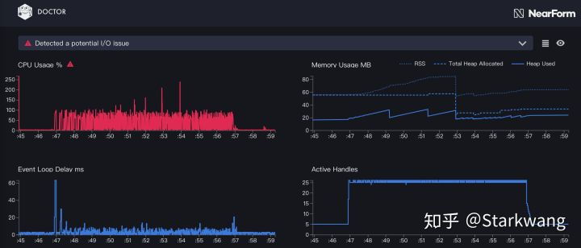
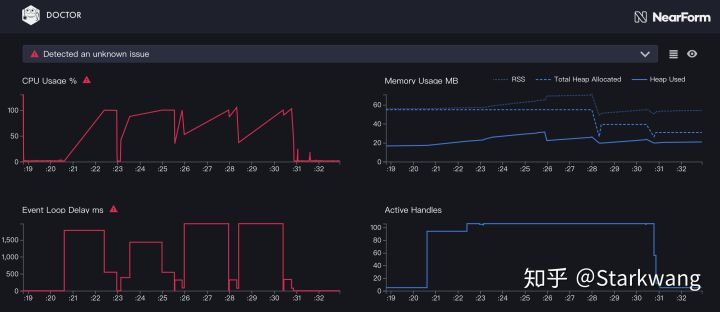

# 你不知道的 Node.js 性能优化

> 原文： https://zhuanlan.zhihu.com/p/50055740 2018-11-16

## 1、使用最新版本的 Node.js

仅仅是简单的升级 Node.js 版本就可以轻松地获得性能提升，因为几乎任何新版本的 Node.js 都会比老版本性能更好，为什么？

Node.js 每个版本的性能提升主要来自于两个方面：

1. V8 的版本更新；
2. Node.js 内部代码的更新优化。

例如最新的 V8 7.1 中，就优化了某些情形下闭包的逃逸分析，让 Array 的一些方法得到了性能提升：


Node.js 的内部代码，随着版本的升级，也会有明显的优化，比如下面这个图就是 `require` 的性能随着 Node.js 版本升级的变化：


每个提交到 Node.js 的 PR 都会在 review 的时候考虑会不会对当前性能造成衰退。同时也有专门的 benchmarking 团队来监控性能变化，你可以在这里看到 Node.js 的每个版本的性能变化：

[Node.js Benchmarking](https://benchmarking.nodejs.org/)

所以，你可以完全对新版本 Node.js 的性能放心，如果发现了任何在新版本下的性能衰退，欢迎提交一个 issue。

### 如何选择 Node.js 的版本？

这里就要科普一下 Node.js 的版本策略：

- Node.js 的版本主要分为 Current 和 LTS；
- Current 就是当前最新的、依然处于开发中的 Node.js 版本；
- LTS 就是稳定的、会长期维护的版本；
- Node.js 每六个月（每年的四月和十月）会发布一次大版本升级，大版本会带来一些不兼容的升级；
- 每年四月发布的版本（版本号为偶数，如 v10）是 LTS 版本，即长期支持的版本，社区会从发布当年的十月开始，继续维护 18 + 12 个月（Active LTS + Maintenance LTS）；
- 每年十月发布的版本（版本号为奇数，例如现在的 v11）只有 8 个月的维护期。

举个例子，现在（2018 年 11 月），Node.js Current 的版本是 v11，LTS 版本是 v10 和 v8。更老的 v6 处于 Maintenace LTS，从明年四月起就不再维护了。去年十月发布的 v9 版本在今年六月结束了维护。


对于生产环境而言，Node.js 官方推荐使用最新的 LTS 版本，现在是 v10.13.0。

## 2、使用 fast-json-stringify 加速 JSON 序列化

在 JavaScript 中，生成 JSON 字符串是非常方便的：

```js
const json = JSON.stringify(obj);
```

但很少人会想到这里竟然也存在性能优化的空间，那就是使用 JSON Schema 来加速序列化。

在 JSON 序列化时，我们需要识别大量的字段类型，比如对于 string 类型，我们就需要在两边加上 "，对于数组类型，我们需要遍历数组，把每个对象序列化后，用 , 隔开，然后在两边加上 [ 和 ]，诸如此类等等。

但如果已经提前通过 Schema 知道每个字段的类型，那么就不需要遍历、识别字段类型，而可以直接用序列化对应的字段，这就大大减少了计算开销，这就是 [fast-json-stringify](https://github.com/fastify/fast-json-stringify) 的原理。

根据项目中的跑分，在某些情况下甚至可以比 JSON.stringify 快接近 10 倍！


一个简单的示例：

```js
const fastJson = require('fast-json-stringify');
const stringify = fastJson({
  title: 'Example Schema',
  type: 'object',
  properties: {
    name: { type: 'string' },
    age: { type: 'integer' },
    books: {
      type: 'array',
      items: {
        type: 'string',
        uniqueItems: true,
      },
    },
  },
});

console.log(
  stringify({
    name: 'Starkwang',
    age: 23,
    books: ['C++ Primer', '響け！ユーフォニアム～'],
  }),
);
//=> {"name":"Starkwang","age":23,"books":["C++ Primer","響け！ユーフォニアム～"]}
```

在 Node.js 的中间件业务中，通常会有很多数据使用 JSON 进行传输，并且这些 JSON 的结构是非常相似的（如果你使用了 TypeScript，更是这样），这种场景就非常适合使用 JSON Schema 来优化。

## 3、提升 Promise 的性能

Promise 是解决回调嵌套地狱的灵丹妙药，特别是当自从 async/await 全面普及之后，它们的组合无疑成为了 JavaScript 异步编程的终极解决方案，现在大量的项目都已经开始使用这种模式。

但是优雅的语法后面也隐藏着性能损耗，我们可以使用 [github 上一个已有的跑分项目](https://github.com/kyrylkov/promise-async-performance)进行测试，以下是测试结果：

```
file                               time(ms)  memory(MB)
callbacks-baseline.js                   380       70.83
promises-bluebird.js                    554       97.23
promises-bluebird-generator.js          585       97.05
async-bluebird.js                       593      105.43
promises-es2015-util.promisify.js      1203      219.04
promises-es2015-native.js              1257      227.03
async-es2017-native.js                 1312      231.08
async-es2017-util.promisify.js         1550      228.74

Platform info:
Darwin 18.0.0 x64
Node.JS 11.1.0
V8 7.0.276.32-node.7
Intel(R) Core(TM) i5-5257U CPU @ 2.70GHz × 4
```

我们可以从结果中看到，原生 async/await + Promise 的性能比 callback 要差很多，并且内存占用也高得多。对于大量异步逻辑的中间件项目而言，这里的性能开销还是不能忽视的。

通过对比可以发现，性能损耗主要来自于 Promise 对象自身的实现，V8 原生实现的 Promise 比 bluebird 这样第三方实现的 Promise 库要慢很多。而 async/await 语法并不会带来太多的性能损失。

所以对于大量异步逻辑、轻量计算的中间件项目而言，可以在代码中把全局的 Promise 换为 bluebird 的实现：

```js
global.Promise = require('bluebird');
```

## 4、正确地编写异步代码

使用 async/await 之后，项目的异步代码会非常好看：

```js
const foo = await doSomethingAsync();
const bar = await doSomethingElseAsync();
```

但因此，有时我们也会忘记使用 Promise 给我们带来的其它能力，比如 Promise.all() 的并行能力：

```js
// bad
async function getUserInfo(id) {
  const profile = await getUserProfile(id);
  const repo = await getUserRepo(id);
  return { profile, repo };
}

// good
async function getUserInfo(id) {
  const [profile, repo] = await Promise.all([
    getUserProfile(id),
    getUserRepo(id),
  ]);
  return { profile, repo };
}
```

还有比如 [Promise.any()](http://bluebirdjs.com/docs/api/promise.any.html)（此方法不在 ES6 Promise 标准中，也可以使用标准的 Promise.race() 代替），我们可以用它轻松实现更加可靠快速的调用：

```js
async function getServiceIP(name) {
  // 从 DNS 和 ZooKeeper 获取服务 IP，哪个先成功返回用哪个
  // 与 Promise.race 不同的是，这里只有当两个调用都 reject 时，才会抛出错误
  return await Promise.any([getIPFromDNS(name), getIPFromZooKeeper(name)]);
}
```

## 5、优化 V8 GC

关于 V8 的垃圾回收机制，已经有很多类似的文章了，这里就不再重复介绍。推荐两篇文章：

[解读 V8 GC Log（一）: Node.js 应用背景与 GC 基础知识](https://yq.aliyun.com/articles/592878)

[解读 V8 GC Log（二）: 堆内外内存的划分与 GC 算法](https://yq.aliyun.com/articles/592880)

我们在日常开发代码的时候，比较容易踩到下面几个坑：

### 坑一：使用大对象作为缓存，导致老生代（Old Space）的垃圾回收变慢

示例：

```js
const cache = {};
async function getUserInfo(id) {
  if (!cache[id]) {
    cache[id] = await getUserInfoFromDatabase(id);
  }
  return cache[id];
}
```

这里我们使用了一个变量 cache 作为缓存，加速用户信息的查询，进行了很多次查询后，cache 对象会进入老生代，并且会变得无比庞大，而老生代是使用三色标记 + DFS 的方式进行 GC 的，一个大对象会直接导致 GC 花费的时间增长（而且也有内存泄漏的风险）。

解决方法就是：

- 使用 Redis 这样的外部缓存，实际上像 Redis 这样的内存型数据库非常适合这种场景；
- 限制本地缓存对象的大小，比如使用 FIFO、TTL 之类的机制来清理对象中的缓存。

### 坑二：新生代空间不足，导致频繁 GC

这个坑会比较隐蔽。

Node.js 默认给新生代分配的内存是 64MB（64 位的机器，后同），但因为新生代 GC 使用的是 Scavenge 算法，所以实际能使用的内存只有一半，即 32MB。

当业务代码频繁地产生大量的小对象时，这个空间很容易就会被占满，从而触发 GC。虽然新生代的 GC 比老生代要快得多，但频繁的 GC 依然会很大地影响性能。极端的情况下，GC 甚至可以占用全部计算时间的 30% 左右。

解决方法就是，在启动 Node.js 时，修改新生代的内存上限，减少 GC 的次数：

```js
node --max-semi-space-size=128 app.js
```

当然有人肯定会问，新生代的内存是不是越大越好呢？

随着内存的增大，GC 的次数减少，但每次 GC 所需要的时间也会增加，所以并不是越大越好，具体数值需要对业务进行压测 profile 才能确定分配多少新生代内存最好。

但一般根据经验而言，**分配 64MB 或者 128MB 是比较合理的**。

## 6、正确地使用 Stream

Stream 是 Node.js 最基本的概念之一，Node.js 内部的大部分与 IO 相关的模块，比如 http、net、fs、repl，都是建立在各种 Stream 之上的。

下面这个经典的例子应该大部分人都知道，对于大文件，我们不需要把它完全读入内存，而是使用 Stream 流式地把它发送出去：

```js
const http = require('http');
const fs = require('fs');

// bad
http.createServer(function(req, res) {
  fs.readFile(__dirname + '/data.txt', function(err, data) {
    res.end(data);
  });
});

// good
http.createServer(function(req, res) {
  const stream = fs.createReadStream(__dirname + '/data.txt');
  stream.pipe(res);
});
```

在业务代码中合理地使用 Stream 能很大程度地提升性能，但是实际的业务中我们很可能会忽略这一点，比如采用 React 服务器端渲染的项目，我们就可以用 [renderToNodeStream](https://reactjs.org/docs/react-dom-server.html#rendertonodestream)：

```js
const ReactDOMServer require('react-dom/server')
const http = require('http')
const fs = require('fs')
const app = require('./app')

// bad
const server = http.createServer((req, res) => {
  const body = ReactDOMServer.renderToString(app)
  res.end(body)
});

// good
const server = http.createServer(function (req, res) {
  const stream = ReactDOMServer.renderToNodeStream(app)
  stream.pipe(res)
})

server.listen(8000)
```

### 使用 pipeline 管理 stream

在过去的 Node.js 中，处理 stream 是非常麻烦的，举个例子：

```js
source
  .pipe(a)
  .pipe(b)
  .pipe(c)
  .pipe(dest);
```

一旦其中 source、a、b、c、dest 中，有任何一个 stream 出错或者关闭，会导致整个管道停止，此时我们需要手工销毁所有的 stream，在代码层面这是非常麻烦的。

所以社区出现了 pump 这样的库来自动控制 stream 的销毁。而 Node.js v10.0 加入了一个新的特性：stream.pipeline，可以替代 pump 帮助我们更好的管理 stream。

一个官方的例子：

```js
const { pipeline } = require('stream');
const fs = require('fs');
const zlib = require('zlib');

pipeline(
  fs.createReadStream('archive.tar'),
  zlib.createGzip(),
  fs.createWriteStream('archive.tar.gz'),
  err => {
    if (err) {
      console.error('Pipeline failed', err);
    } else {
      console.log('Pipeline succeeded');
    }
  },
);
```

### 实现自己的高性能 Stream

在业务中你可能也会自己实现一个 Stream，可读、可写、或者双向流，可以参考文档：

- [implementing Readable streams](https://nodejs.org/docs/latest/api/stream.html#stream_implementing_a_readable_stream)
- [implementing Writable streams](https://nodejs.org/docs/latest/api/stream.html#stream_implementing_a_writable_stream)

Stream 虽然很神奇，但自己实现 Stream 也可能会存在隐藏的性能问题，比如：

```js
class MyReadable extends Readable {
  _read(size) {
    while (null !== (chunk = getNextChunk())) {
      this.push(chunk);
    }
  }
}
```

当我们调用 new MyReadable().pipe(xxx) 时，会把 getNextChunk() 所得到的 chunk 都 push 出去，直到读取结束。但如果此时管道的下一步处理速度较慢，就会导致数据堆积在内存中，导致内存占用变大，GC 速度降低。

而正确的做法应该是，根据 this.push() 返回值选择正确的行为，当返回值为 false 时，说明此时堆积的 chunk 已经满了，应该停止读入。

```js
class MyReadable extends Readable {
  _read(size) {
    while (null !== (chunk = getNextChunk())) {
      if (!this.push(chunk)) {
        return false;
      }
    }
  }
}
```

这个问题在 Node.js 官方的一篇文章中有详细的介绍：

[Backpressuring in Streams | Node.js](https://nodejs.org/en/docs/guides/backpressuring-in-streams/)

## 7、C++ 扩展一定比 JavaScript 快吗？

Node.js 非常适合 IO 密集型的应用，而对于计算密集的业务，很多人都会想到用编写 C++ Addon 的方式来优化性能。但实际上 C++ 扩展并不是灵丹妙药，V8 的性能也没有想象的那么差。

比如，我在今年九月份的时候把 Node.js 的 net.isIPv6() 从 C++ 迁移到了 JS 的实现，让大多数的测试用例都获得了 10%- 250% 不等的性能提升（[具体 PR 可以看这里](https://github.com/nodejs/node/pull/22673)）。

JavaScript 在 V8 上跑得比 C++ 扩展还快，这种情况多半发生在与字符串、正则表达式相关的场景，因为 V8 内部使用的正则表达式引擎是 [irregexp](https://github.com/ashinn/irregex)，这个正则表达式引擎比 [boost](https://www.boost.org/) 中自带的引擎（boost::regex）要快得多。

还有一处值得注意的就是，Node.js 的 C++ 扩展在进行类型转换的时候，可能会消耗非常多的性能，如果不注意 C++ 代码的细节，性能会很大地下降。

这里有一篇文章对比了相同算法下 C++ 和 JS 的性能（需翻墙）：

[How to get a performance boost using Node.js native addons](https://medium.com/developers-writing/how-to-get-a-performance-boost-using-node-js-native-addons-fd3a24719c85)

其中值得注意的结论就是，C++ 代码在对参数中的字符串进行转换后（String::Utf8Value 转为 std::string），性能甚至不如 JS 实现的一半。只有在使用 NAN 提供的类型封装后，才获得了比 JS 更高的性能。


换句话说，C++ 是否比 JavaScript 更加高效需要具体问题具体分析，某些情况下，C++ 扩展不一定就会比原生 JavaScript 更高效。如果你对自己的 C++ 水平不是那么有信心，其实还是建议用 JavaScript 来实现，因为 V8 的性能比你想象的要好得多。

## 8、使用 node-clinic 快速定位性能问题

说了这么多，有没有什么可以开箱即用，五分钟见效的呢？当然有。

[node-clinic](https://github.com/nearform/node-clinic) 是 [NearForm](https://www.nearform.com/) 开源的一款 Node.js 性能诊断工具，可以非常快速地定位性能问题。

```bash
npm i -g clinic
npm i -g autocannon
```

使用的时候，先开启服务进程：

```bash
clinic doctor -- node server.js
```

然后我们可以用任何压测工具跑一次压测，比如使用同一个作者的 [autocannon](https://github.com/mcollina/autocannon)（当然你也可以使用 ab、curl 这样的工具来进行压测。）：

```bash
autocannon http://localhost:3000
```

压测完毕后，我们 ctrl + c 关闭 clinic 开启的进程，就会自动生成报告。比如下面就是我们一个中间件服务的性能报告：


我们可以从 CPU 的使用曲线看出，这个中间件服务的性能瓶颈不在自身内部的计算，而在于 I/O 速度太慢。clinic 也在上面告诉我们检测到了潜在的 I/O 问题。

下面我们使用 clinic bubbleprof 来检测 I/O 问题：

```bash
clinic bubbleprof -- node server.js
```

再次进行压测后，我们得到了新的报告：


这个报告中，我们可以看到，`http.Server` 在整个程序运行期间，96% 的时间都处于 pending 状态，点开后，我们会发现调用栈中存在大量的 empty frame，也就是说，由于网络 I/O 的限制，CPU 存在大量的空转，这在中间件业务中非常常见，也为我们指明了优化方向不在服务内部，而在服务器的网关和依赖的服务响应速度上。

想知道如何读懂 clinic bubbleprof 生成的报告，可以看这里：https://clinicjs.org/bubbleprof/walkthrough/

**同样，clinic 也可以检测到服务内部的计算性能问题**，下面我们做一些“破坏”，让这个服务的性能瓶颈出现在 CPU 计算上。

我们在某个中间件中加入了空转一亿次这样非常消耗 CPU 的“破坏性”代码：

```js
function sleep() {
  let n = 0;
  while (n++ < 10e7) {
    empty();
  }
}
function empty() {}

module.exports = (ctx, next) => {
  sleep();
  // ......
  return next();
};
```

然后使用 `clinic doctor`，重复上面的步骤，生成性能报告：


这就是一个非常典型的**同步计算阻塞了异步队列**的“病例”，即主线程上进行了大量的计算，导致 JavaScript 的异步回调没法及时触发，Event Loop 的延迟极高。

对于这样的应用，我们可以继续使用 `clinic flame` 来确定到底是哪里出现了密集计算：

```js
clinic flame -- node app.js
```

压测后，我们得到了火焰图（这里把空转次数减少到了 100 万次，让火焰图看起来不至于那么极端）：


从这张图里，我们可以明显看到顶部的那个大白条，它代表了 sleep 函数空转所消耗的 CPU 时间。根据这样的火焰图，我们可以非常轻松地看出 CPU 资源的消耗情况，从而定位代码中哪里有密集的计算，找到性能瓶颈。
