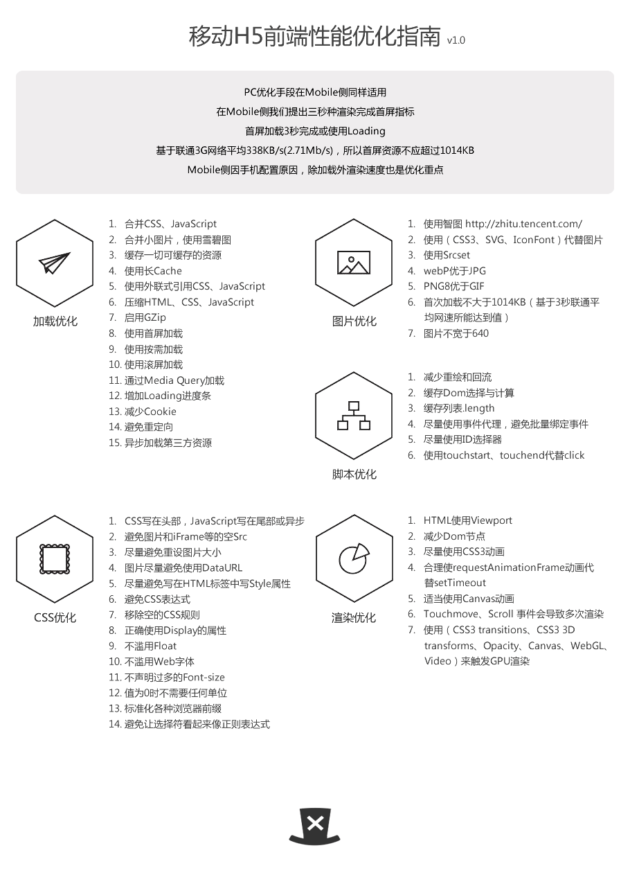

# 移动 H5 前端性能优化

- [移动 H5 前端性能优化指南 - 腾讯 ISUX](https://cloud.tencent.com/developer/article/1154376)

如何优化 HTML5 在移动设置上的性能表现，首先需要明确以下几个原则：

1. PC 优化手段在 Mobile 侧同样适用
2. 在 Mobile 侧我们提出**三秒种渲染完成首屏指标**
3. 基于第二点，首屏加载 3 秒完成或使用 Loading
4. 基于联通 3G 网络平均 338KB/s(2.71Mb/s)，所以**首屏资源不应超过 1014KB**
5. Mobile 侧因手机配置原因，除加载外渲染速度也是优化重点
6. 基于第五点，要合理处理代码减少渲染损耗
7. 基于第二、第五点，所有**影响首屏加载和渲染的代码应在处理逻辑中后置**
8. 加载完成后用户交互使用时也需注意性能

## 一：加载优化

对于移动端的网页来说，加载过程是最为耗时的过程，可能会占到总耗时的 80%时间，因此是优化的重点，当然，手机站的其他前端要素优化也是不能忽略的。

**1、减少 HTTP 请求**

因为手机浏览器同时响应请求为 4 个请求（Android 支持 4 个，iOS 5 后可支持 6 个），所以要尽量减少页面的请求数，首次加载同时请求数不能超过 4 个，建议优化要点为以下 2 点：

1. 合并 CSS、JavaScript
2. 合并小图片，使用雪碧图

**2、缓存**

使用缓存可以减少向服务器的请求数，节省加载时间，所以所有静态资源都要在服务器端设置缓存，并且尽量使用长 Cache（长 Cache 资源的更新可使用时间戳）。

1. 缓存一切可缓存的资源
2. 使用长 Cache（使用时间戳更新 Cache）
3. 使用外联式引用 CSS、JavaScript

**3、压缩 HTML、CSS、JavaScript**

减少资源大小可以加快网页显示速度，所以要对 HTML、CSS、JavaScript 等进行代码压缩，并在服务器端设置 GZip。

1. 压缩（例如，多余的空格、换行符和缩进）
2. 启用 GZip

**4、无阻塞**

写在 HTML 头部的 JavaScript（无异步），和写在 HTML 标签中的 Style 会阻塞页面的渲染，因此 **CSS 放在页面头部并使用 Link 方式引入，避免在 HTML 标签中写 Style，JavaScript 放在页面尾部**或使用异步方式加载

**5、使用首屏加载**

首屏的快速显示，可以大大提升用户对页面速度的感知，因此应**尽量针对首屏的快速显示做优化**。

**6、按需加载**

将不影响首屏的资源和当前屏幕资源不用的资源放到用户需要时才加载，可以大大提升重要资源的显示速度和降低总体流量。

1. LazyLoad
2. 滚屏加载
3. 通过 Media Query 加载

另外，提醒大家一点：按需加载会导致大量重绘，影响渲染性能。

**7、预加载**

大型重资源页面（如游戏）可使用增加 Loading 的方法，资源加载完成后再显示页面，但 Loading 时间过长，会造成用户流失。

1. 可感知 Loading(如进入空间游戏的 Loading)
2. 不可感知的 Loading（如提前加载下一页）
3. 对用户行为分析，可以在当前页加载下一页资源，提升速度。

**8、压缩图片**

图片是最占流量的资源，因此尽量避免使用他，使用时选择最合适的格式（实现需求的前提下，以大小判断），合适的大小，然后使用智图压缩，同时在代码中用 srcset 来按需显示。

1. 使用智图
2. 使用其它方式代替图片（使用 CSS3；使用 SVG；使用 IconFont）
3. 使用 srcset
4. 选择合适的图片（webP 优于 JPG；PNG8 优于 GIF）
5. 选择合适的大小（首次加载不大于 1014KB；基于手机屏幕一般宽度不宽于 640）

提醒大家一点：过度压缩图片大小影响图片显示效果。

**9、减少 Cookie**

Cookie 会影响加载速度，所以静态资源域名不使用 Cookie。

**10、避免重定向**

重定向会影响加载速度，所以在服务器正确设置避免重定向。

**11、异步加载第三方资源**

第三方资源不可控会影响页面的加载和显示，因此要异步加载第三方资源。

## 二：脚本执行优化

脚本处理不当会阻塞页面加载、渲染，因此在使用时需要注意以下几点：

1. CSS 写在头部，JavaScript 写在尾部或异步。
2. 避免图片和 iframe 等的空 src，空 src 会重新加载当前页面，影响速度和效率。
3. 尽量避免重设图片大小，重设图片大小是指在页面、CSS、JavaScript 等中多次重置图片大小，多次重设图片大小会引发图片的多次重绘，影响性能。
4. 图片尽量避免使用 DataURL，DataURL 图片没有使用图片的压缩算法文件会变大，并且要解码后再渲染，加载慢耗时长。

## 三：CSS 优化

1. **尽量避免写在 HTML 标签中写 Style 属性。**
2. **避免 CSS 表达式**，CSS 表达式的执行需跳出 CSS 树的渲染，因此请避免 CSS 表达式。
3. **移除空的 CSS 规则**，空的 CSS 规则增加了 CSS 文件的大小，且影响 CSS 树的执行，所以需移除空的 CSS 规则。
4. **正确使用 Display 的属性**，Display 属性会影响页面的渲染，因此请要合理使用。

   1. display:inline 后不应该再使用 width、height、margin、padding 以及 float
   2. display:inline-block 后不应该再使用 float
   3. display:block 后不应该再使用 vertical-align
   4. display:table-\*后不应该再使用 margin 或者 float

5. **不滥用 float**，Float 在渲染时计算量比较大，尽量减少使用。
6. **不滥用 Web 字体**，Web 字体需要下载，解析，重绘当前页面，尽量减少使用。
7. **不声明过多的 font-size**，过多的 Font-size 引发 CSS 树的效率。
8. **值为 0 时不需要任何单位**，为了浏览器的兼容性和性能，值为 0 时不要带单位。
9. **标准化各种浏览器前缀**

   1. 无前缀应放在最后。
   2. CSS 动画只用（-webkit- 无前缀）两种即可。
   3. 其它前缀为“-webkit- -moz- -ms- 无前缀”四种（-o-Opera 浏览器改用 blink 内核，所以淘汰）。

10. **避免让选择符看起来像正则表达式。** 高级选择器执行耗时长且不易读懂，避免使用。

## 四：JavaScript 执行优化

1. 减少重绘和回流

   1. 避免不必要的 Dom 操作
   2. 尽量改变 Class 而不是 Style，使用 classList 代替 className
   3. 避免使用 document.write
   4. 减少 drawImage

2. 缓存 Dom 选择与计算，每次 Dom 选择都要计算，缓存他。
3. 缓存列表.length，每次.length 都要计算，用一个变量保存这个值。
4. 尽量使用事件代理，避免批量绑定事件。
5. 尽量使用 ID 选择器，ID 选择器是最快的。
6. TOUCH 事件优化，使用 touchstart、touchend 代替 click，因为响应速度快，但应注意 Touch 响应过快，易引发误操作。

## 五：渲染优化

HTML 文档是以包含文档编码信息的数据流方式在网络间传输，页面的编码信息一般会在 HTTP 响应的头部信息或在文档内的 HTML 标记中指明，客户端浏览器只有在确定了页面编码后才能正确的渲染页面，所以在绘制页面或执行任何的 javascript 代码前，大部分的浏览器（ie6、ie7、ie8 除外）都会缓冲一定字节的数据来从中查找编码信息，不同的浏览器当中预缓冲的字节数是不一样的。

**1、 HTML 使用 Viewport**

Viewport 可以加速页面的渲染，请使用以下代码：

`<meta name="viewport" content="width=device-width,initial-scale=1">`

**2、 减少 Dom 节点**

Dom 节点太多影响页面的渲染，应尽量减少 Dom 节点。

**3、 动画优化**

1. 尽量使用 CSS3 动画。
2. 合理使用 requestAnimationFrame 动画代替 setTimeout。
3. 适当使用 Canvas 动画 5 个元素以内使用 css 动画，5 个以上使用 Canvas 动画（iOS8 可使用 webGL）。

**4、高频事件优化**

Touchmove、Scroll 事件可导致多次渲染。

1. 使用 requestAnimationFrame 监听帧变化，使得在正确的时间进行渲染。
2. 增加响应变化的时间间隔，减少重绘次数。

**5、GPU 加速**

CSS 中以下属性（CSS3 transitions、CSS3 3Dtransforms、Opacity、Canvas、WebGL、Video）来触发 GPU 渲染，请合理使用。（PS：过渡使用会引发手机过耗电增加。）
