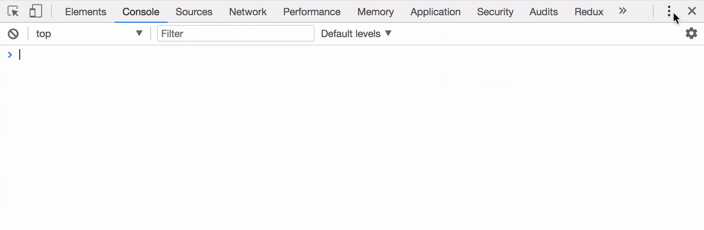
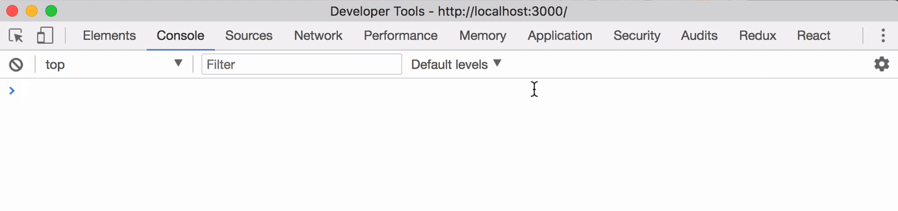
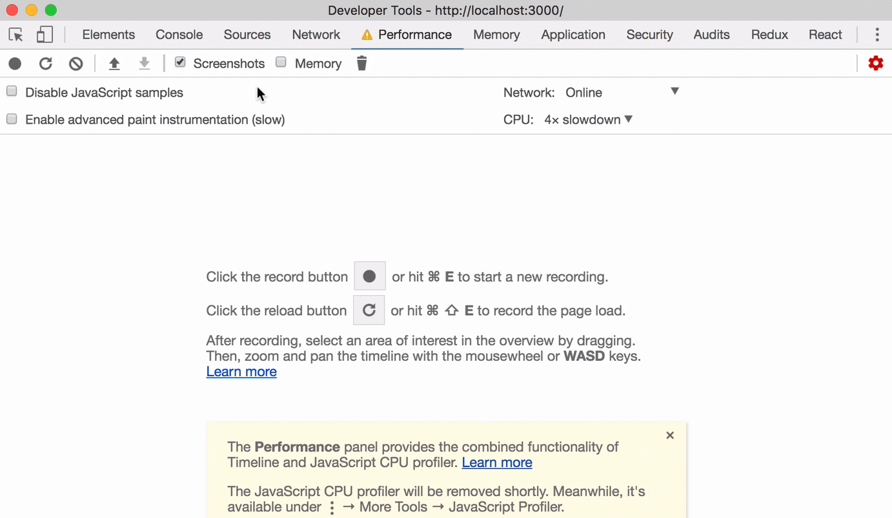
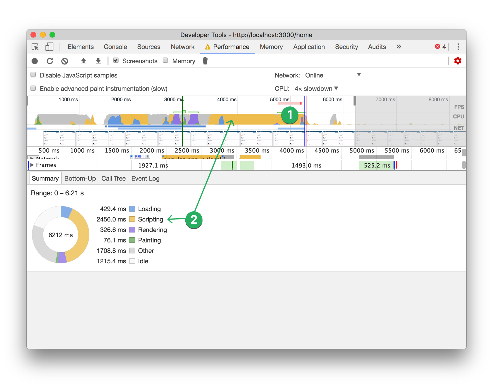
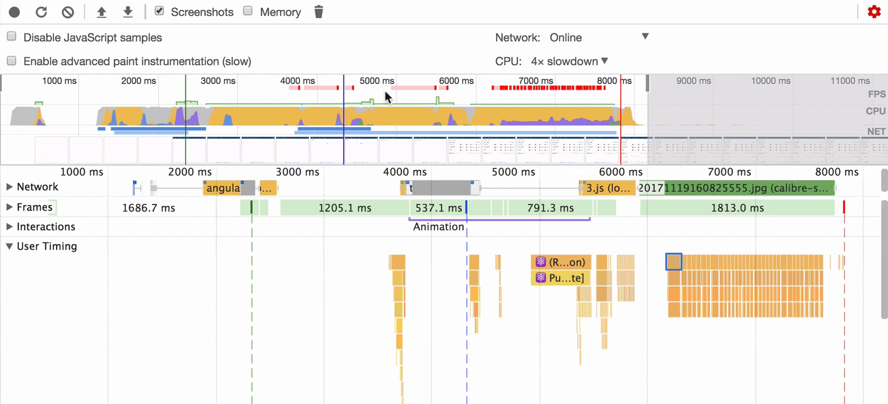
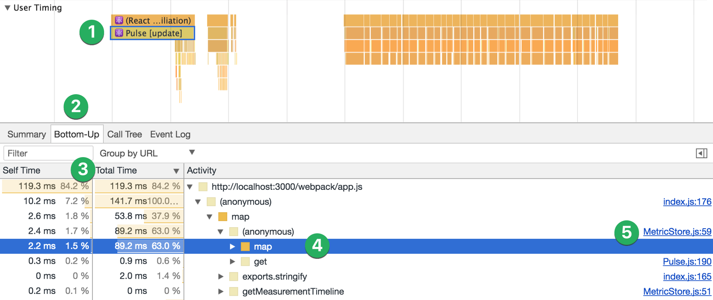
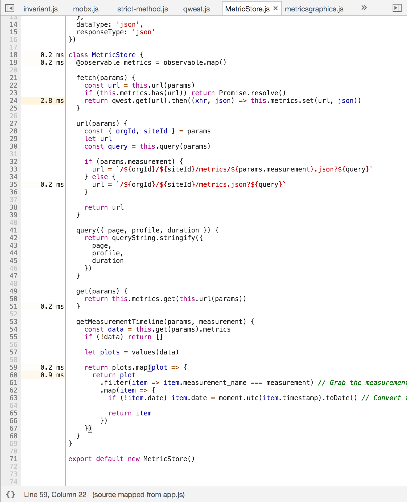

# 使用 React 16 和 Chrome Devtools 来做 React 性能调优

> 翻译自：
> https://building.calibreapp.com/debugging-react-performance-with-react-16-and-chrome-devtools-c90698a522ad

React 作为前端首个主要框架之一，不只是它的名字而在于它出色渲染性能。React 的 virtual dom 以高效渲染组件而闻名--但是当组件突然变慢时，到底发生了什么，怎么去优化呢？

今天我将使用 React 实际代码 和 Chrome DevTools 来演示一下新的的性能追踪特性的强大，以及怎么使用这些工具来调试慢渲染组件。

新的性能工具需要三点：

1. 使用 React 16 的 dev 模式
2. 导出 source-maps(这是可选项，但强烈推荐)
3. 使用 Chrome 或者 Chromium 的 Dev Tools

## 设置监视器

首先你需要足够的发挥空间，全屏你的 Dev Tools

当我们做性能监测时，有必要贴近实际一点，不是每个人都有高昂的电脑和现代的手机。

幸运的是 Chrome 考虑到了这一点--我们将放慢一下 JavaScript 的执行，这样做可以让性能问题更明显，如果能在低性能设备上快速运行，那么在正常设备上绝对飞起

## 查看性能跟踪

在开发模式下，正如 React 所呈现的，会为每个组件创建`mark and measure`事件。

打开你想测试的页面，点击`Start profiling and reload page`按钮，来创建性能分析监测。

这会为每个页面记录性能跟踪，Chrome 会在程序暂停时自动停止记录跟踪。

一旦你执行了跟踪，你的页面可能会长这样

上面从左到右我可以看到一个页面加载初始化的时间线

我会花点时间介绍些可能对于新接触 Performace tab 不那么明显的东西

1. 红色指示器表示这个地方有一些比较消耗 CPU 的任务，可能需要探究下
2. 性能窗口顶部的图形中使用的颜色对应于不同类型的活动。每个类别都有各种原因，需要修复分析。

今天我们关注下`Scripting`(JavaScript 运行时性能)

展开窗口，点击打开 User Timing,然后看截图时间线看看你页面怎么渲染的

现在我们将研究下特耗 CPU 的地方，我们能看到跟踪期间页面所呈现的元素

在图表上拖动可以缩放时间线，你点击这个表情图标 ⚛️ 了吗？

缩放立即显示了用户时间信息，一个叫 'Pulse'的组件（呈现花了 500ms）

Pulse 组件下面是子组件的呈现，虽然看上去并没有花费太多执行时间

## 发现慢函数

1. 点击你想看的组件，这个例子里就是 Pulse,在窗体下面部分，我们可以只关注这个组件的活动。
2. 选择`Bottom-up`.
3. 按 total time 降序，也许有时你需要按照 self time 排序或者按照其他分组而不是 URL. 看看哪种方式最好。
4. 点击展开箭头直到你发现了需要探究的点，这个例子里 `map`很可疑，被调用了很长时间差不多 90m 的执行时间。
5. 这就是为什么我们需要 sourcemap 的原因: 点击`MetricStore.js:59`,会直接跳到程序里的这个点。

