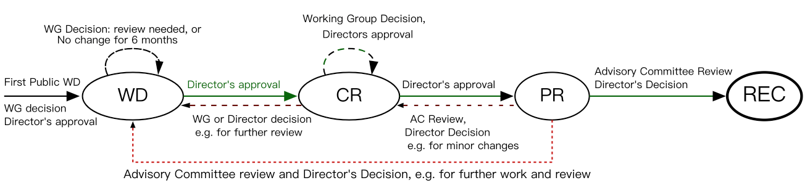

# W3C

World Wide Web Consortium \([W3C](https://www.w3.org/)\) 的缩写，一个专门研发[Web 标准](https://www.w3.org/TR/)的国际组织，使命就是通过制定协议规范激发万维网所有潜能以保持 Web 的长足发展。

## 组成人员

领导者: 万维网发明人 [Tim Berners-Lee](https://www.w3.org/People/Berners-Lee) 和 CEO [Dr. Jeffrey Jaffe](https://www.w3.org/People/Jeff/).

员工：目前有 62 人，主要来自 [MIT](https://www.csail.mit.edu/)（麻省理工学院）, [ERCIM](https://www.ercim.eu/)（欧洲信息学和数学研究联合会）, [Keio](https://www.keio.ac.jp/) （庆应义塾大学），[Beihang](http://ev.buaa.edu.cn/)（北京航空航天大学），包括来自 10 多个不同国家的工程师。

[会员公司](https://www.w3.org/Consortium/Member/List)：浏览器厂商、主流网站、研究机构、常规技术公司等，目前有 475 个会员，如：

- [Apple, Inc.](http://www.apple.com/)
- [Google, Inc.](http://www.google.com/)
- [Adobe](http://www.adobe.com/)
- [Microsoft Corporation](http://www.microsoft.com/)
- [Amazon](https://www.amazon.com/)
- [Facebook](http://www.facebook.com/)
- [Tencent](http://www.tencent.com/)
- [Alibaba Group](http://www.alibabagroup.com/en/global/home)
- [Baidu, Inc.](http://www.baidu.com/)
- ...

## 工作组

[Working Group](https://www.w3.org/Consortium/activities#WebAssembly_Working_Group): W3C 本身并不生产标准，而是以工作组的方式，把某项技术的相关各方聚集起来，最终由他们来产出标准、指南、支持材料。规范的编辑可能是 W3C 的工作人员、浏览器开发者、相关专业的特邀专家，也可能是会员公司的雇员。工作组如：

- Web Platform\(HTML\)
- Cascading Style Sheets \(CSS\)
- SVG
- Web Fonts
- WebAssembly
- Internationalization
- ...

## 标准成熟过程

[Process Document](https://www.w3.org/2018/Process-20180201/)

1. 编辑草案（ED）Editor's Draft
2. 首个公开工作草案（FPWD）First Public Working Draft
3. 草案（WD）Working Drafts
4. 候选（CR）Candidate Recommendations
5. 提案（PR）Proposed Recommendations
6. 正式推荐标准（REC）Recommendations

## 标准

W3C 的[标准](https://www.w3.org/TR/)主要涉及以下方面

- Web Design and Applications
- Web of Devices
- Web Architecture
- Semantic Web
- XML Technology
- Web of Services
- Browsers and Authoring Tools

 目前所有标准在[这里](https://www.w3.org/TR/)，下面列出最新的比较关注的一些

- [HTML](https://www.w3.org/TR/?tag=html)
  - [HTML 5.2(REC)](https://www.w3.org/TR/2017/REC-html52-20171214/)
  - [HTML 5.3(WD)](https://www.w3.org/TR/2018/WD-html53-20181018/)
- [CSS](https://www.w3.org/TR/?tag=css)
  - CSS 语法 [CSS Syntax Module Level 3(CR)](http://www.w3.org/TR/2014/CR-css-syntax-3-20140220/)
  - CSS 层叠与继承 [CSS Cascading and Inheritance Level 4(CR)](https://www.w3.org/TR/2018/CR-css-cascade-4-20180828/)
  - CSS 颜色 [CSS Color Module Level 3(REC)](https://www.w3.org/TR/2018/REC-css-color-3-20180619/)
  - CSS 选择器 [Selectors Level 3(REC)](https://www.w3.org/TR/2018/REC-selectors-3-20181106/)
  - CSS 背景与边框 [CSS Backgrounds and Borders Module Level 3(CR)](https://www.w3.org/TR/2017/CR-css-backgrounds-3-20171017/)
  - CSS 值与单位 [CSS Values and Units Module Level 3(CR)](https://www.w3.org/TR/2018/CR-css-values-3-20180814/)
  - CSS 文本排版 [CSS Text Module Level 3(WD)](https://www.w3.org/TR/2018/WD-css-text-3-20180920/)
  - CSS 文本装饰效果 [CSS Text Decoration Module Level 3(CR)](https://www.w3.org/TR/2018/CR-css-text-decor-3-20180703/)
  - CSS 字体 [CSS Fonts Module Level 3(REC)](https://www.w3.org/TR/2018/REC-css-fonts-3-20180920/)
  - CSS 基本 UI 特性 [CSS Basic User Interface Module Level 3 (CSS3 UI)(REC)](https://www.w3.org/TR/2018/REC-css-ui-3-20180621/)
  - CSS 变形 [CSS Transforms Module Level 1(WD)](https://www.w3.org/TR/2017/WD-css-transforms-1-20171130/)
  - 图像混合效果 [Compositing and Blending Level 1(CR)](http://www.w3.org/TR/2015/CR-compositing-1-20150113/)
  - 滤镜效果 [Filter Effects Module Level 1(WD)](http://www.w3.org/TR/2014/WD-filter-effects-1-20141125/)
  - CSS 遮罩 [CSS Masking Module Level 1(CR)](http://www.w3.org/TR/2014/CR-css-masking-1-20140826/)
  - CSS 伸缩盒布局 [CSS Flexible Box Layout Module Level 1(CR)](https://www.w3.org/TR/2018/CR-css-flexbox-1-20181119/)
  - CSS 网格布局 [CSS Grid Layout Module Level 1(CR)](https://www.w3.org/TR/2017/CR-css-grid-1-20171214/)
- [DOM](https://www.w3.org/TR/?tag=dom)
- [Web API](https://www.w3.org/TR/?tag=webapi)
- ...
