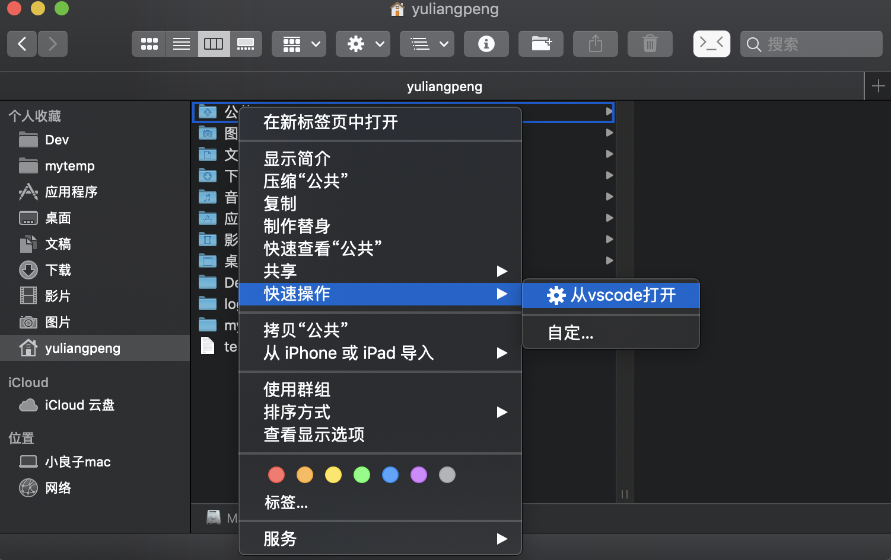

# Mac

## 软件工具

### 一、shell 增强

[oh my zsh](https://ohmyz.sh/) 提供了丰富的插件和主题

1. 插件

   - git

     默认已经自带，git 仓库目录下会显示 git:(分支)样式， 还定义了很多 git [alias](https://github.com/robbyrussell/oh-my-zsh/tree/master/plugins/git)

     

   - tig

     [tig](https://jonas.github.io/tig/) 命令行中查看浏览 git

     

     在 Repo 下 `tig` + `enter` 进入tig模式 此时展现在面前的将会是本地所有的 commit 记录以及分支的演化。

      `j` `k` 可上下切换选中的行，`Enter` 可分屏查看当前 commit 记录详情，`ctrl + d/u` 半屏浏览，`空格` 翻页

      `r` 进入 refs view  模式，查看所有分支，使用 `j/k` 上下切换， `Enter` 查看分支演化。

      `s` 进入 status view，效果同 git status 命令，会展示所有 Untracked 和 UnStaged 文件。 选中 Unstaged 的文件键入 `u` 效果同 git add ，选中 staged 的文件键入 `u` 效果同 git reset，即撤销 add 操作。`Enter` 查看分屏查看当前文件的修改记录。

      *status view 模式下键入 `C` 进入 vim 编辑器，`i` 进入编辑模式，在第一行输入 commit 信息，`:x` 退出并保存。`m` 查看 commit 记录。*

      `y` 进入 stash view 模式

      `t` 进入 tree view 模式，git 目录会以文件夹的形式展示。`Enter` 进入子目录，`,` 返回上一级目录。

      `m` 进入 main view 查看当前分支的所有 commit 记录，使用 `j/k` 上下切换，`Enter` 可分屏查看 commit 详情。

      main view 可以认为是主页。

      `/` 输入关键字可进行搜索。`n` 下一个 `N` 上一个

      `Q` 退出 tig。

      `h` 查看快捷键帮助。


   - [autojump](https://github.com/wting/autojump)

     快速跳转到常用目录，不用总是 `cd` 切换目录了，只需要 `j + <dirname>`

     

     ```bash
     # 1. 安装
     brew install autojump

     # 2. 配置 ～/.zshrc
     # 插件列表添加 autojump
     plugins=(git autojump)
     # 继续添加 autojump 配置
     [[ -s $(brew --prefix)/etc/profile.d/autojump.sh ]] && . $(brew --prefix)/etc/profile.d/autojump.sh

     # 3. 立即生效
     source ~/.zshrc
     ```

2. 主题

    默认 [主题](https://github.com/robbyrussell/oh-my-zsh/wiki/Themes)， robbyrussell

    


### 二、终端

1.  [iTerm2](https://www.iterm2.com/)

    `cmd + d` 横向分屏，`shift + cmd + d` 纵向分屏，`cmd + w` 关闭当前分屏，`cmd + t` 新建标签


2.  [Hyper](https://hyper.is) 另一个酷炫的终端 GUI

    

### 三、应用切换器

- [Manico](https://manico.im/) 可以给常用 app 设置快速启动切换快捷键


- [HyperSwitch](https://bahoom.com/hyperswitch) 会显示切换窗口缩略图、同一应用的多窗口也会平铺切换


### 四、窗口管理

- [Shiftlt](https://github.com/fikovnik/ShiftIt) 窗口尺寸位置管理器


### 五、Finder

- [Go2Shell](https://zipzapmac.com/Go2Shell) 从当前目录启动终端

  安装好后会在 Finder 上生成一个图标 点击即会从当前目录启动终端

  

- 右键菜单新增文件夹打开方式，以 `从vscode打开` 为例

  可以通过 Automator（自动动作） 添加这个操作

  - Automator -> 快速动作 -> 选取
  - 左侧选择 实用工具 -> 运行 Shell 脚本 拖入右侧

  

  - 输入脚本
  ```shell
  for f in "$@"
  do
      open -a "Visual Studio Code" "$f"
  done
  ```
  - 保存为 从vscode打开

  

### 六、截图录制

- [截图(Jietu)](https://apps.apple.com/cn/app/jie-tu-jietu/id1059334054?mt=12)，腾讯出品的截图录屏工具，可以选取区域 可标注 马赛克等

  

- [LICEcap](https://www.cockos.com/licecap/) 录制 GIF，可选区域、可调节FPS
