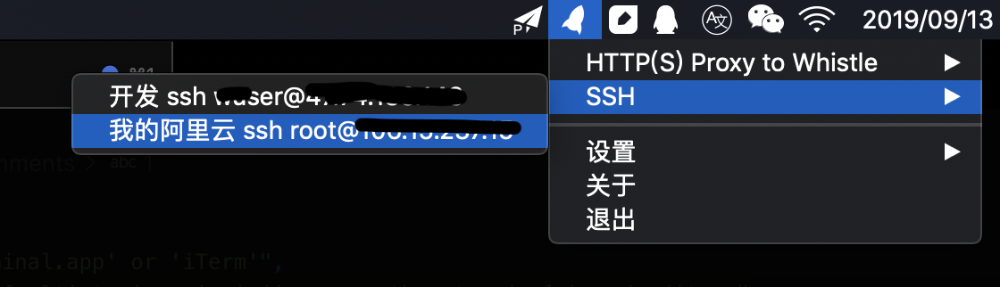

# 软件工具

## 一、终端

1.  [iTerm2](https://www.iterm2.com/)

    `cmd + d` 水平分屏，`cmd + shift + d` 垂直分屏，`cmd + w` 关闭当前分屏， `cmd + option + 方向键` 切换分屏

    `cmd + t` 新建标签，`cmd + <- / ->` 切换 tab，或者 `cmd + 数字` 直接定位到 tab

    `cmd + r` = `clear` 清空屏幕，`ctrl + u` 清除当前行，`ctrl + w` 删除单词

    `ctrl + a` 回到行首，`ctrl + e` 回到行末

    `cmd + ;` 自动提示，`cmd + shift + h` 列出剪切板历史

    `option + click` 移动光标到鼠标点击处

    - 终端中使用代理

      配置 `~/.zshrc` 连到 shadowsocks 为例

      ```bash
      # proxy
      alias proxy='export all_proxy=socks5://127.0.0.1:1086'
      alias unproxy='unset all_proxy'
      alias ip='curl cip.cc'
      ```

      

2.  [Hyper](https://hyper.is) 另一个酷炫的终端 GUI

    

## 二、shell 增强

[oh my zsh](https://ohmyz.sh/) 提供了丰富的插件和主题

1.  插件

    - git

      默认已经自带，git 仓库目录下会显示 git:(分支)样式， 还定义了很多 git [alias](https://github.com/robbyrussell/oh-my-zsh/tree/master/plugins/git)

      

      ```bash
      g=git

      gst='git status'
      gsb='git status -sb'

      glg='git log --stat'
      glo='git log --oneline --decorate'
      glod='git log --graph --pretty='\''%Cred%h%Creset -%C(auto)%d%Creset %s %Cgreen(%ad) %C(bold blue)<%an>%Creset'\'
      glog='git log --oneline --decorate --graph'
      gloga='git log --oneline --decorate --graph --all'

      gf='git fetch'
      gl='git pull'
      gup='git pull --rebase'
      ggpull='git pull origin "$(git_current_branch)"'
      ggpush='git push origin "$(git_current_branch)"'

      ga='git add'
      gaa='git add --all'

      gb='git branch'
      gba='git branch -a'
      gbr='git branch --remote'

      gcmsg='git commit -m'
      gcam='git commit -a -m'
      'gc!'='git commit -v --amend' # 修改commit信息
      'gca!'='git commit -v -a --amend' # 追加到上一个commit

      gco='git checkout'
      gcb='git checkout -b' # 切出新分支
      gcd='git checkout develop'
      gcm='git checkout master'

      gd='git diff'
      gcl='git clone --recurse-submodules'
      gclean='git clean -id'
      ```

      !> issue: git plugin 默认的 gcam 不会自动提交 untracked 文件

      ```bash
      > git add --all # includes untracked files
      > git commit --all # does not include untracked files
      ```

      修改下 ~/.zshrc

      ```bash
      alias gcam='git add . && git commit -a -m'
      ```

    - tig

      [tig](https://jonas.github.io/tig/) 命令行中查看浏览 git

      

      在 Repo 下 `tig` + `enter` 进入 tig 模式 此时展现在面前的将会是本地所有的 commit 记录以及分支的演化。

      `j` `k` 可上下切换选中的行，`Enter` 可分屏查看当前 commit 记录详情，`ctrl + d/u` 半屏浏览，`空格` 翻页

      `r` 进入 refs view 模式，查看所有分支，使用 `j/k` 上下切换， `Enter` 查看分支演化。

      `s` 进入 status view，效果同 git status 命令，会展示所有 Untracked 和 UnStaged 文件。 选中 Unstaged 的文件键入 `u` 效果同 git add ，选中 staged 的文件键入 `u` 效果同 git reset，即撤销 add 操作。`Enter` 分屏查看当前文件的修改记录。

      _status view 模式下键入 `C` 进入 vim 编辑器，`i` 进入编辑模式，在第一行输入 commit 信息，`:x` 退出并保存。`m` 查看 commit 记录。_

      `y` 进入 stash view 模式

      `t` 进入 tree view 模式，git 目录会以文件夹的形式展示。`Enter` 进入子目录，`,` 返回上一级目录。

      `m` 进入 main view 查看当前分支的所有 commit 记录，使用 `j/k` 上下切换，`Enter` 可分屏查看 commit 详情。

      main view 可以认为是主页。

      `/` 输入关键字可进行搜索。`n` 下一个 `N` 上一个

      `Q` 退出 tig。

      `h` 查看快捷键帮助。

- [autojump](https://github.com/wting/autojump)

  快速跳转到常用目录，不用总是 `cd` 切换目录了，只需要 `j + <dirname>` 支持模糊匹配

  

  ```bash
  # 1. 安装
  brew install autojump

  # 2. 配置 ～/.zshrc
  # 插件列表添加 autojump
  plugins=(git autojump)
  # 继续添加 autojump 配置
  [[ -s $(brew --prefix)/etc/profile.d/autojump.sh ]] && . $(brew --prefix)/etc/profile.d/autojump.sh

  # 3. 立即生效
  source ~/.zshrc
  ```

  - [zsh-syntax-highlighting](https://github.com/zsh-users/zsh-syntax-highlighting) 语法高亮

    

    安装

    ```bash
    cd .oh-my-zsh/plugins

    git clone https://github.com/zsh-users/zsh-syntax-highlighting.git ${ZSH_CUSTOM:-~/.oh-my-zsh/custom}/plugins/zsh-syntax-highlighting

    # 配置 ~/.zshrc 必须在所有插件自后
    plugins=( [plugins...] zsh-syntax-highlighting)
    ```

  - [zsh-autosuggestions](https://github.com/zsh-users/zsh-autosuggestions) 自动提示

    方向键补齐

    安装

    ```bash
    cd ~/.oh-my-zsh/custom/plugins
    git clone https://github.com/zsh-users/zsh-autosuggestions ${ZSH_CUSTOM:-~/.oh-my-zsh/custom}/plugins/zsh-autosuggestions

    # 配置 ~/.zshrc
    plugins=(zsh-autosuggestions)
    ```

2. 主题

   默认 [主题](https://github.com/robbyrussell/oh-my-zsh/wiki/Themes)， robbyrussell

   

## 三、应用切换器

- [Manico](https://manico.im/) 可以给常用 app 设置快速启动切换快捷键


- [HyperSwitch](https://bahoom.com/hyperswitch) 会显示切换窗口缩略图、同一应用的多窗口也会平铺切换


## 四、窗口管理

- [Shiftlt](https://github.com/fikovnik/ShiftIt) 窗口尺寸位置管理器


`ctrl + option + cmd` + `方向键` 调整位置

`ctrl + option + cmd` + `+/-` 调整大小

`ctrl + option + cmd` + `m` 最大化

`ctrl + option + cmd` + `c` 居中

`ctrl + option + cmd` + `f/z` 全屏

`ctrl + option + cmd` + `n` 多屏幕，将窗口移入另一屏

## 五、Finder

- [Go2Shell](https://zipzapmac.com/Go2Shell) 从当前目录启动终端

  安装好后会在 Finder 上生成一个图标 点击即会从当前目录启动终端

  

- 右键菜单新增文件夹打开方式，以 `从vscode打开` 为例

  可以通过 Automator（自动动作） 添加这个操作

  - Automator -> 快速动作 -> 选取
  - 左侧选择 实用工具 -> 运行 Shell 脚本 拖入右侧

  

  - 输入脚本

  ```shell
  for f in "$@"
  do
      open -a "Visual Studio Code" "$f"
  done
  ```

  - 保存为 `从 vscode 打开`

  

- 配置

  - `cmd + shift + .` 显示隐藏文件
  - 偏好设置 -> 高级 -> 显示所有文件扩展名
  - 显示 -> 显示路径栏 & 显示状态栏
  - 显示 -> 自定义工具栏 添加常用的 `新建文件夹` `删除` `显示简介` 按钮
  - 按住 `option` 拖拽分栏可永久调节分栏大小

## 六、菜单栏工具

- [Itsycal](https://www.mowglii.com/itsycal/) 时间日历小工具

  

- [Shuttle](http://fitztrev.github.io/shuttle/)

  可以将常用的命令保存成一个快捷菜单

  

  设置->编辑 可以修改配置

  ```json
  {
    "_comments": [
      "Valid terminals include: 'Terminal.app' or 'iTerm'",
      "In the editor value change 'default' to 'nano', 'vi', or another terminal based editor.",
      "Hosts will also be read from your ~/.ssh/config or /etc/ssh_config file, if available",
      "For more information on how to configure, please see http://fitztrev.github.io/shuttle/"
    ],
    "editor": "default",
    "launch_at_login": true,
    "terminal": "iTerm",
    "iTerm_version": "nightly",
    "default_theme": "Homebrew",
    "open_in": "tab",
    "show_ssh_config_hosts": false,
    "ssh_config_ignore_hosts": [],
    "ssh_config_ignore_keywords": [],
    "hosts": [
      {
        "HTTP(S) Proxy to Whistle": [
          {
            "name": "✅Wi-Fi Proxy",
            "cmd": "w2 start && echo p | sudo -S networksetup -setautoproxystate 'Wi-Fi' off && sudo networksetup -setwebproxy 'Wi-Fi' 127.0.0.1 8899 && sudo networksetup -setsecurewebproxy 'Wi-Fi' 127.0.0.1 8899 && exit"
          },
          {
            "name": "❌Wi-Fi Proxy",
            "cmd": "echo p | sudo -S networksetup -setwebproxystate 'Wi-Fi' off && sudo networksetup -setsecurewebproxystate 'Wi-Fi' off && sudo networksetup -setautoproxyurl 'Wi-Fi' http://127.0.0.1:8090/proxy.pac && exit"
          }
        ],
        "SSH": [
          {
            "name": "开发 ssh xxx@12.34.56.7",
            "cmd": "ssh ssh xxx@12.34.56.7"
          },
          {
            "name": "我的阿里云 ssh root@12.34.56.7",
            "cmd": "ssh root@12.34.56.7"
          }
        ]
      }
    ]
  }
  ```

## 七、Touch Bar 工具

- [Pock](https://pock.dev/) 可以将 Dock 移入 Touch Bar，触摸切换应用

  

## 八、截图录制

- [截图(Jietu)](https://apps.apple.com/cn/app/jie-tu-jietu/id1059334054?mt=12)，腾讯出品的截图录屏工具，可以选取区域 可标注 马赛克等

  

- [LICEcap](https://www.cockos.com/licecap/) 录制 GIF，可选区域、可调节 FPS

## 九、Chrome 插件

- Smart TOC

  有些在线文章没有一个很好的目录，这个插件可以为文章生成一个悬浮的大纲目录

  

- Octotree

  为 Github 项目生成目录树，便于浏览 Github 上的项目

  

- FeHelper

  前端工具集合

  
