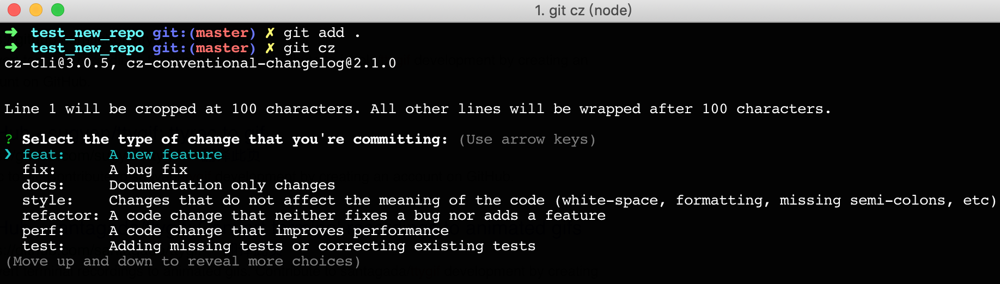

# Git commit 提交规范

## Why

- 自动化生成 CHANGELOG。
- 基于提交的类型，自动决定语义化的版本变更。
- 向团队、公众与其他利益关系人传达变化的性质。
- 触发构建和部署流程。
- 更容易地浏览结构化的提交历史，降低项目贡献难度。

## Commit Message 格式

### 格式

```
<type>[optional scope]: <description>
<空行>
[optional body]
<空行>
[optional footer]
```

### type

- fix: 修复 bug(对应于语义化版本里的 PATCH，会出现在 CHANGELOG 中)
- feat: 增加新特性(对应于语义化版本里的 MINOR，会出现在 CHANGELOG 中)
- docs: 文档修改
- perf: 性能优化
- refactor: 重构代码
- style: 代码格式化如去除空格分号等
- test: 测试代码增加或修改
- build: 打包构建工具的修改或者改变外部依赖如 webpack、npm
- chore: 修改既不是 src 文件也不是 test 文件，如 chore(release): v1.1.0
- ci: 改变 CI 配置文件

### scope

- scope 说明了代码影响范围一个业务名称或者模块名称，如 login、home、task-list

### description

- 使用命令式，现在时: "change" not "changed" nor "changes"
- 不要首字母大写
- 不需要句号结尾

### body

- 必须在 description 之后空一行
- 跟 description 差不多，也是命令式语句，补充修改的上下文、原因动机、跟之前行为的对比等
- 或者是破坏性变更，以 BREAKING CHANGE 开头，后紧跟冒号空格(对应于语义化版本里的 MAJOR)

### footer

- 如 BREAKING CHANGE、外部链接、或者 issue 引用

### 例子

```
feat(complie): allow provided config object to extend other configs

BREAKING CHANGE: `extends` key in config file is now used for extending other config files
```

```
fix: minor typos in code

see the issue for details on the typos fixed

fixes issue #12
```

## Commitizen 工具

纯裸写 commit message 相对麻烦，我们可以使用工具 [cz-cli](https://github.com/commitizen/cz-cli) 和 一个适配 [cz-conventional-changelog](https://github.com/commitizen/cz-conventional-changelog)(一个符合 Angular 团队规范的 preset)

### 全局安装

```bash
npm install -g commitizen cz-conventional-changelog
echo '{ "path": "cz-conventional-changelog" }' > ~/.czrc #全局模式下, 需要 ~/.czrc 配置文件, 为 commitizen 指定 Adapter.
```

之后我们提交代码时只要将 `git commit` 改成 `git cz` 就会弹出交互式编辑 commit 内容了



## CHANGELOG

使用 [standard-version](https://github.com/conventional-changelog/standard-version) 自动生成 CHANGELOG

### 全局安装

```bash
npm i -g standard-version
```

然后通过`standard-version`命令就会自动升级版本号、创建修改 CHANGELOG.md 文件、git commit、打 tag

```bash
standard-version
✔ bumping version in package.json from 1.0.0 to 1.1.0
✔ created CHANGELOG.md
✔ outputting changes to CHANGELOG.md
✔ committing package.json and CHANGELOG.md
✔ tagging release v1.1.0
ℹ Run `git push --follow-tags origin master && npm publish` to publish
```

会生成一个类似这样的提交

```
commit 3ea5ff3c6b052b38b7d27c7c0952afee6c694b0c (HEAD -> master, tag: v1.1.0)
Author: ipeng6 <ipeng6@qq.com>
Date:   Sun Dec 16 01:57:26 2018 +0800

    chore(release): 1.1.0

```

### 首次发布

首次可以不用升级版本号，添加`--first-release`参数

```bash
standard-version --first-release
```

### 预览

```bash
standard-version --dry-run
```

### 指定版本号

```bash
standard-version --release-as patch
standard-version --release-as minor
standard-version --release-as major
standard-version --release-as 1.1.0
```

参考：

- [Conventional Commits](https://www.conventionalcommits.org/en/v1.0.0-beta.2/)
- [Angular Commit Guidelines](https://github.com/angular/angular.js/blob/master/CONTRIBUTING.md#commit)
- [cz-cli](https://github.com/commitizen/cz-cli)
- [cz-conventional-changelog](https://github.com/commitizen/cz-conventional-changelog)
- [standard-version](https://github.com/conventional-changelog/standard-version)
- [优雅的提交你的 Git Commit Message](https://zhuanlan.zhihu.com/p/34223150)
