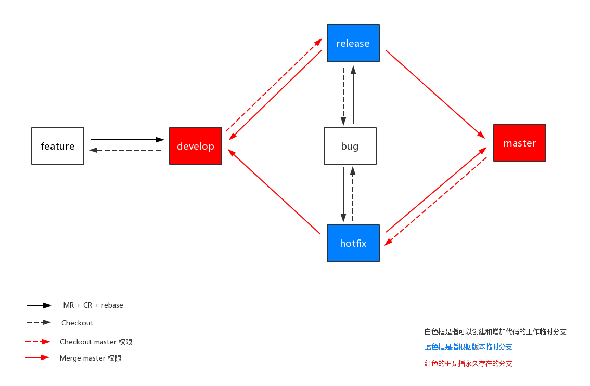

# Gitflow

参考 - 2019年04月18日

- [A successful Git branching model](https://nvie.com/posts/a-successful-git-branching-model/)
- [Using git-flow to automate your git branching workflow](https://jeffkreeftmeijer.com/git-flow/)

