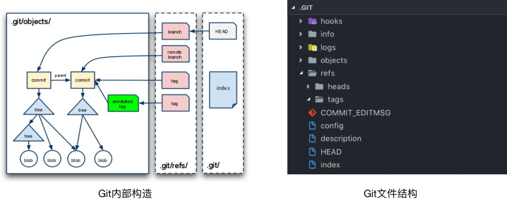

# Git

<details>
<summary>引用参考 - 2019年09月14日</summary>

- [git book](https://git-scm.com/book/en/v2) [[中文]](https://git-scm.com/book/zh/v2)
- [LearnGitBranching 图形化理解 Git](https://github.com/pcottle/learnGitBranching)
- [代码合并：Merge、Rebase 的选择](https://github.com/geeeeeeeeek/git-recipes/wiki/5.1-%E4%BB%A3%E7%A0%81%E5%90%88%E5%B9%B6%EF%BC%9AMerge%E3%80%81Rebase-%E7%9A%84%E9%80%89%E6%8B%A9)
- [Git 项目管理](https://www.yuque.com/docs/share/cc5f2761-c72b-420e-bd26-448d645691ef)

</details>

## 4 个区

- **工作区**( Working Area ) 就是你平时存放项目代码的地方
- **暂存区**( Stage ) 用于临时存放你的改动，事实上它只是一个文件，保存即将提交到文件列表信息
- **本地仓库**( Local Repository ) 就是安全存放数据的位置，这里面有你提交到所有版本的数据。其中 HEAD 指向最新放入仓库的版本
- **远程仓库**( Remote Repository ) 托管代码的远程服务器仓库

## 5 种状态

以上 4 个区，进入每一个区成功之后会产生一个状态，再加上最初始的一个状态，一共是 5 种状态。以下我们把这 5 种状态分别命名为：

- 未修改( Origin )
- 已修改( Modified )
- 已暂存( Staged )
- 已提交( Committed )
- 已推送( Pushed )

## Git 内部构造

要理解 Git 内部构造的核心，我们应理解三个东西： 实体、引用、 索引。



- **实体**：你提交到一个 Git 代码仓库中的所有文件，包括每个提交的说明信息（the commit info）都在目录 .git/objects/中存储为实体。一个实体以一个 40 字符长度的字符串（该实体内容的 SHA1 哈希值）来标识。

- **引用**：Git 中，一个分支（branch）、远程分支（remote branch）或一个标签（tag）（也称为轻量标签）仅是指向一个实体的一个指针，这里的实体通常是一个 commit 实体。这些引用以文本文件的形式存储在目录.git/refs/中。

- **索引**：索引是一个暂存区，以二进制文件的形式存储为文件.git/index。当 git add 一个文件，Git 将该文件的信息添加到索引中。当 git commit，Git 仅提交索引文件中列出的文件。

## 基本的 Git 工作流程如下：

1. 在工作目录中修改文件。
2. 暂存文件，将文件的快照放入暂存区域。
3. 提交更新，找到暂存区域的文件，将快照永久性存储到 Git 仓库目录


```bash
git add .   # 把所有文件放入 暂存区；

git commit -m "comment"  # 把所有文件从 暂存区 提交进 本地仓库；

git push # 把所有文件从 本地仓库 推送进 远程仓库。
```

## 配置

- git config 会配置 `.git/config` 文件，当前使用仓库的 Git 目录中的 config 文件：针对该仓库。
- git config --global 会配置 `~/.gitconfig` 或 `~/.config/git/config` 文件：只针对当前用户。
- git config --system 会配置 `/etc/gitconfig` 文件中的变量: 包含系统上每一个用户及他们仓库的通用配置。

## 配置用户信息

```bash
git config --global user.name "John Doe"
git config --global user.email johndoe@example.com

git config --global pull.rebase true
```

## 检查配置项

```bash
git config --list
git config user.name # 查看某一项的值
```

## 查看撤销修改

```bash
git diff # 已修改，未暂存
git diff --cached # 已暂存，未提交
git diff master origin/master # 已提交，未推送

# 撤销
# 已修改，未暂存
git checkout .
# 或者
git reset --hard

# 已暂存，未提交
git reset # 先撤掉add状态
git checkout .
# 或者
git reset --hard

# 已提交，未推送
git reset --hard origin/master

# 已推送
git reset --hard HEAD^
git push -f # 慎重！

```
